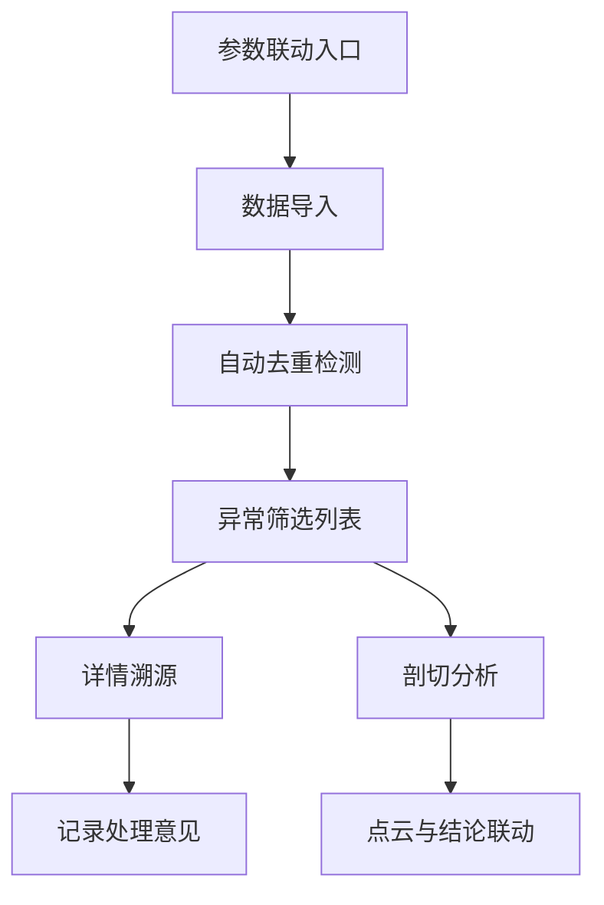

## 1. 产品概述
浮标阵列海况立体图是一个用于管理浮标数据、三维模型和设备坐标的专业工具，解决数据重复、异常筛选和溯源问题。
- 主要服务于仿真工程师，用于管理浮标海况数据，提供异常检测、数据溯源和重复导入防护
- 提升数据管理效率，确保数据一致性，便于向甲方展示和复盘

## 2. Core Features

### 2.1 User Roles
| 角色 | 注册方式 | 核心权限 |
|------|----------|----------|
| 仿真工程师 | 无需注册 | 数据导入、异常筛选、查看详情、剖切分析、复核数据 |

### 2.2 Feature Module
1. **数据导入页面**：批量导入浮标数据、三维模型、设备坐标，自动去重
2. **异常筛选页面**：展示所有导入记录，按异常类型筛选，保留原始信息
3. **详情页面**：查看数据来源、原始行号、处理意见，支持跳转溯源
4. **剖切分析页面**：月底/课前查看点云切片与结论对应关系
5. **参数联动入口**：日常使用入口，快速访问核心功能

### 2.3 Page Details
| 页面名称 | 模块名称 | Feature description |
|----------|----------|---------------------|
| 数据导入页面 | 文件上传 | 支持Excel、CSV、3D模型文件导入，自动检测重复数据 |
| 数据导入页面 | 预览校验 | 导入前预览数据，显示潜在冲突提示 |
| 异常筛选页面 | 数据列表 | 展示所有记录，标记异常状态，支持多条件筛选 |
| 异常筛选页面 | 原始信息保留 | 显示原始行号、图片名、来源备注 |
| 详情页面 | 来源溯源 | 展示数据来源、处理历史、关联记录 |
| 详情页面 | 处理意见 | 记录处理意见，支持编辑更新 |
| 剖切分析页面 | 点云切片 | 展示点云切片，关联最终结论，支持双向跳转 |
| 参数联动入口 | 导航入口 | 日常访问快捷入口，整合核心功能 |

## 3. Core Process

导入数据 → 自动检测重复与异常 → 展示筛选结果 → 查看详情溯源 → 记录处理意见 → 剖切分析验证

## 4. User Interface Design
### 4.1 Design Style
- 主色调：深海蓝(#003366) + 科技蓝(#0099CC)
- 按钮风格：简洁直角，轻微阴影，科技感
- 字体：Inter 系统字体，清晰易读
- 布局风格：顶部导航 + 侧边栏 + 内容区，卡片式布局
- 图标：简洁线性图标，海洋科技风格

### 4.2 Page Design Overview
| 页面名称 | 模块名称 | UI Elements |
|----------|----------|-------------|
| 数据导入页面 | 文件上传 | 拖拽上传区，文件预览，冲突提示卡片 |
| 异常筛选页面 | 数据列表 | 表格视图，状态标签，筛选栏，原始信息展示 |
| 详情页面 | 来源溯源 | 时间线视图，关联记录，原始数据展示 |
| 剖切分析页面 | 点云切片 | 左右分栏，左侧切片，右侧结论，双向跳转 |

### 4.3 Responsiveness
桌面端为主，适配1920×1080及以上分辨率，简化移动端功能

### 4.4 3D Scene Guidance
- 环境：中性灰色背景，突出3D模型
- 光照：柔和顶部光源，清晰展示模型细节
- 相机设置：默认等距视角，支持拖拽旋转缩放
- 交互：点击高亮选中模型，支持剖切操作
