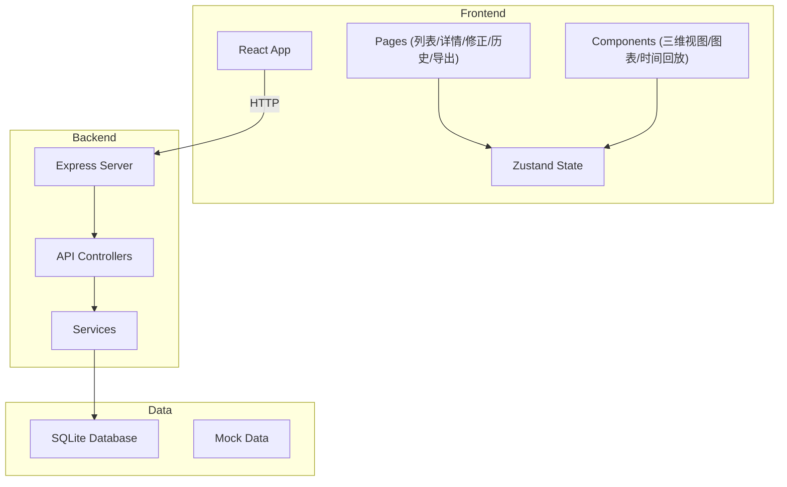
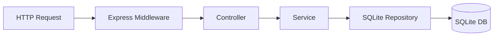
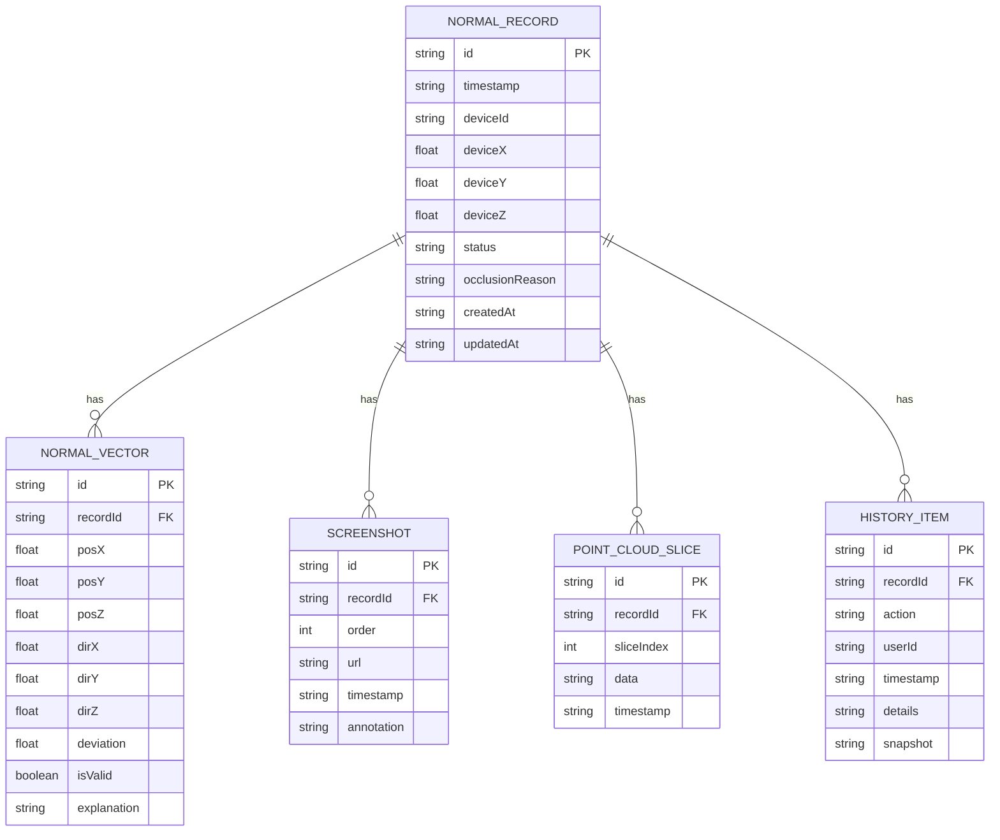

## 1. 架构设计



## 2. 技术描述

- **Frontend**: React@18 + TypeScript + Tailwind CSS + Vite + Zustand + React Router + Three.js + Recharts + lucide-react
- **Initialization Tool**: vite-init
- **Backend**: Express@4 + TypeScript
- **Database**: SQLite (本地文件存储)
- **3D Library**: Three.js
- **Chart Library**: Recharts

## 3. 路由定义

| 前端路由 | 后端API | 用途 |
|---------|---------|------|
| / | - | 重定向到 /records |
| /records | GET /api/records | 记录列表页 |
| /records/:id | GET /api/records/:id | 记录详情页 |
| /records/:id/edit | GET/PUT /api/records/:id | 记录修正页 |
| /records/:id/history | GET /api/records/:id/history | 历史记录页 |
| /records/:id/export | GET /api/records/:id/export | 导出页 |

## 4. API 定义

### TypeScript 类型定义

```typescript
// 共享类型
interface NormalRecord {
  id: string;
  timestamp: string;
  deviceId: string;
  deviceCoordinates: { x: number; y: number; z: number };
  status: 'available' | 'unavailable' | 'pending';
  normalData: NormalVector[];
  occlusionAnalysis: OcclusionAnalysis;
  screenshots: Screenshot[];
  pointCloudSlices: PointCloudSlice[];
  history: HistoryItem[];
  createdAt: string;
  updatedAt: string;
}

interface NormalVector {
  id: string;
  position: { x: number; y: number; z: number };
  direction: { x: number; y: number; z: number };
  deviation: number;
  isValid: boolean;
  explanation: string;
}

interface OcclusionAnalysis {
  hasMisreading: boolean;
  reason: string;
  affectedAreas: { x: number; y: number; z: number }[];
  deviceCoordinateRelation: string;
}

interface Screenshot {
  id: string;
  order: number;
  url: string;
  timestamp: string;
  annotation: string;
}

interface PointCloudSlice {
  id: string;
  sliceIndex: number;
  data: number[];
  timestamp: string;
}

interface HistoryItem {
  id: string;
  action: string;
  userId: string;
  timestamp: string;
  details: string;
  snapshot: NormalRecord;
}
```

### API 端点

| 方法 | 路径 | 描述 |
|------|------|------|
| GET | /api/records | 获取所有记录 |
| GET | /api/records/:id | 获取单条记录 |
| PUT | /api/records/:id | 更新记录 |
| GET | /api/records/:id/history | 获取历史记录 |
| POST | /api/records/:id/slices | 添加点云切片 |
| GET | /api/records/:id/export | 导出报告 |

## 5. 服务器架构



## 6. 数据模型

### 6.1 ER 图



### 6.2 DDL

```sql
CREATE TABLE normal_records (
    id TEXT PRIMARY KEY,
    timestamp TEXT NOT NULL,
    device_id TEXT NOT NULL,
    device_x REAL NOT NULL,
    device_y REAL NOT NULL,
    device_z REAL NOT NULL,
    status TEXT NOT NULL,
    occlusion_reason TEXT,
    created_at TEXT NOT NULL,
    updated_at TEXT NOT NULL
);

CREATE TABLE normal_vectors (
    id TEXT PRIMARY KEY,
    record_id TEXT NOT NULL,
    pos_x REAL NOT NULL,
    pos_y REAL NOT NULL,
    pos_z REAL NOT NULL,
    dir_x REAL NOT NULL,
    dir_y REAL NOT NULL,
    dir_z REAL NOT NULL,
    deviation REAL NOT NULL,
    is_valid INTEGER NOT NULL,
    explanation TEXT NOT NULL,
    FOREIGN KEY (record_id) REFERENCES normal_records(id)
);

CREATE TABLE screenshots (
    id TEXT PRIMARY KEY,
    record_id TEXT NOT NULL,
    "order" INTEGER NOT NULL,
    url TEXT NOT NULL,
    timestamp TEXT NOT NULL,
    annotation TEXT,
    FOREIGN KEY (record_id) REFERENCES normal_records(id)
);

CREATE TABLE point_cloud_slices (
    id TEXT PRIMARY KEY,
    record_id TEXT NOT NULL,
    slice_index INTEGER NOT NULL,
    data TEXT NOT NULL,
    timestamp TEXT NOT NULL,
    FOREIGN KEY (record_id) REFERENCES normal_records(id)
);

CREATE TABLE history_items (
    id TEXT PRIMARY KEY,
    record_id TEXT NOT NULL,
    action TEXT NOT NULL,
    user_id TEXT NOT NULL,
    timestamp TEXT NOT NULL,
    details TEXT,
    snapshot TEXT NOT NULL,
    FOREIGN KEY (record_id) REFERENCES normal_records(id)
);
```
