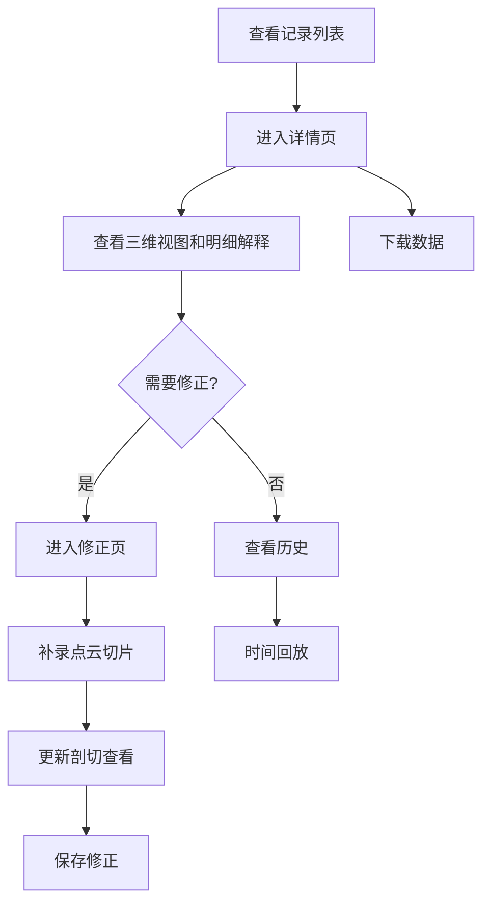
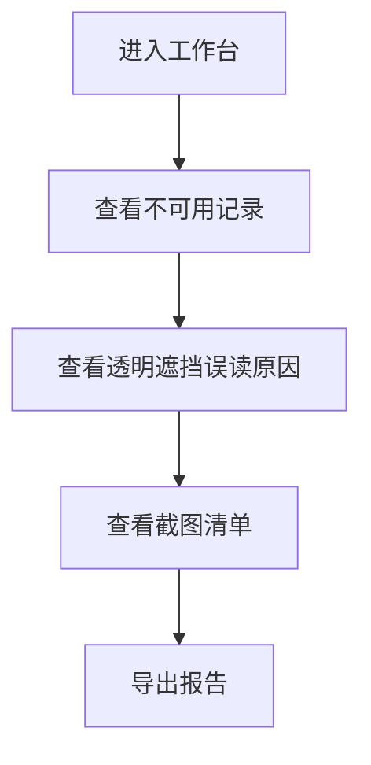

## 1. 产品概述
复杂曲面法线练习本地Web工作台，服务于舞台统筹团队和评审会，用于管理、查看、修正和导出法线练习记录，重点解决透明遮挡误读判断、时间回放、点云切片等专业需求。

## 2. 核心功能

### 2.1 用户角色
| 角色 | 使用方式 | 核心需求 |
|------|----------|----------|
| 舞台统筹 | 日常操作 | 列表、详情、修正、历史、下载、截图清单、时间回放、点云切片 |
| 评审会 | 月底转交 | 查看不可用记录、导出报告、理解透明遮挡误读原因 |

### 2.2 功能模块
1. **记录列表页**：法线练习记录列表，筛选、搜索
2. **详情页**：记录详情、三维视图、图表、明细解释
3. **修正页**：编辑记录、重新计算、添加备注
4. **历史页**：操作历史、时间回放
5. **导出页**：截图清单、报告导出

### 2.3 页面详情
| 页面名称 | 模块名称 | 功能描述 |
|-----------|-------------|---------------------|
| 记录列表页 | 记录卡片 | 显示记录状态、时间、设备坐标、是否可用 |
| 记录列表页 | 筛选搜索 | 按日期、状态、设备筛选 |
| 详情页 | 三维视图 | 显示复杂曲面法线，旁边有明细解释面板 |
| 详情页 | 透明遮挡分析 | 显示误读原因、拦截记录、设备坐标关系 |
| 详情页 | 图表面板 | 法线偏差图表，带数值标注 |
| 修正页 | 编辑表单 | 修改法线参数、添加修正备注 |
| 修正页 | 点云切片 | 补录切片数据，实时更新剖切查看 |
| 历史页 | 时间线 | 操作历史记录 |
| 历史页 | 时间回放 | 可拖拽进度条，逐帧查看 |
| 导出页 | 截图清单 | 按顺序排列的截图列表 |
| 导出页 | 报告生成 | PDF报告导出，包含透明遮挡误读分析 |

## 3. 核心流程

### 舞台统筹日常工作流程

### 评审会月底转交流程

## 4. 用户界面设计

### 4.1 设计风格
- **主色调**：深蓝色（#0F172A）+ 科技蓝（#3B82F6）+ 警告橙（#F59E0B）+ 错误红（#EF4444）
- **次要色**：灰色系（#1E293B, #334155, #475569）
- **按钮风格**：圆角矩形，轻微阴影，hover时有放大效果
- **字体**：Inter 作为主字体，JetBrains Mono 用于代码和数值
- **布局风格**：三栏式（左侧导航、中间主内容、右侧明细解释）
- **图标**：使用 lucide-react 线性图标

### 4.2 页面设计概述
| 页面名称 | 模块名称 | UI元素 |
|-----------|-------------|-------------|
| 记录列表页 | 记录卡片 | 深色卡片、状态指示点、关键数据高亮、悬停上浮效果 |
| 详情页 | 三维视图区 | 大尺寸画布、右侧固定的明细解释面板、实时数值显示 |
| 详情页 | 透明遮挡分析 | 彩色流程图、设备坐标标注、拦截原因说明 |
| 修正页 | 点云切片 | 多视图布局、切片预览、补录按钮 |
| 历史页 | 时间回放 | 进度条、播放控制、关键帧标记 |
| 导出页 | 截图清单 | 瀑布流布局、缩略图预览、顺序编号 |

### 4.3 响应式
- 桌面端优先，适配1920×1080及以上分辨率
- 三栏式布局在小屏幕自动转为两栏或单栏
- 三维视图区域保持最小尺寸

### 4.4 三维视图指导
- 环境：深色科技感背景
- 光照：蓝色主光源 + 橙色补光
- 相机：可旋转、缩放、平移
- 交互：法线向量可点击查看详细信息
- 后处理：轻微辉光效果，突出法线方向
