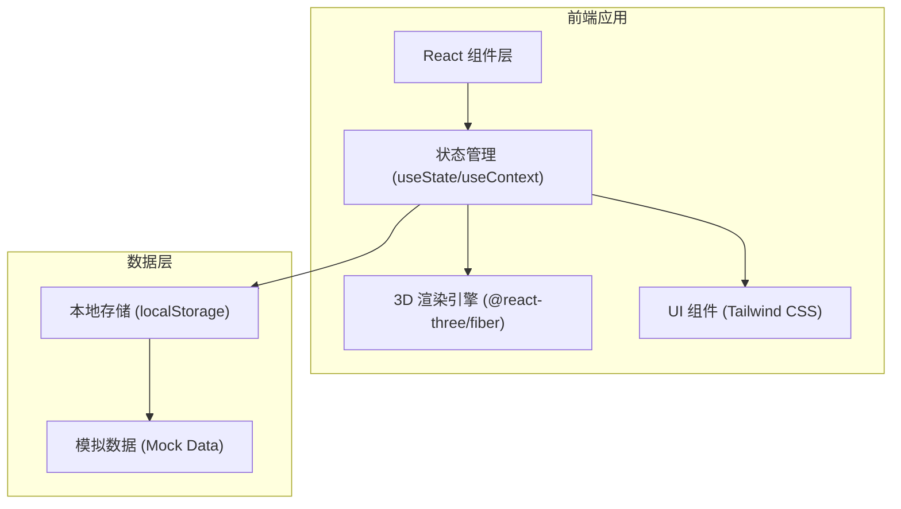
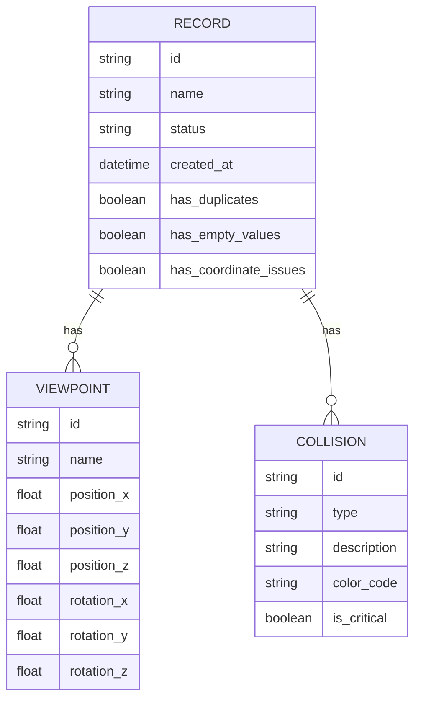

## 1. 架构设计


## 2. 技术描述
- 前端框架：React@18 + TypeScript
- 构建工具：Vite
- UI 框架：Tailwind CSS@3
- 3D 渲染：@react-three/fiber, @react-three/drei, three.js
- 状态管理：React Context API + useState
- 数据存储：localStorage（存储视角、记录等）

## 3. 路由定义
| 路由 | 用途 |
|------|------|
| / | 主工作台页面 |

## 4. 数据模型
### 4.1 数据模型定义


### 4.2 数据结构定义
```typescript
interface Viewpoint {
  id: string;
  name: string;
  position: [number, number, number];
  rotation: [number, number, number];
  fov: number;
}

interface Collision {
  id: string;
  type: 'collision' | 'boundary' | 'warning';
  description: string;
  position: [number, number, number];
  colorCode: string;
  isCritical: boolean;
}

interface Record {
  id: string;
  name: string;
  status: 'valid' | 'needs_review' | 'invalid';
  createdAt: Date;
  hasDuplicates: boolean;
  hasEmptyValues: boolean;
  hasCoordinateIssues: boolean;
  viewpoints: Viewpoint[];
  collisions: Collision[];
  modelData: any;
}
```
