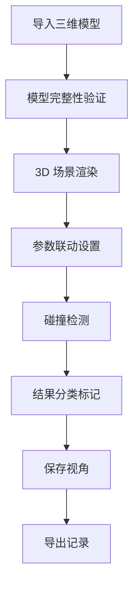

## 1. 产品概述
工厂管架碰撞预审系统是面向工程评审员和运维组的专业工具，用于提前发现工厂管架设计中的碰撞问题，兜住常见工程质量坑，提升设计复核效率。
- 解决三维模型不完整、单位换算错误、结果导出不一致等常见问题
- 目标用户：工程评审员、运维组

## 2. 核心功能

### 2.1 用户角色
| 角色 | 使用场景 | 核心需求 |
|------|----------|----------|
| 工程评审员 | 设计复核、碰撞预审、讲解沟通 | 兜住常见坑、视角保存、颜色含义清晰、越界提示 |
| 运维组 | 月底转交、结果使用 | 快速识别可用记录、问题溯源 |

### 2.2 功能模块
1. **模型导入与验证**：模型完整性检查、空值/重复检测、坐标系混用识别
2. **3D 渲染与交互**：场景渲染、颜色标注、越界提示、视角保存
3. **碰撞检测与分析**：参数联动、碰撞结果展示、分类标记
4. **记录管理**：重复导入测试、结果导出、复核标记

### 2.3 页面详情
| 页面名称 | 模块名称 | 功能描述 |
|----------|----------|----------|
| 主工作台 | 模型导入区 | 支持导入三维模型，自动检测模型完整性 |
| 主工作台 | 3D 渲染区 | 实时渲染管架模型，支持缩放旋转，视角保存 |
| 主工作台 | 碰撞分析区 | 参数联动控制，显示碰撞结果，颜色含义说明 |
| 记录面板 | 记录列表 | 展示所有检测记录，标记可用/需复核状态 |
| 记录面板 | 复核工具 | 重复导入场景测试，结果对比功能 |

## 3. 核心流程
用户导入模型 → 系统自动验证模型完整性（空值、重复、坐标系）→ 3D 渲染展示 → 参数联动调整 → 碰撞检测 → 结果分类标记（可用/需复核）→ 保存视角与记录 → 导出结果。

## 4. 用户界面设计
### 4.1 设计风格
- 主色调：工业蓝 (#1E3A8A) 配合科技灰 (#1F2937)
- 按钮风格：硬朗的工业风，带微妙渐变和阴影
- 字体：思源黑体，清晰易读的工程风格
- 布局风格：分区明确的工作台布局，左侧记录、中央3D、右侧参数
- 图标风格：几何化的工业图标，线条简洁

### 4.2 页面设计概览
| 页面名称 | 模块名称 | UI 元素 |
|----------|----------|----------|
| 主工作台 | 3D 渲染区 | 深色背景、动态光照、悬浮信息卡、颜色图例 |
| 记录面板 | 记录列表 | 卡片式设计，状态色标，快速筛选 |
| 主工作台 | 参数控制区 | 滑动条、数字输入、实时联动反馈 |

### 4.3 响应性
桌面优先设计，大屏幕充分展示3D场景，支持平板适配，触摸屏优化。

### 4.4 3D 场景指导
- 环境：工业场景风格，HDRI 模拟车间光照
- 光照：三点光源系统，突出管架结构
- 摄像机：轨道控制，视角预设快速切换
- 交互：碰撞区域高亮，鼠标悬停显示详情
- 动画：加载时的结构展开动画，视角切换的平滑过渡
