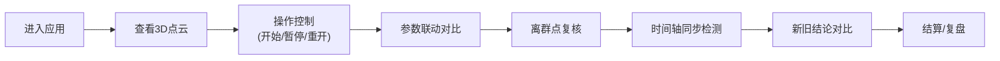

## 1. 产品概述
海冰厚度立体切片是一个用于展示和复核海冰厚度数据的交互式浏览器应用，支持3D点云切片可视化、操作控制和历史数据对比。
- 主要面向海洋研究和运维主管，提供直观的数据复核和复盘功能
- 提升海冰厚度数据处理的透明度和可追溯性

## 2. 核心功能

### 2.1 用户角色
| 角色 | 注册方式 | 核心权限 |
|------|----------|----------|
| 普通用户 | 无需注册 | 浏览数据、使用操作功能、查看历史记录 |

### 2.2 功能模块
1. **主界面**: 3D点云切片渲染、控制面板
2. **操作控制**: 开始、暂停、重开、结算、复盘
3. **数据对比**: 参数联动对比、新旧结论并排显示
4. **历史记录**: 离群点复核记录、操作历史
5. **时间轴**: 时间轴同步检测、报告生成

### 2.3 页面详情
| 页面名称 | 模块名称 | 功能描述 |
|----------|----------|----------|
| 主界面 | 3D点云渲染 | 展示海冰厚度立体切片数据，支持旋转、缩放 |
| 主界面 | 控制面板 | 提供开始、暂停、重开、结算、复盘按钮 |
| 主界面 | 参数面板 | 显示当前参数和历史参数对比 |
| 主界面 | 历史记录 | 显示离群点复核记录，包含修改人、时间、原因 |
| 主界面 | 时间轴面板 | 显示时间轴同步状态和不同步报告 |
| 主界面 | 结论对比 | 并排显示新旧结论，便于对比影响范围 |

## 3. 核心流程
用户进入应用 → 查看3D点云数据 → 开始/暂停/重开操作 → 查看参数联动和历史对比 → 复核离群点 → 查看时间轴状态 → 新旧结论对比 → 结算/复盘

## 4. 用户界面设计
### 4.1 设计风格
- 主色调: 深海蓝 (#0A2463) + 冰白 (#F0F7FF)
- 辅助色: 警示橙 (#FF9F1C) + 安全绿 (#2EC4B6)
- 按钮风格: 圆角矩形，带微阴影和悬停效果
- 字体: 标题使用Playfair Display，正文使用Lato
- 布局风格: 卡片式布局，左右分栏
- 图标风格: 简洁线性图标

### 4.2 页面设计概述
| 页面名称 | 模块名称 | UI元素 |
|----------|----------|--------|
| 主界面 | 3D渲染区 | 深蓝色背景，冰白色点云，交互响应动画 |
| 主界面 | 控制面板 | 圆角按钮，线性图标，状态指示灯 |
| 主界面 | 参数面板 | 卡片式布局，左右分栏对比，差异高亮 |
| 主界面 | 历史记录 | 时间线布局，头像+信息卡片 |
| 主界面 | 时间轴面板 | 线性时间轴，同步/不同步状态标识 |
| 主界面 | 结论对比 | 左右分栏，不同之处高亮显示 |

### 4.3 响应式
桌面优先设计，支持移动端自适应，触控操作优化

### 4.4 3D场景设计
- 环境: 深色海洋背景，模拟深海环境
- 光照: 柔和的顶部光源，突出点云轮廓
- 相机: 可自由旋转、缩放、平移，默认视角为45度俯视
- 交互: 鼠标拖拽旋转，滚轮缩放，点击选中点云
- 动画: 点云加载时的粒子效果，选中时的高亮动画
- 后处理: 轻微的光晕效果，增强视觉层次感
- 性能: 使用Three.js渲染，优化大量点云的显示性能
