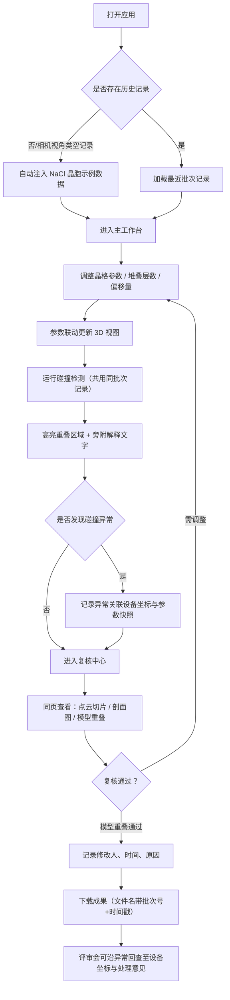

## 1. 产品概述

化学晶胞堆叠课堂是一款面向规划设计师、化学教师和工艺工程师的专业可视化复核工具，用于施工交底前的晶胞堆叠参数联动校验、碰撞检测及成果输出，减少人工对账和口头解释的沟通成本。

- 核心价值：将点云切片、剖面图、模型重叠纳入同一轮复核，用统一的处理记录串联界面展示与报告输出，支撑评审会对具体材料批次的可追溯审查
- 目标用户：规划设计师（主要）、化学教师、工艺工程师、评审会成员

## 2. 核心功能

### 2.1 用户角色

| 角色 | 登录方式 | 核心权限 |
|------|----------|----------|
| 规划设计师 | 本地直接进入 | 调整堆叠参数、运行碰撞检测、提交复核、下载结果 |
| 复核人员 | 本地直接进入 | 审核模型重叠、填写处理意见、标记复核通过 |
| 查看人员 | 本地直接进入 | 浏览结果、查看解释说明、导出报告 |

### 2.2 功能模块

1. **晶胞堆叠工作区**：3D 晶胞可视化、参数联动面板、实时碰撞高亮
2. **复核记录中心**：统一批次处理记录、异常追踪链路、操作审计日志
3. **成果输出面板**：下载带运行标识的结果文件、附带一两句解释文字
4. **首次引导**：相机视角丢失类记录自动注入示例数据，降低上手门槛

### 2.3 页面详情

| 页面名称 | 模块名称 | 功能描述 |
|----------|----------|----------|
| 主工作台 | 3D 晶胞视口 | 展示晶胞堆叠结构，支持旋转/缩放/平移，高亮碰撞区域，旁附解释文字 |
| 主工作台 | 参数联动面板 | 晶格常数、堆叠层数、偏移量等参数实时联动修改，所有改动记入同批次记录 |
| 主工作台 | 碰撞检测区 | 与参数面板共用同一批处理记录，展示重叠区域坐标、体积、涉及设备编号 |
| 复核中心 | 批次列表 | 按批次展示处理记录，区分本次运行与历史运行，可追溯到设备坐标与处理意见 |
| 复核中心 | 复核详情 | 点云切片、剖面图、模型重叠同页展示；记录修改人、修改时间、修改原因 |
| 复核中心 | 异常追踪视图 | 从一条异常回查关联的参数记录、设备坐标、处理意见的完整链路 |
| 成果输出 | 下载面板 | 文件名带批次号与时间戳区分运行；报告内容含解释文字，不做花哨装饰 |
| 首次引导 | 示例数据注入 | 当检测到无记录或相机视角类空记录时，自动加载一套 NaCl 晶胞堆叠示例数据 |

## 3. 核心流程

## 4. 用户界面设计

### 4.1 设计风格

- **主色**：深蓝 #0F2747（专业沉稳）+ 晶胞高亮青 #3DDC97（科学感）
- **辅色**：碰撞警示橙 #FF8C42、复核通过绿 #2EC27E、异常红 #E63946
- **按钮风格**：方角微圆角（4px），细边描边按钮为主，主操作为实色填充
- **字体**：标题用 Cormorant Garamond（学术衬线气质），正文用 JetBrains Mono（等宽便于阅读坐标与参数）
- **布局风格**：左参数面板 + 中央 3D 视口 + 右侧复核/解释说明区的三栏工程布局
- **图标风格**：线性极简几何图标，与晶格结构视觉统一

### 4.2 页面设计概览

| 页面名称 | 模块名称 | UI 元素 |
|----------|----------|---------|
| 主工作台 | 3D 视口 | 深色背景、晶格线框 + 半透明原子球体、碰撞区域橙红色闪烁、右下角相机状态提示、视口内悬浮解释卡片 |
| 主工作台 | 参数面板 | 分组可折叠（晶格/堆叠/偏移）、数值输入框带步进按钮、参数变化有淡蓝高亮反馈、底部显示当前批次号 |
| 主工作台 | 碰撞检测区 | 异常列表卡片，每项含坐标、体积、关联设备号、点击后 3D 视口自动定位 |
| 复核中心 | 批次列表 | 卡片式时间线，本次运行用蓝条高亮，每项显示运行时间、异常数、复核状态 |
| 复核中心 | 复核详情 | 上方三栏横向排布（点云切片 / 剖面图 / 模型重叠），下方审计日志（修改人/时间/原因） |
| 成果输出 | 下载面板 | 极简表单，文件名预览带批次号+时间戳，格式可选 JSON/PDF，一键下载 |

### 4.3 响应式

桌面端优先（≥1440px 三栏布局），1024~1439px 自动折叠右侧面板为抽屉，≤1023px 堆叠为上下布局并隐藏次要解释卡片。

### 4.4 3D 场景指引

- **环境**：深色渐变背景 + 微弱网格地面，营造实验室观察氛围
- **光照**：三点光（主光 45° 侧上方 + 补光 + 轮廓光），原子球体有微弱金属质感
- **相机**：默认正交 45° 俯视角，支持轨道控制，视角状态显示在视口角落
- **交互**：悬停原子显示元素符号与坐标，点击碰撞区域自动框选并定位相机
- **后处理**：轻微辉光（Bloom）用于高亮碰撞，保持科学严谨不过度炫技
