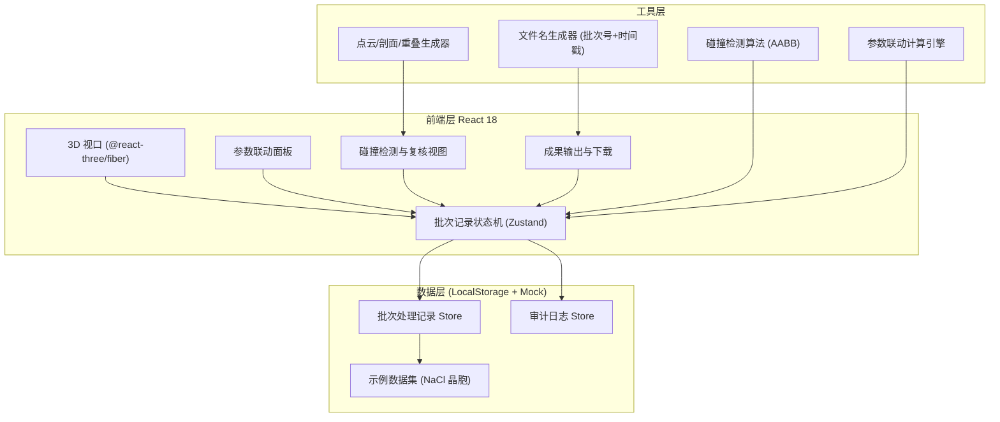
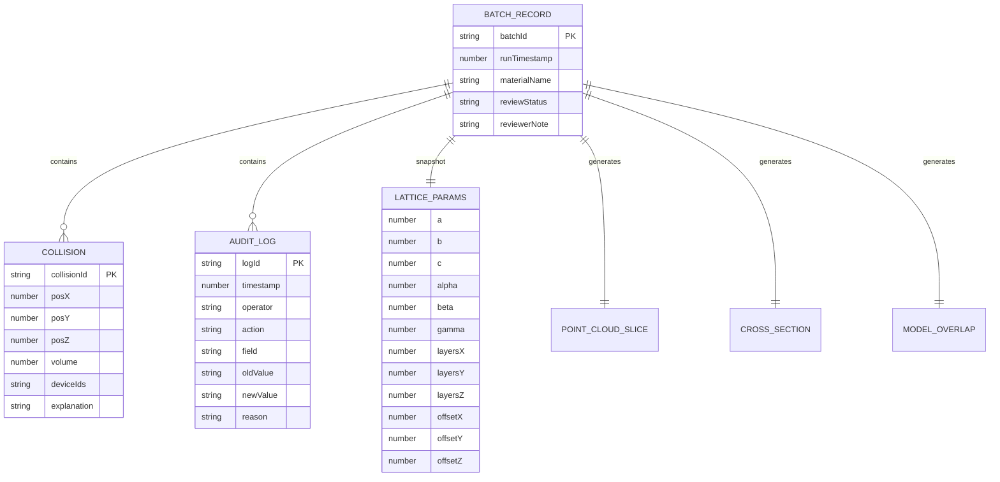

## 1. 架构设计



## 2. 技术说明

- **前端框架**：React@18 + TypeScript + Vite
- **样式方案**：TailwindCSS@3
- **3D 渲染**：three@0.160 + @react-three/fiber@8 + @react-three/drei@9 + @react-three/postprocessing@2
- **状态管理**：Zustand@4（管理批次记录、参数快照、审计日志，确保界面与报告共用同一份数据）
- **碰撞检测**：自研 AABB 轴对齐包围盒算法（轻量，适用于晶胞立方体场景）
- **数据持久化**：LocalStorage（纯前端，不依赖后端）
- **报告生成**：原生 JSON 导出 + jsPDF 生成带解释文字的极简报告

## 3. 路由定义

| 路由 | 用途 |
|------|------|
| / | 主工作台（3D 视口 + 参数面板 + 碰撞检测） |
| /review | 复核中心（批次列表 + 复核详情 + 异常追踪） |
| /export | 成果输出面板 |

## 4. API 定义（纯前端 Mock，无后端）

```typescript
// 批次处理记录 —— 界面与报告共用的唯一数据来源
interface BatchRecord {
  batchId: string;                    // 批次号，如 B-20260609-001
  runTimestamp: number;               // 本次运行时间戳
  materialName: string;               // 材料名称（如 NaCl 氯化钠）
  parameters: LatticeParameters;      // 参数快照
  collisions: CollisionItem[];        // 碰撞检测结果
  pointCloudSlice: PointCloudSlice;   // 点云切片
  crossSection: CrossSection;         // 剖面图
  modelOverlap: ModelOverlap;         // 模型重叠
  auditLogs: AuditLog[];              // 审计日志
  reviewStatus: 'pending' | 'approved' | 'rejected';
  reviewerNote?: string;               // 复核处理意见
}

interface LatticeParameters {
  a: number;       // 晶格常数 a (Å)
  b: number;       // 晶格常数 b (Å)
  c: number;       // 晶格常数 c (Å)
  alpha: number;   // 夹角 α (°)
  beta: number;    // 夹角 β (°)
  gamma: number;   // 夹角 γ (°)
  layersX: number; // X 方向堆叠层数
  layersY: number; // Y 方向堆叠层数
  layersZ: number; // Z 方向堆叠层数
  offsetX: number; // X 偏移 (Å)
  offsetY: number; // Y 偏移 (Å)
  offsetZ: number; // Z 偏移 (Å)
}

interface CollisionItem {
  collisionId: string;
  position: { x: number; y: number; z: number };
  volume: number;              // 重叠体积 (ų)
  deviceIds: string[];         // 关联设备编号
  atomPair: [string, string];  // 碰撞原子对
  explanation: string;         // 一两句解释文字
}

interface AuditLog {
  logId: string;
  timestamp: number;
  operator: string;            // 修改人
  action: 'parameter_change' | 'collision_approved' | 'review_submit' | 'note_update';
  field?: string;
  oldValue?: any;
  newValue?: any;
  reason?: string;             // 修改原因
}
```

## 5. 数据模型

### 5.1 数据模型定义



### 5.2 初始数据（首次注入的 NaCl 示例）

- 材料名称：NaCl 氯化钠晶胞
- 晶格常数：a=b=c=5.64 Å，α=β=γ=90°
- 堆叠：2×2×2 层
- 预设 1 处碰撞异常（位于 X=2.82, Y=2.82, Z=2.82，体积 0.45 ų），附带解释文字
- 内置 2 条审计日志示例（含修改人、时间、原因）
