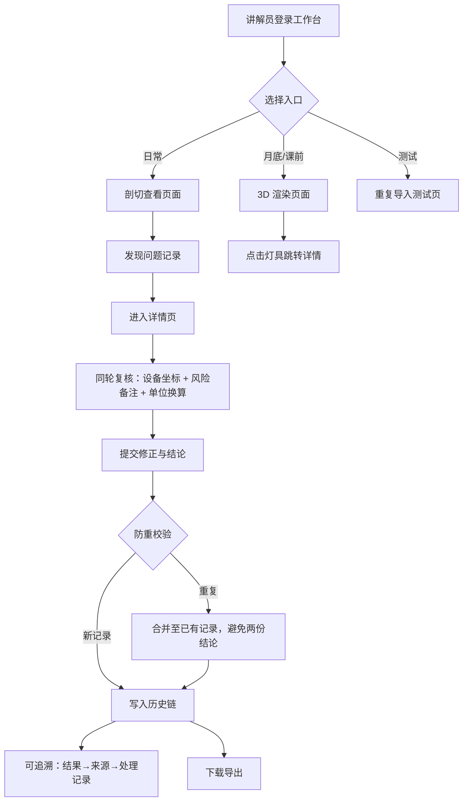

## 1. 产品概述

本产品为展馆讲解员设计的本地 Web 工作台，用于复核"大型展台灯光预演"记录。核心目标是快速拎出单位换算错误等坏记录，支持从列表→详情→修正→历史→下载的全流程闭环，并打通剖切查看日常入口与 3D 渲染月底复核。

- 主要解决：灯光预演数据重复导入、结论混乱、人工查表低效、单位换算错误漏检
- 目标用户：展馆讲解员、运维组
- 核心价值：同一件事不出现两份结论，从结果可追溯至来源和处理记录

## 2. 核心功能

### 2.1 用户角色

| 角色 | 登录方式 | 核心权限 |
|------|---------|---------|
| 展馆讲解员 | 本地工作台登录 | 查看列表、剖切查看、修正记录、追溯历史、下载导出 |
| 运维组 | 本地工作台登录 | 同讲解员权限，额外查看批量复核结果与风险备注汇总 |

### 2.2 功能模块

1. **列表页**：预演记录总览、剖切查看入口、单位换算错误高亮过滤、重复导入告警
2. **详情页**：单条记录详情、设备坐标/风险备注/单位换算错误同轮复核、修正操作、历史追溯
3. **剖切查看**：日常工作入口，快速浏览与标记问题记录
4. **3D 渲染页面**：月底/课前复核，3D 可视化展示灯光效果
5. **测试页面**：重复导入场景验证，防重机制演示
6. **下载与导出**：批量下载复核结果

### 2.3 页面详情

| 页面名称 | 模块名称 | 功能描述 |
|---------|---------|---------|
| 列表页 | 顶部导航 | 切换列表/剖切/3D/测试入口，显示当前复核批次 |
| 列表页 | 搜索过滤区 | 按单位换算错误、风险备注、重复导入、设备坐标区间过滤 |
| 列表页 | 记录列表 | 表格展示，坏记录红色高亮，重复导入黄色标记，点击进入详情 |
| 列表页 | 批量操作 | 批量标记、批量下载 |
| 详情页 | 设备坐标区 | 展示当前记录的设备 X/Y/Z 坐标与灯具编号 |
| 详情页 | 风险备注区 | 可编辑风险备注，可跳转至最终结论 |
| 详情页 | 单位换算区 | 高亮换算错误，支持修正输入（米/英尺/流明等） |
| 详情页 | 最终结论区 | 显示处理结论，可点击跳回风险备注 |
| 详情页 | 来源追溯链 | 透明遮挡误读等验收记录可一路回溯至原始来源与中间处理记录 |
| 详情页 | 历史版本 | 时间线展示历次修正记录与操作人 |
| 详情页 | 修正面板 | 修正单位换算、补充备注、提交结论 |
| 剖切查看页 | 剖切浏览 | 卡片式快速浏览，日常标记问题入口 |
| 3D 渲染页 | 3D 场景 | Three.js 展台灯光渲染，点击灯具跳转对应记录 |
| 测试页 | 重复导入测试 | 模拟重复导入场景，验证防重逻辑与合并策略 |
| 下载导出 | 导出面板 | 按条件选择导出 CSV/JSON |

## 3. 核心流程

讲解员日常工作流程：打开工作台进入剖切查看页，快速浏览记录→发现单位换算错误或风险→点击进入详情→在同轮复核面板中修正设备坐标/风险备注/单位换算→提交结论→系统自动防重检查→可下载导出。

验收时通过透明遮挡误读记录倒查：从结果记录→点击来源→查看原始导入→查看中间处理链→确认结论唯一。

## 4. 用户界面设计

### 4.1 设计风格

- **主色调**：深色工业风，底色 `#0E1116`，面板 `#1A1F29`，边框 `#2A3140`
- **强调色**：琥珀橙 `#F59E0B`（正常操作）、警示红 `#EF4444`（单位换算错误）、警告黄 `#EAB308`（重复导入）
- **字体**：显示字体用 Space Grotesk，正文用 JetBrains Mono，营造控制台专业感
- **按钮风格**：方形微圆角，2px 边框，悬停有轻微发光效果
- **布局风格**：三栏式（左侧导航 + 中间主内容 + 右侧追溯面板），数据密集型表格布局
- **图标风格**：lucide-react 线性图标，配合琥珀橙高亮点

### 4.2 页面设计概览

| 页面名称 | 模块名称 | UI 元素 |
|---------|---------|---------|
| 列表页 | 搜索过滤区 | 深色胶囊形筛选标签，红色高亮单位换算错误过滤器 |
| 列表页 | 记录表格 | 斑马纹行，错误行红色背景渐变，重复记录黄色左侧竖条标记 |
| 详情页 | 同轮复核区 | 三栏卡片并列：设备坐标/风险备注/单位换算，统一琥珀橙提交按钮 |
| 详情页 | 来源追溯链 | 垂直时间线，节点可点击跳转，连接线带发光效果 |
| 详情页 | 风险备注↔结论 | 双向箭头图标按钮，点击平滑滚动对应区域 |
| 剖切查看页 | 卡片网格 | 错落排列卡片，错误卡片红色边框脉冲动画 |
| 3D 渲染页 | 场景区域 | 深色背景 + 暖色灯光，Three.js 渲染，悬浮提示灯具信息 |

### 4.3 响应式

桌面优先，最小支持 1280px 宽度。内容区内部滚动，导航与追溯面板固定。

### 4.4 3D 场景指导

- **环境**：暗黑色 HDR，模拟展馆内部低光环境
- **灯光**：多组聚光灯模拟展台灯具，点击切换灯具状态
- **相机**：轨道控制器，初始俯视 45°
- **交互**：点击灯具模型高亮并跳转详情页
- **后处理**：Bloom 发光效果模拟灯光溢出
