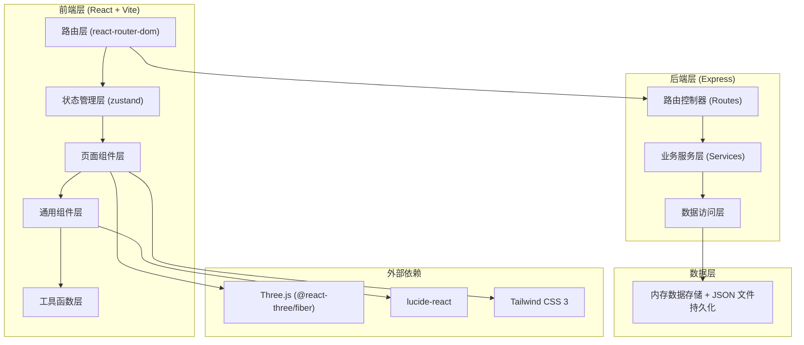
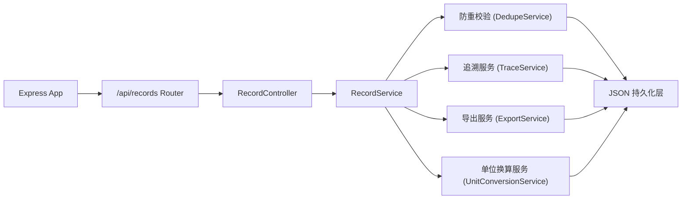
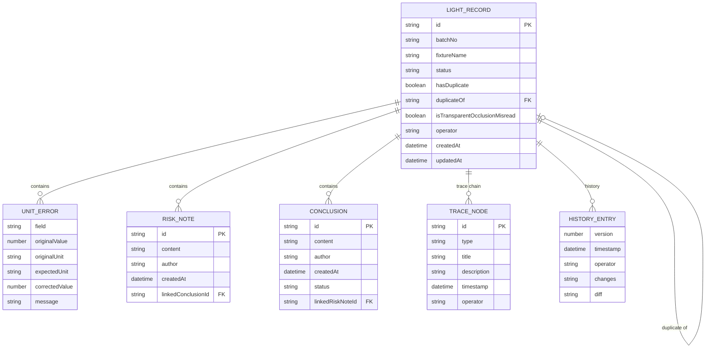

## 1. 架构设计



## 2. 技术描述

- **前端**: React@18 + TypeScript + Vite + Tailwind CSS@3 + Zustand + react-router-dom + lucide-react + three + @react-three/fiber + @react-three/drei
- **初始化工具**: vite-init (react-express-ts 模板)
- **后端**: Express@4 + TypeScript (ESM)
- **数据存储**: 内存数据结构 + JSON 文件持久化（本地工作台，无需数据库）
- **图标**: lucide-react

## 3. 路由定义

| 路由 | 用途 |
|------|------|
| / | 重定向至剖切查看页（日常入口） |
| /records | 预演记录列表页 |
| /records/:id | 单条记录详情页（含修正、历史、追溯） |
| /section | 剖切查看页（日常入口） |
| /render-3d | 3D 渲染查看页 |
| /test | 重复导入测试场景 |

后端 API 路由前缀 `/api`：

| 路由 | 方法 | 用途 |
|------|------|------|
| /api/records | GET | 获取预演记录列表（支持过滤） |
| /api/records/:id | GET | 获取单条记录详情（含追溯链） |
| /api/records/:id | PUT | 修正记录（单位换算、备注、结论） |
| /api/records/:id/history | GET | 获取记录历史版本 |
| /api/records/import | POST | 导入记录（含防重校验） |
| /api/records/export | GET | 导出记录 CSV/JSON |
| /api/records/:id/trace | GET | 获取来源追溯链（透明遮挡误读验收用） |

## 4. API 类型定义

```typescript
// 单位类型
export type UnitType = 'meter' | 'feet' | 'lumen' | 'candela' | 'kelvin';

// 设备坐标
export interface DeviceCoord {
  fixtureId: string;
  x: number;
  y: number;
  z: number;
  unit: UnitType;
}

// 单位换算错误
export interface UnitError {
  field: string;
  originalValue: number;
  originalUnit: UnitType;
  expectedUnit: UnitType;
  correctedValue: number | null;
  message: string;
}

// 风险备注
export interface RiskNote {
  id: string;
  content: string;
  author: string;
  createdAt: string;
  linkedConclusionId: string | null;
}

// 最终结论
export interface Conclusion {
  id: string;
  content: string;
  author: string;
  createdAt: string;
  status: 'pending' | 'approved' | 'rejected';
  linkedRiskNoteId: string | null;
}

// 追溯节点
export interface TraceNode {
  id: string;
  type: 'source' | 'process' | 'result';
  title: string;
  description: string;
  timestamp: string;
  operator: string;
  metadata: Record<string, any>;
}

// 预演记录
export interface LightRecord {
  id: string;
  batchNo: string;
  fixtureName: string;
  coords: DeviceCoord;
  unitErrors: UnitError[];
  riskNotes: RiskNote[];
  conclusions: Conclusion[];
  traceChain: TraceNode[];
  hasDuplicate: boolean;
  duplicateOf: string | null;
  status: 'draft' | 'reviewing' | 'corrected' | 'finalized';
  createdAt: string;
  updatedAt: string;
  operator: string;
  isTransparentOcclusionMisread: boolean; // 验收用：透明遮挡误读标记
}

// 历史版本
export interface HistoryEntry {
  version: number;
  timestamp: string;
  operator: string;
  changes: Partial<LightRecord>;
  diff: string;
}
```

## 5. 后端架构



## 6. 数据模型

### 6.1 ER 图



### 6.2 初始 Mock 数据

包含 15 条预演记录，其中：
- 5 条含单位换算错误（米/英尺/流明混用）
- 3 条重复导入标记（黄色预警）
- 1 条透明遮挡误读记录（用于验收倒查）
- 完整追溯链（来源→处理→结果）
- 每条记录包含设备坐标、风险备注、最终结论
