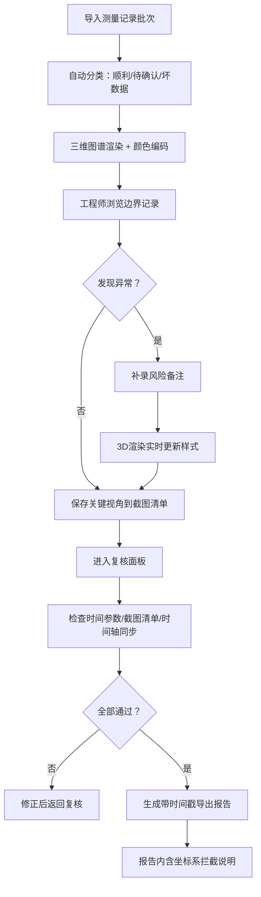

## 1. 产品概述

脑区连接三维图谱是面向神经科学研究与评审场景的专业可视化工具，用于对脑区连接测量记录进行三维呈现、边界复核、风险标注与报告导出。核心解决传统工具只展示顺利路径、不处理边界记录，以及评审时截图沟通缺乏上下文的问题。

- 目标用户：神经科学研究员、数据评审工程师、甲方项目审查人员
- 核心价值：让边界数据透明可查、让评审沟通有据可依、让导出报告自解释

## 2. 核心功能

### 2.1 用户角色

| 角色 | 使用场景 | 核心诉求 |
|------|----------|----------|
| 操作工程师 | 日常数据处理与复核 | 批量处理、边界检测、快速补录备注 |
| 评审人员 | 会议沟通与截图说明 | 视角保存、颜色明确、越界提示醒目 |
| 甲方审查 | 仅阅读导出报告 | 坐标系混用拦截原因可读、数据来源可追溯 |

### 2.2 功能模块

1. **三维图谱主视图**：脑区节点、连接线、坐标系网格、越界高亮
2. **测量记录列表**：顺利/待确认/坏数据分类展示，明细解释联动
3. **视角管理面板**：保存命名视角、截图清单、视角切换
4. **风险备注补录**：关联记录补录备注，实时更新3D渲染样式
5. **复核工作区**：时间参数检查、截图清单汇总、时间轴同步校验
6. **报告导出**：带时间戳文件名、坐标系拦截说明、完整可追溯信息

### 2.3 页面详情

| 页面名称 | 模块名称 | 功能描述 |
|----------|----------|----------|
| 主工作台 | 三维图谱视图 | 可旋转缩放的3D脑区连接，节点/连线颜色编码，越界闪烁提示 |
| 主工作台 | 右侧记录列表 | 按状态分类的测量记录，点击联动3D定位与左侧明细 |
| 主工作台 | 左侧明细解释 | 当前选中记录的完整参数、坐标系信息、风险备注、状态判定依据 |
| 主工作台 | 顶部视角工具栏 | 保存视角、命名视角、视角快速切换、截图捕获 |
| 主工作台 | 底部复核面板 | 时间参数一致性、截图清单、时间轴同步检查，红灯/黄灯/绿灯标识 |
| 导出对话框 | 导出配置 | 文件名自动带时间戳、包含运行标识、坐标系拦截说明嵌入 |

## 3. 核心流程

## 4. 用户界面设计

### 4.1 设计风格

- **主色调**：深靛蓝底（#0B1026）+ 青蓝高亮（#22D3EE）+ 琥珀警示（#F59E0B）+ 珊瑚红错误（#F87171）
- **辅助色**：翡翠绿正常（#34D399）、紫罗兰待确认（#A78BFA）
- **按钮风格**：扁平无边框、微圆角（6px）、hover 时轻微发光
- **字体**：标题使用 JetBrains Mono 等宽字体营造工程感，正文使用 Noto Sans SC
- **布局风格**：三栏式工作台（左明细、中3D、右记录列表），底部悬浮复核条
- **图标风格**：Lucide 线性图标，线条粗细统一 1.5px

### 4.2 页面设计概览

| 页面名称 | 模块名称 | UI 元素 |
|----------|----------|---------|
| 主工作台 | 三维图谱视图 | 深色背景带噪点纹理、半透明脑区球体、发光连接线、越界红色脉冲光晕、右上角颜色图例浮窗 |
| 主工作台 | 右侧记录列表 | 卡片式列表，左侧色条标识状态，hover 展开概要，选中时卡片高亮发光 |
| 主工作台 | 左侧明细解释 | 分区折叠面板：基本信息、坐标系、连接参数、风险备注、状态判定理由 |
| 主工作台 | 顶部工具栏 | 视角名称输入框、保存按钮、视角下拉、截图按钮、状态指示灯 |
| 主工作台 | 底部复核条 | 三栏横向排布（时间参数/截图清单/时间轴），每栏带状态灯与详情弹层 |
| 导出对话框 | 导出配置 | 文件名预览（自动带时间戳）、内容勾选清单、坐标系拦截说明预览 |

### 4.3 响应式

桌面端优先（≥1440px），保证三栏布局完整展示。中等屏幕（1024-1439px）记录列表可折叠为窄栏。移动端仅展示3D视图与记录列表的简易模式，不支持完整复核功能。

### 4.4 三维场景指引

- **环境**：纯深色背景 + 微弱径向渐变中心光晕，模拟医学影像观察环境
- **光照**：主光半球光（青蓝偏上）+ 补光点光源（暖白偏下），无阴影以保证线条清晰
- **相机**：PerspectiveCamera，初始距离 12，支持 OrbitControls 旋转缩放平移
- **构图**：脑区节点居中，连接线半透明发光，越界节点带红色脉冲 RingGeometry
- **交互**：悬停节点显示名称浮窗，点击节点/连线联动右侧记录与左侧明细
- **后处理**：Bloom 发光效果用于连接线和越界提示，不影响脑区节点本体
- **性能预算**：节点 ≤ 120 个，连线 ≤ 500 条，帧率 ≥ 45fps
