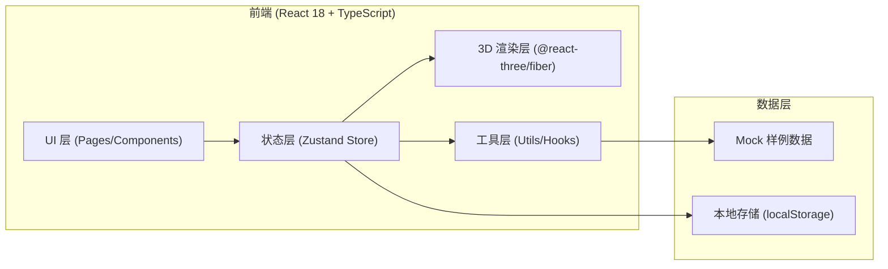

## 1. 架构设计



## 2. 技术说明

- 前端：React 18 + TypeScript 5 + Vite 5 + TailwindCSS 3
- 3D 渲染：three ^0.160.0 + @react-three/fiber ^8.15.0 + @react-three/drei ^9.92.0 + @react-three/postprocessing ^2.15.0
- 状态管理：zustand ^4.4.0
- 图标：lucide-react ^0.294.0
- 后端：无，纯前端 + Mock 数据 + localStorage 持久化
- 数据库：无，使用 localStorage 存储视角保存、风险备注、复核状态

## 3. 路由定义

| 路由 | 用途 |
|------|------|
| / | 主工作台：三维图谱 + 记录列表 + 明细 + 复核 |

## 4. 数据模型

### 4.1 核心类型定义

```typescript
// 脑区节点
interface BrainRegion {
  id: string;
  name: string;
  abbr: string;
  position: [number, number, number]; // x, y, z 归一化坐标
  lobe: string; // 所属脑叶
}

// 连接测量记录
interface ConnectionRecord {
  id: string;
  fromRegion: string; // BrainRegion.id
  toRegion: string;   // BrainRegion.id
  strength: number;   // 连接强度 0-1
  coordinateSystem: 'MNI' | 'Talairach' | 'Native';
  timestamp: string;  // ISO 时间戳
  acquisitionTime: string; // 采集时间点
  status: 'normal' | 'pending' | 'invalid'; // 顺利/待确认/坏数据
  outOfBounds: boolean; // 是否越界
  outOfBoundsReason?: string;
  riskNotes?: RiskNote[];
  parameters: {
    tractLength: number;
    faValue: number;
    mdValue: number;
    streamlineCount: number;
  };
  validationIssues?: ValidationIssue[];
}

// 风险备注
interface RiskNote {
  id: string;
  content: string;
  createdAt: string;
  author: string;
  severity: 'low' | 'medium' | 'high';
}

// 校验问题
interface ValidationIssue {
  type: 'coordinate_mismatch' | 'timestamp_desync' | 'parameter_outlier';
  severity: 'warning' | 'error';
  message: string;
  detail: string;
}

// 保存的视角
interface SavedViewpoint {
  id: string;
  name: string;
  cameraPosition: [number, number, number];
  cameraTarget: [number, number, number];
  createdAt: string;
  screenshot?: string; // base64
  relatedRecordIds?: string[];
}

// 复核状态
interface ReviewState {
  timeParamsConsistent: 'pass' | 'warning' | 'fail';
  screenshotChecklistComplete: 'pass' | 'warning' | 'fail';
  timelineSynchronized: 'pass' | 'warning' | 'fail';
  lastRunId: string;
  lastRunAt: string;
}

// 运行批次标识
interface RunIdentifier {
  id: string;
  startedAt: string;
  label: string;
}
```

### 4.2 Zustand Store 结构

```typescript
interface AppState {
  // 数据
  brainRegions: BrainRegion[];
  records: ConnectionRecord[];
  selectedRecordId: string | null;
  
  // 视角
  savedViewpoints: SavedViewpoint[];
  currentViewpointId: string | null;
  
  // 复核
  reviewState: ReviewState;
  currentRun: RunIdentifier;
  
  // UI
  showExportDialog: boolean;
  activeDetailTab: string;
  
  // Actions
  selectRecord: (id: string | null) => void;
  addRiskNote: (recordId: string, note: Omit<RiskNote, 'id' | 'createdAt'>) => void;
  saveViewpoint: (vp: Omit<SavedViewpoint, 'id' | 'createdAt'>) => void;
  deleteViewpoint: (id: string) => void;
  setReviewItem: (key: keyof ReviewState, value: any) => void;
  startNewRun: () => void;
  exportReport: () => Blob;
}
```

## 5. 项目目录结构

```
src/
├── components/
│   ├── BrainAtlas3D/          # 3D 图谱组件目录
│   │   ├── BrainAtlas3D.tsx   # 主 Canvas 容器
│   │   ├── BrainRegionNode.tsx # 脑区节点
│   │   ├── ConnectionLine.tsx # 连接线
│   │   ├── OutOfBoundsRing.tsx # 越界脉冲环
│   │   └── ColorLegend.tsx    # 颜色图例
│   ├── RecordList/            # 记录列表
│   │   ├── RecordList.tsx
│   │   └── RecordCard.tsx
│   ├── DetailPanel/           # 左侧明细
│   │   ├── DetailPanel.tsx
│   │   ├── Section.tsx
│   │   └── RiskNotesEditor.tsx
│   ├── ViewpointToolbar/      # 顶部视角工具栏
│   │   └── ViewpointToolbar.tsx
│   ├── ReviewBar/             # 底部复核条
│   │   ├── ReviewBar.tsx
│   │   └── ReviewItem.tsx
│   └── ExportDialog/          # 导出对话框
│       └── ExportDialog.tsx
├── hooks/
│   ├── useCameraState.ts      # 相机状态追踪
│   └── useScreenshot.ts       # 截图捕获
├── store/
│   └── useAppStore.ts         # Zustand Store
├── data/
│   ├── brainRegions.ts        # 脑区 Mock 数据
│   └── sampleRecords.ts       # 三种样例记录
├── utils/
│   ├── reportGenerator.ts     # 报告生成
│   ├── validation.ts          # 数据校验（坐标系/时间轴等）
│   └── timestamp.ts           # 时间戳工具
├── types/
│   └── index.ts               # 类型定义
├── App.tsx
├── main.tsx
└── index.css
```
