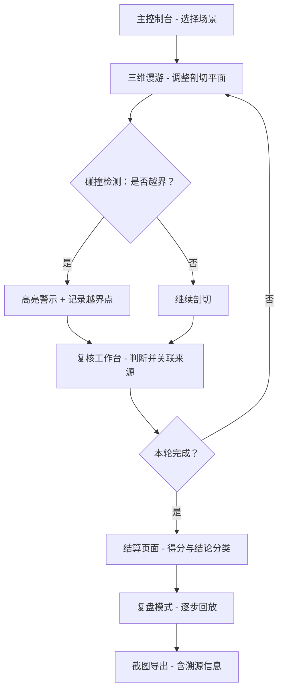

## 1. 产品概述

油气储层孔隙漫游是一款面向油气勘探领域物理团队的交互式浏览器培训工具。通过三维孔隙模型漫游与剖切面越界复核游戏化流程，帮助新同事快速理解"剖切面越界为什么要复核"这一核心经验。

- 目标用户：油气勘探团队新成员、物理评审会成员
- 解决问题：传统经验传帮带效率低、剖切面越界判断标准不统一、复盘需人工查表效率低
- 核心价值：将测量记录、三维模型、离群点漂浮纳入同一轮复核，评审可一键追溯来源材料

## 2. 核心功能

### 2.1 用户角色
| 角色 | 注册方式 | 核心权限 |
|------|----------|----------|
| 新同事 | 直接使用 | 完成漫游训练、查看复核规则、进行剖切面越界练习 |
| 物理老师 / 评审 | 直接使用 | 查看所有复核记录、导出截图、确认最终结论 |

### 2.2 功能模块
1. **主控制台页面**：游戏入口、场景选择、训练记录总览
2. **三维漫游场景**：油气储层孔隙模型、剖切平面实时调整、碰撞检测反馈
3. **复核工作台**：剖切面越界判断、来源材料追溯、离群点标记
4. **结算复盘页面**：本轮得分、错误复盘、结论分类（直接可用/需复核）
5. **截图导出中心**：带溯源信息的截图导出、原始记录行号/图片名备注

### 2.3 页面详情
| 页面名称 | 模块名称 | 功能描述 |
|----------|----------|----------|
| 主控制台 | 场景选择 | 选择训练场景（含重复导入测试场景）、查看历史记录 |
| 主控制台 | 训练仪表盘 | 显示已完成轮数、准确率、需复核率统计 |
| 三维漫游场景 | 孔隙模型展示 | 可旋转/缩放的三维储层孔隙模型，含孔隙结构与岩石基质 |
| 三维漫游场景 | 剖切控制 | X/Y/Z 三轴剖切平面拖动、实时剖面预览 |
| 三维漫游场景 | 碰撞检测 | 剖切平面越界时实时高亮警示、显示越界距离 |
| 复核工作台 | 越界判断面板 | 标记越界点、填写复核意见、关联原始测量记录 |
| 复核工作台 | 来源追溯面板 | 显示原始记录行号、图片名、来源备注，可跳转定位 |
| 复核工作台 | 离群点漂浮层 | 三维场景中高亮漂浮显示离群测量点，点击查看详情 |
| 结算复盘页面 | 得分结算 | 正确/错误统计、准确率计算、本轮处理结论概览 |
| 结算复盘页面 | 复盘时间线 | 按操作顺序回放每一步剖切判断，支持逐步复盘 |
| 结算复盘页面 | 结论分类展示 | 绿色=直接可用，黄色=需物理老师复核，红色=越界错误 |
| 截图导出中心 | 批量导出 | 一键导出带溯源水印的截图，含行号/图片名/备注 |
| 截图导出中心 | 导出配置 | 可选是否叠加剖切平面、离群点标记、溯源信息 |

## 3. 核心流程

用户从主控制台选择场景开始训练 → 进入三维漫游场景调整剖切平面 → 碰撞检测实时反馈越界状态 → 在复核工作台对每个越界点进行判断并关联来源 → 本轮完成后进入结算页面查看得分与结论分类 → 复盘模式逐步回放每一步操作 → 导出带溯源信息的截图供评审会使用。

## 4. 用户界面设计

### 4.1 设计风格
- **主色调**：深矿蓝 (#0F2744) 作为主背景，琥珀金 (#D4A853) 作为强调色，警示红 (#C94A4A) 标记越界
- **辅助色**：孔隙绿 (#2E7D6E) 标记安全区域，待复核黄 (#E8C547) 标记需人工判断
- **按钮风格**：微立体圆角按钮，按压有下沉反馈，主按钮用琥珀金渐变
- **字体**：标题使用 "Noto Serif SC"（衬线体，体现专业严谨），正文使用 "JetBrains Mono"（等宽字体，便于显示行号与测量数据）
- **布局风格**：三栏式工作台布局（左：3D场景 + 中：复核面板 + 右：来源追溯），卡片式信息层叠
- **图标风格**：使用 Lucide 线性图标，状态指示用几何色块（■●▲）

### 4.2 页面设计概览
| 页面名称 | 模块名称 | UI 元素 |
|----------|----------|---------|
| 主控制台 | 场景卡片 | 暗色玻璃拟态卡片，悬浮时琥珀金描边，显示场景名称/难度/已完成次数 |
| 三维漫游场景 | 3D 视口 | 深矿蓝渐变背景，孔隙半透明绿色渲染，剖切平面琥珀金色半透明 |
| 三维漫游场景 | 剖切控制条 | 底部三轨滑动条（X/Y/Z），实时数值显示，越界时轨道变红 |
| 复核工作台 | 判断卡片 | 左侧缩略剖切图，右侧判断按钮（直接可用/需复核/越界错误） |
| 复核工作台 | 来源追溯面板 | 等宽字体显示表格行号/图片名，点击高亮对应3D位置 |
| 结算复盘页面 | 结论分类条 | 三段式进度条（绿/黄/红），鼠标悬停显示具体条目列表 |
| 截图导出中心 | 导出预览 | 缩略图网格布局，每张图右下角显示溯源标签 |

### 4.3 响应式
桌面端优先（1280px+），采用三栏固定布局；平板端自动折叠为两栏；移动端保留核心3D视口与操作按钮。

### 4.4 3D 场景指引
- **环境**：深矿蓝渐变背景 + 微弱粒子漂浮（模拟储层环境），无 HDRI
- **光照**：三点布光（主光冷白 + 补光琥珀金 + 轮廓光蓝紫），孔隙内部自发光微绿
- **相机设置**：透视相机，初始角度俯角30°，支持轨道控制器（OrbitControls）自由旋转缩放
- **构图**：孔隙模型居中，剖切平面浮动在模型上半部分，离群点用发光球体标记在模型外围
- **交互与动画**：剖切平面拖动时有吸附反馈，越界时边框脉冲红色发光，离群点缓慢上下漂浮
- **后处理**：Bloom 发光（越界警示与离群点），轻微噪点增加工业质感
- **性能**：单场景三角面控制在 20 万以内，使用 InstancedMesh 渲染大量孔隙
