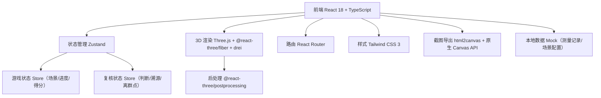
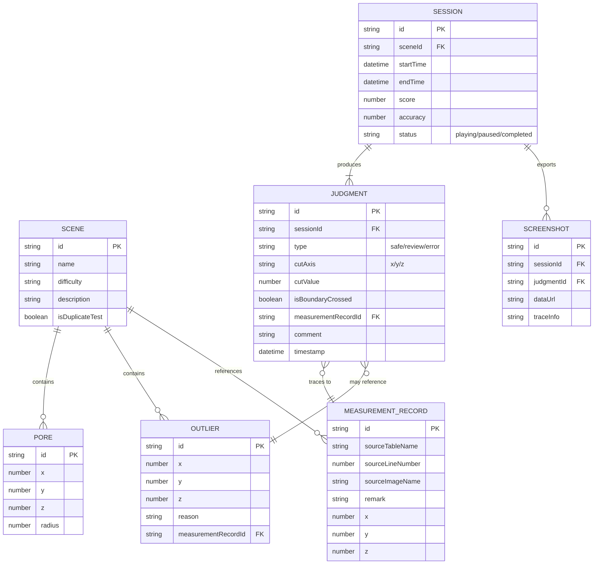

## 1. 架构设计

## 2. 技术描述

- **前端框架**：React@18 + TypeScript + Vite
- **初始化工具**：vite-init（react-ts 模板，内置 react-router-dom、tailwindcss、zustand）
- **3D 技术栈**：three@0.160 + @react-three/fiber@8 + @react-three/drei@9 + @react-three/postprocessing@2
- **状态管理**：zustand（分两个 store：游戏流程状态 + 复核数据状态）
- **样式方案**：tailwindcss@3 + CSS 变量（主题色/发光效果）
- **图标库**：lucide-react
- **截图导出**：原生 Canvas API（从 Three.js renderer.domElement 直接导出），叠加溯源水印
- **后端**：无后端，纯前端 Mock 数据
- **数据存储**：localStorage 持久化训练进度

## 3. 路由定义

| 路由 | 用途 |
|------|------|
| / | 主控制台（场景选择 + 训练仪表盘） |
| /game/:sceneId | 三维漫游 + 复核工作台（核心游戏场景） |
| /result/:sessionId | 结算复盘页面（得分 + 结论分类 + 时间线复盘） |
| /export/:sessionId | 截图导出中心 |

## 4. 数据模型

### 4.1 数据模型定义

### 4.2 Mock 数据说明

所有数据使用 TypeScript 类型定义 + Mock 工厂函数生成，包含：
- 3 个训练场景（其中 1 个为重复导入测试场景）
- 每个场景 50-80 个孔隙、3-5 个离群点
- 每个场景关联 20-30 条测量记录（含来源表名/行号/图片名/备注）
- 重复导入测试场景故意包含 2 组相同 ID 的测量记录，用于验证去重逻辑

## 5. 核心模块划分

| 模块路径 | 职责 |
|----------|------|
| src/stores/gameStore.ts | 游戏流程状态（开始/暂停/重开、当前场景、计时器） |
| src/stores/reviewStore.ts | 复核数据状态（判断记录、溯源关联、离群点状态） |
| src/components/three/ | 3D 场景子组件（PoreModel、CutPlane、OutlierLayer、CollisionDetector） |
| src/components/ui/ | 通用 UI 组件（GameControls、SourceTracePanel、JudgmentCard、ExportCard） |
| src/pages/Dashboard.tsx | 主控制台页面 |
| src/pages/GameScene.tsx | 三维漫游 + 复核工作台页面 |
| src/pages/Result.tsx | 结算复盘页面 |
| src/pages/ExportCenter.tsx | 截图导出中心 |
| src/data/mock/ | Mock 场景与测量记录数据 |
| src/utils/collision.ts | 碰撞检测与越界计算工具函数 |
| src/utils/export.ts | 截图导出与溯源水印叠加工具 |
