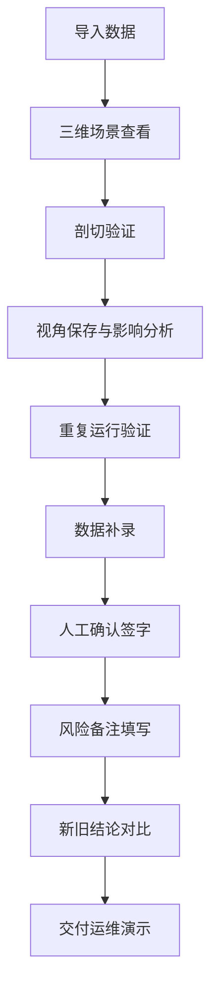

## 1. 产品概述

面向水利工程运维的船闸水位三维可视化演示系统，将三维模型、设备坐标、异常检测结论进行直观联动展示，帮助仿真工程师向运维组清晰传递水位异常信息和风险评估结果。

- 目标用户：仿真工程师、运维组、技术培训讲师
- 核心价值：用"能说人话"的三维可视化替代传统数据报表，降低技术门槛，提升沟通效率

## 2. 核心功能

### 2.1 用户角色

| 角色 | 使用方式 | 核心需求 |
|------|----------|----------|
| 仿真工程师 | 数据录入、复核、结论生成 | 准确展示异常、可追溯、便于复核 |
| 运维组 | 查看演示、理解结论 | 直观易懂、风险清晰、可操作建议 |
| 培训讲师 | 教学演示 | 案例典型、讲解辅助、互动性强 |

### 2.2 功能模块

1. **主演示页面**：三维船闸场景、水位动态展示、设备坐标标注、异常结果联动
2. **剖切查看面板**：多平面剖切、剖面图对比、点云切片显示、模型重叠校验
3. **视角管理面板**：视角保存/加载、视角切换对比、视角丢失异常记录
4. **复核流程面板**：重复运行验证、数据补录、人工确认签字、结论生成
5. **风险对比面板**：新旧结论并排对比、风险备注修改历史、影响范围可视化
6. **边界案例库**：相机视角丢失、离群点漂浮等典型边界场景（2-3个真实案例）

### 2.3 页面详情

| 页面名称 | 模块名称 | 功能描述 |
|----------|----------|----------|
| 主演示页面 | 三维船闸场景 | 可交互的3D船闸模型，支持水位动态升降、设备坐标点高亮、异常区域标记 |
| 主演示页面 | 智能解说栏 | 每个数据旁边配1-2句通俗解释，工程师可直接用于讲解 |
| 剖切查看面板 | 多平面剖切 | X/Y/Z三轴任意平面剖切，剖切后同步显示2D剖面图 |
| 剖切查看面板 | 前后对比 | 剖切前与剖切后结果并排展示，差异高亮标注 |
| 视角管理面板 | 视角保存 | 一键保存当前相机视角，支持命名和备注 |
| 视角管理面板 | 视角影响分析 | 切换视角时实时提示判断结果变化，避免视角偏差导致误判 |
| 复核流程面板 | 重复运行 | 一键重复执行仿真计算，结果对比展示 |
| 复核流程面板 | 数据补录 | 缺失数据手动录入，记录补录来源和时间 |
| 复核流程面板 | 人工确认 | 工程师签字确认，记录复核时间和人员 |
| 风险对比面板 | 新旧并排对比 | 修改风险备注后，左侧旧结论右侧新结论同步显示 |
| 风险对比面板 | 影响范围标注 | 自动高亮受备注修改影响的结论项 |
| 边界案例库 | 典型案例 | 相机视角丢失、离群点漂浮等2-3个真实案例，每个都实际改变检测结果 |

## 3. 核心流程

仿真工程师完成一轮水位分析后，通过以下流程向运维组交付演示：
1. 导入仿真数据和设备坐标
2. 在三维场景中确认水位状态和异常区域
3. 执行剖切查看，验证内部结构异常
4. 保存关键视角，检查视角变化对结论的影响
5. 执行复核流程：重复运行 → 补录缺失数据 → 人工确认
6. 填写风险备注，对比新旧结论差异
7. 生成可交付的演示文件，附带解说文字

## 4. 用户界面设计

### 4.1 设计风格
- **主色调**：深蓝工业风（#0A1628 背景）+ 水青色（#00D4FF 高亮）+ 琥珀警示色（#FF8C00）
- **辅助色**：钢灰色系用于设备和结构，水位使用半透明蓝色渐变
- **按钮风格**：工业风立体按钮，圆角4px，悬浮有微光效果
- **字体**：标题使用 Noto Sans SC Bold，正文使用 Noto Sans SC Regular，数据使用 JetBrains Mono
- **布局**：左侧三维主场景（70%）+ 右侧信息面板（30%），顶部工具条，底部解说栏
- **图标**：使用 lucide-react 线性图标，配合水流动效元素

### 4.2 页面设计概览

| 页面名称 | 模块名称 | UI元素 |
|----------|----------|--------|
| 主演示页面 | 三维场景 | 深蓝色雾气环境、定向光源模拟日光、水面反射、设备金属质感、异常区域红色脉冲光环 |
| 主演示页面 | 解说栏 | 深色半透明卡片、左侧图标、右侧文字、重要数据高亮色块、逐句淡入动画 |
| 剖切查看面板 | 剖切控制 | 三轴滑块、平面颜色预览、剖切深度数字输入、实时剖面图缩略图 |
| 视角管理面板 | 视角列表 | 卡片式视角缩略图、选中态边框高亮、视角名称、影响等级徽章 |
| 复核流程面板 | 步骤指示器 | 横向三步进度条、已完成绿色勾选、进行中蓝色脉冲、待执行灰色 |
| 风险对比面板 | 双栏对比 | 中间可拖动分隔线、左侧旧数据灰色调、右侧新数据亮色调、差异行黄色背景 |

### 4.3 响应式
- 桌面端优先：最小分辨率 1440×900
- 面板可折叠：右侧面板可收起为图标栏，扩大三维场景可视区域
- 触控优化：滑块和按钮尺寸适配平板触控操作

### 4.4 3D场景指引
- **环境**：深蓝色雾气工业环境，HDRI模拟阴天散射光，水面有动态波纹
- **光照**：主光源45°斜射模拟日光，辅助光提亮设备细节，水面使用反射探针
- **相机**：初始45°俯视全景视角，支持轨道控制、平移、缩放，焦点锁定船闸中心
- **构图**：船闸居中偏左，右侧预留面板空间，水位线处于视觉黄金分割位置
- **交互**：鼠标悬停设备显示坐标浮窗，点击异常区域展开详情，水位支持拖拽调节
- **后处理**：Bloom效果增强水位发光，轻微景深突出焦点，SSAO增强结构立体感
- **性能预算**：模型面数控制在10万以内，帧率稳定45fps以上
