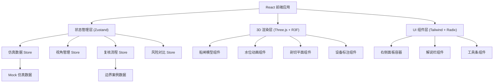

## 1. 架构设计



## 2. 技术描述

- **前端框架**：React@18 + TypeScript + Vite
- **3D渲染**：three@^0.160.0 + @react-three/fiber@^8.15.0 + @react-three/drei@^9.92.0 + @react-three/postprocessing@^2.15.0
- **样式方案**：tailwindcss@^3.4.0 + @tailwindcss/forms
- **状态管理**：zustand@^4.4.0
- **UI组件**：lucide-react@^0.294.0 + @radix-ui/react-slot
- **后端**：无后端，纯前端 Mock 数据驱动
- **数据持久化**：localStorage 保存视角、复核记录

## 3. 路由定义

| 路由 | 用途 |
|------|------|
| / | 船闸水位三维演示主页面（单页应用，所有功能集成在主页） |

## 4. 数据模型

### 4.1 核心数据类型定义

```typescript
interface DeviceCoord {
  id: string;
  name: string;
  type: 'sensor' | 'valve' | 'pump' | 'gauge';
  position: [number, number, number];
  status: 'normal' | 'warning' | 'error';
  value?: number;
  unit?: string;
}

interface WaterLevelState {
  currentLevel: number;
  targetLevel: number;
  maxLevel: number;
  minLevel: number;
  upstreamLevel: number;
  downstreamLevel: number;
  flowRate: number;
}

interface CameraView {
  id: string;
  name: string;
  description: string;
  position: [number, number, number];
  target: [number, number, number];
  impactLevel: 'none' | 'low' | 'medium' | 'high';
  impactNote: string;
  createdAt: number;
}

interface AnomalyConclusion {
  id: string;
  title: string;
  description: string;
  explanation: string;
  severity: 'info' | 'warning' | 'danger';
  affectedDevices: string[];
  location?: [number, number, number];
  verified: boolean;
}

interface ReviewRecord {
  step: 'repeat' | 'supplement' | 'confirm';
  completed: boolean;
  timestamp?: number;
  operator?: string;
  note?: string;
  supplementData?: Record<string, unknown>;
}

interface RiskRemark {
  id: string;
  content: string;
  modifiedAt: number;
  modifier: string;
  previousVersion?: RiskRemark;
  impactedConclusions: string[];
}

interface SectionPlane {
  axis: 'x' | 'y' | 'z';
  position: number;
  enabled: boolean;
  invert: boolean;
}

interface BoundaryCase {
  id: string;
  name: string;
  description: string;
  category: 'camera_loss' | 'outlier_float' | 'data_gap';
  beforeState: {
    waterLevel: WaterLevelState;
    anomalies: AnomalyConclusion[];
  };
  afterState: {
    waterLevel: WaterLevelState;
    anomalies: AnomalyConclusion[];
  };
  impactExplanation: string;
}
```

### 4.2 Mock 数据文件结构

```
src/data/
  ├── devices.ts          # 设备坐标数据
  ├── waterLevel.ts       # 水位状态数据
  ├── anomalies.ts        # 异常结论数据
  ├── views.ts            # 预设视角数据
  ├── boundaryCases.ts    # 边界案例数据
  └── explanations.ts     # 解说文案数据
```

## 5. 组件结构

```
src/
  ├── components/
  │   ├── scene/
  │   │   ├── LockModel.tsx          # 船闸主体模型
  │   │   ├── WaterSurface.tsx       # 水面对象
  │   │   ├── DeviceMarkers.tsx      # 设备标注点
  │   │   ├── AnomalyZones.tsx       # 异常区域高亮
  │   │   ├── SectionPlanes.tsx      # 剖切平面
  │   │   ├── PointCloudSlice.tsx    # 点云切片
  │   │   └── SceneLighting.tsx      # 场景光照
  │   ├── panels/
  │   │   ├── RightPanel.tsx         # 右侧面板容器
  │   │   ├── SectionPanel.tsx       # 剖切查看面板
  │   │   ├── ViewPanel.tsx          # 视角管理面板
  │   │   ├── ReviewPanel.tsx        # 复核流程面板
  │   │   └── RiskComparePanel.tsx   # 风险对比面板
  │   ├── common/
  │   │   ├── Toolbar.tsx            # 顶部工具条
  │   │   ├── ExplanationBar.tsx     # 底部解说栏
  │   │   ├── StatusBadge.tsx        # 状态徽章
  │   │   └── SectionThumbnail.tsx   # 剖面缩略图
  │   └── boundary/
  │       ├── CaseCard.tsx           # 边界案例卡片
  │       └── CaseCompare.tsx        # 案例前后对比
  ├── stores/
  │   ├── useSceneStore.ts           # 3D场景状态
  │   ├── useReviewStore.ts          # 复核流程状态
  │   └── useRiskStore.ts            # 风险对比状态
  ├── hooks/
  │   ├── useCameraController.ts     # 相机控制钩子
  │   ├── useSectionCut.ts           # 剖切控制钩子
  │   └── useWaterAnimation.ts       # 水位动画钩子
  ├── pages/
  │   └── MainPage.tsx               # 主页面
  └── App.tsx
```

## 6. 核心交互流程

1. **三维场景交互**：OrbitControls 控制相机，鼠标悬停设备显示 Tooltip，点击异常区域切换面板
2. **剖切控制**：滑块调整剖切平面位置，实时更新 clippingPlanes，右侧同步显示 2D 剖面图
3. **视角保存**：捕获当前相机 position/target，计算与标准视角的偏差，生成影响等级提示
4. **复核流程**：三步状态机（repeat → supplement → confirm），每步完成后持久化到 localStorage
5. **风险对比**：双状态快照对比，diff 算法标记差异项，高亮显示受影响结论
