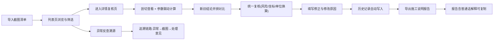

## 1. 产品概述

"数据库锁等待拓扑"本地 Web 工作台，服务于舞台统筹岗位日常施工交底场景。核心解决截图清单导入后，模型重叠复核、参数单位换算校验、风险备注标注、施工说明导出、历史追溯等一整套闭环流程。确保界面剖切查看、报告导出共用同一批处理记录，新旧结论可并排对比，报告输出含普通话通俗解释便于直接转发同事。

## 2. 核心功能

### 2.1 用户角色

| 角色 | 注册方式 | 核心权限 |
|------|----------|----------|
| 舞台统筹 | 本地工作台免登录 | 导入清单、复核参数、修正结论、导出报告、查看历史 |
| 复核员（同岗） | 本地工作台免登录 | 复核通过/驳回、填写复核意见、追溯变更记录 |

### 2.2 功能模块

1. **截图清单列表页**：批量导入、状态筛选、异常溯源入口、导出操作
2. **详情复核页**：剖切查看、参数联动、新旧结论并排对比、统一复核区
3. **修正面板**：风险备注、设备坐标修正、单位换算纠错、修改原因录入
4. **历史追溯页**：版本时间线、操作人/时间/原因、变更差异对比
5. **报告导出**：结构化施工说明、普通话解释段落、可复制文本、PDF/Markdown 下载

### 2.3 页面详情

| 页面名称 | 模块名称 | 功能描述 |
|----------|----------|----------|
| 截图清单列表页 | 顶部工具栏 | 批量导入按钮、状态筛选标签、搜索框、导出报告入口 |
| 截图清单列表页 | 清单表格 | 缩略图、编号、设备名称、复核状态、风险等级、最后操作人/时间、操作列 |
| 截图清单列表页 | 异常溯源面板 | 选中异常行后右侧展开，关联截图、处理意见、历史链路 |
| 详情复核页 | 左侧剖切查看区 | 截图放大、剖切标尺、坐标标注、参数热区联动 |
| 详情复核页 | 中间参数联动区 | 设备坐标、尺寸参数、单位换算结果实时联动计算 |
| 详情复核页 | 右侧新旧对比区 | 旧结论与新修正并排显示、差异高亮 |
| 详情复核页 | 底部统一复核区 | 风险备注、设备坐标、单位换算同一轮提交 |
| 修正面板 | 修正表单 | 字段级修改、修改原因必填、修改人自动记录 |
| 历史追溯页 | 时间线 | 每次修改时间、操作人、原因的纵向时间轴 |
| 历史追溯页 | 差异对比 | 相邻版本字段级 Diff 高亮 |
| 历史追溯页 | 溯源链路 | 从异常反查至截图清单和处理意见的完整链路图 |
| 报告导出页 | 预览区 | 结构化施工说明实时预览 |
| 报告导出页 | 普通话解释 | 自动生成可直接复制给同事的通俗解释段落 |
| 报告导出页 | 下载区 | Markdown/PDF 两种格式下载 |

## 3. 核心流程

## 4. 用户界面设计

### 4.1 设计风格

- 主色：深工业蓝 `#1e3a5f`，辅以警示橙 `#f97316` 标记风险，成功绿 `#10b981` 标记复核通过
- 中性底色：炭灰 `#111827` 背景 + 石板灰卡片，营造工程审查的专业严谨感
- 字体：显示标题用 `JetBrains Mono` 等宽字体（工程参数对齐感），正文用 `Noto Sans SC`
- 按钮：直角微倒角，高度 36px，主按钮深色填充 + 橙色 hover 描边
- 布局：三栏错落工作台布局（左剖切/中参数/右对比 + 底部复核条），支持横向滚动
- 图标：Lucide 线性图标，尺寸统一 18px，状态色跟随语义
- 动效：数据刷新用数字滚动、参数联动用字段高亮脉冲、历史展开用纵向滑入

### 4.2 页面设计概述

| 页面名称 | 模块名称 | UI 元素 |
|----------|----------|---------|
| 截图清单列表页 | 顶部工具栏 | 深色导航栏、橙色导入按钮、胶囊筛选标签、输入框配搜索图标 |
| 截图清单列表页 | 清单表格 | 斑马行、风险等级彩色徽章、状态 Pill、操作列图标按钮 |
| 详情复核页 | 剖切查看区 | 深色画布背景、截图居中、剖切可拖动标尺、坐标悬浮提示 |
| 详情复核页 | 参数联动区 | 参数卡片网格、联动字段橙色脉冲、换算公式小字展示 |
| 详情复核页 | 新旧对比区 | 左右双栏、旧结论半透明灰、新结论高亮绿边框、差异行黄色背景 |
| 详情复核页 | 统一复核区 | 固定底部横条、三个复核卡片并排、橙色提交按钮 |
| 历史追溯页 | 时间线 | 左侧竖线时间轴、节点圆形标记、右侧卡片含操作人头像和原因 |
| 历史追溯页 | 差异对比 | 行内 Diff、删除红色删除线、新增绿色下划线 |
| 报告导出页 | 预览区 | 白色纸张质感卡片、结构化标题层级、段落间距舒适 |
| 报告导出页 | 普通话解释 | 浅蓝背景 Callout、复制按钮、文字可直接选中 |

### 4.3 响应式

- 桌面优先设计，最小宽度 1280px
- 平板端（≥768px）：三栏变两栏，底部复核区保持固定
- 移动端：参数与对比区折叠为手风琴，剖切查看区缩放至全屏

### 4.4 3D 场景指引

本项目不涉及 3D 场景。
