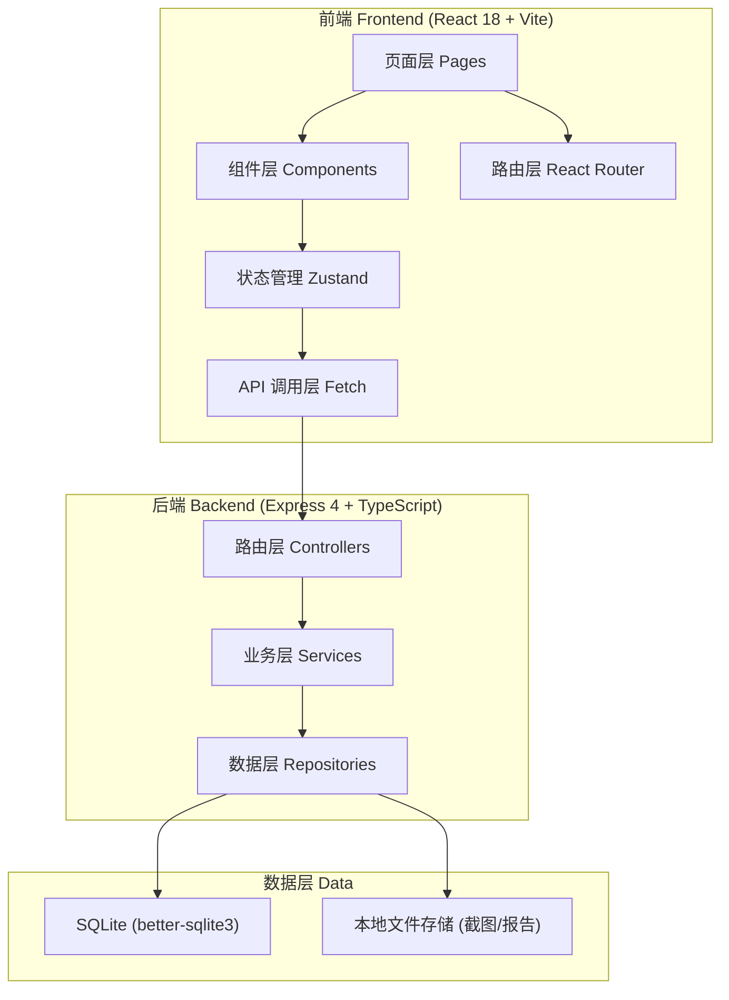
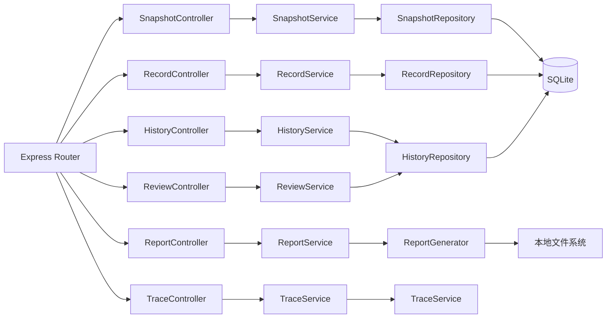
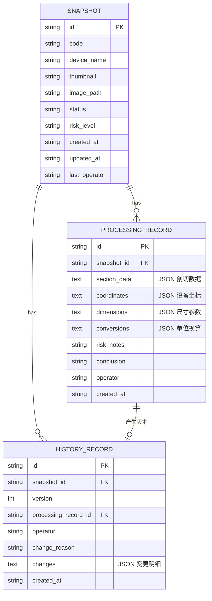

## 1. 架构设计



## 2. 技术说明

- 前端：React@18 + TypeScript + Vite + TailwindCSS@3 + Zustand + React Router DOM + lucide-react
- 后端：Express@4 + TypeScript + better-sqlite3
- 初始化工具：vite-init (react-express-ts 模板)
- 数据库：SQLite（本地文件存储，便于工作台独立部署）
- 文件存储：本地 `uploads/` 目录存放截图、`exports/` 目录存放导出报告

## 3. 路由定义

| 前端路由 | 页面名称 | 用途 |
|----------|----------|------|
| `/` | 截图清单列表页 | 浏览、筛选、导入、异常溯源入口 |
| `/snapshot/:id` | 详情复核页 | 剖切查看、参数联动、新旧对比、统一复核 |
| `/snapshot/:id/history` | 历史追溯页 | 时间线、差异对比、溯源链路 |
| `/report/:id` | 报告导出页 | 施工说明预览、普通话解释、下载 |

## 4. API 定义

```typescript
// 截图清单
interface Snapshot {
  id: string;
  code: string;           // 编号
  deviceName: string;     // 设备名称
  thumbnail: string;      // 缩略图路径
  imagePath: string;      // 原图路径
  status: 'pending' | 'reviewing' | 'approved' | 'rejected';
  riskLevel: 'low' | 'medium' | 'high' | 'critical';
  createdAt: string;
  updatedAt: string;
  lastOperator: string;
}

// 处理记录（剖切/参数/换算共用）
interface ProcessingRecord {
  id: string;
  snapshotId: string;
  // 剖切数据
  sectionData: {
    cutLine: { x1: number; y1: number; x2: number; y2: number };
    measurements: Array<{ label: string; value: number; unit: string }>;
  };
  // 设备坐标
  coordinates: {
    x: number;
    y: number;
    z: number;
    unit: string;
  };
  // 尺寸参数
  dimensions: {
    width: number;
    height: number;
    depth: number;
    unit: string;
  };
  // 单位换算结果
  conversions: Array<{
    fromUnit: string;
    toUnit: string;
    value: number;
    converted: number;
    formula: string;
  }>;
  // 风险备注
  riskNotes: string;
  // 结论
  conclusion: string;
  operator: string;
  createdAt: string;
}

// 历史版本
interface HistoryRecord {
  id: string;
  snapshotId: string;
  version: number;
  processingRecordId: string;
  operator: string;
  changeReason: string;
  changes: Array<{
    field: string;
    oldValue: any;
    newValue: any;
  }>;
  createdAt: string;
}

// 复核提交
interface ReviewSubmission {
  snapshotId: string;
  processingRecord: ProcessingRecord;
  riskApproved: boolean;
  coordinateApproved: boolean;
  conversionApproved: boolean;
  reviewComment: string;
  changeReason: string;
  operator: string;
}

// 报告导出
interface ReportData {
  snapshot: Snapshot;
  latestRecord: ProcessingRecord;
  plainExplanation: string;  // 普通话解释
  historySummary: Array<{ version: number; operator: string; reason: string; date: string }>;
}
```

### 后端 REST API 端点

| 方法 | 路径 | 用途 |
|------|------|------|
| GET | `/api/snapshots` | 获取截图清单列表（支持筛选、搜索） |
| GET | `/api/snapshots/:id` | 获取单条截图详情 |
| POST | `/api/snapshots/import` | 批量导入截图清单（multipart/form-data） |
| GET | `/api/snapshots/:id/records` | 获取处理记录列表 |
| POST | `/api/snapshots/:id/records` | 创建/更新处理记录 |
| GET | `/api/snapshots/:id/history` | 获取历史版本时间线 |
| GET | `/api/history/:recordId/diff` | 获取相邻版本差异对比 |
| POST | `/api/review` | 提交统一复核（风险/坐标/换算） |
| GET | `/api/snapshots/:id/report` | 获取报告数据（含普通话解释） |
| GET | `/api/snapshots/:id/report/download?format=md\|pdf` | 下载报告文件 |
| GET | `/api/snapshots/:id/trace?anomalyId=xxx` | 异常反查溯源链路 |

## 5. 服务端架构图



## 6. 数据模型

### 6.1 数据模型定义



### 6.2 数据定义语言（SQLite DDL）

```sql
CREATE TABLE IF NOT EXISTS snapshots (
  id TEXT PRIMARY KEY,
  code TEXT NOT NULL UNIQUE,
  device_name TEXT NOT NULL,
  thumbnail TEXT,
  image_path TEXT,
  status TEXT NOT NULL DEFAULT 'pending',
  risk_level TEXT NOT NULL DEFAULT 'low',
  created_at TEXT NOT NULL,
  updated_at TEXT NOT NULL,
  last_operator TEXT NOT NULL
);

CREATE TABLE IF NOT EXISTS processing_records (
  id TEXT PRIMARY KEY,
  snapshot_id TEXT NOT NULL,
  section_data TEXT,
  coordinates TEXT,
  dimensions TEXT,
  conversions TEXT,
  risk_notes TEXT,
  conclusion TEXT,
  operator TEXT NOT NULL,
  created_at TEXT NOT NULL,
  FOREIGN KEY (snapshot_id) REFERENCES snapshots(id)
);

CREATE TABLE IF NOT EXISTS history_records (
  id TEXT PRIMARY KEY,
  snapshot_id TEXT NOT NULL,
  version INTEGER NOT NULL,
  processing_record_id TEXT NOT NULL,
  operator TEXT NOT NULL,
  change_reason TEXT NOT NULL,
  changes TEXT NOT NULL,
  created_at TEXT NOT NULL,
  FOREIGN KEY (snapshot_id) REFERENCES snapshots(id),
  FOREIGN KEY (processing_record_id) REFERENCES processing_records(id),
  UNIQUE(snapshot_id, version)
);

CREATE INDEX IF NOT EXISTS idx_snapshots_status ON snapshots(status);
CREATE INDEX IF NOT EXISTS idx_snapshots_risk ON snapshots(risk_level);
CREATE INDEX IF NOT EXISTS idx_records_snapshot ON processing_records(snapshot_id);
CREATE INDEX IF NOT EXISTS idx_history_snapshot ON history_records(snapshot_id);
```
