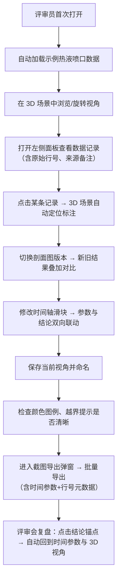

## 1. 产品概述

深海热液喷口场景评审工具是一款面向海洋地质/油气工程评审员的 3D 可视化专业协作平台，解决剖面图修改后新旧结果与评审报告"各说各话"的数据一致性难题，提供视角保存、颜色图例、越界提示、截图清单、时间参数回溯等评审必备功能。

- **核心用户**：工程评审员、讲解人、课前备课教师
- **核心价值**：评审记录全程可追溯，同一条数据不因坐标系混用或重复导入产生两份结论，截图与报告描述严格对应

## 2. 核心功能

### 2.1 用户角色

| 角色 | 使用场景 | 核心权限 |
|------|----------|----------|
| 工程评审员 | 日常复核剖面图、导出截图、在评审会演示 | 全部功能：视角保存、版本对比、数据编辑、结论标注 |
| 讲解人/教师 | 月底复盘、课前演示 | 视角加载、截图导出、时间轴回放 |

### 2.2 功能模块

1. **3D 渲染主场景**：海底地形、热液喷口粒子特效、剖面图切面、测量标注
2. **数据管理面板**：示例数据首次加载、版本历史（原始行号/图片名/来源备注）、坐标系去重校验
3. **评审协作面板**：时间轴+时间参数双向跳转、结论锚点回溯、截图清单与当前参数绑定
4. **导出与演示**：视角保存/加载、颜色图例浮窗、越界值高亮提示、批量截图导出

### 2.3 页面详情

| 页面名称 | 模块名称 | 功能描述 |
|----------|----------|----------|
| 3D 渲染主页 | 场景视口 | Three.js 深海环境，含海底地形隆起、黑烟囱热液柱、粒子上升效果，支持鼠标旋转/缩放/平移 |
| 3D 渲染主页 | 左侧数据面板 | 数据记录列表，每条显示来源表名+原始行号、坐标系标识、时间戳、结论摘要；支持点击高亮对应 3D 标注 |
| 3D 渲染主页 | 右侧评审面板 | 剖面图查看器（支持新旧版本叠加对比）、时间轴滑块（绑定时间参数）、结论编辑器（可插入参数锚点点击回溯） |
| 3D 渲染主页 | 顶部工具栏 | 视角保存/切换下拉框、颜色图例开关、越界提示总览、截图导出按钮 |
| 3D 渲染主页 | 底部状态栏 | 当前坐标系、选中记录行号、数据版本、异常计数 |
| 截图导出弹窗 | 截图清单 | 列出本轮复核所有截图，每张附带时间参数、视角名称、对应记录行号，支持批量导出为 PNG + JSON 元数据包 |

## 3. 核心流程

## 4. 用户界面设计

### 4.1 设计风格

- **主色调**：深海蓝 `#0A1628`（背景）、热液橙 `#FF6B35`（强调）、数据青 `#00D4AA`（辅助）
- **次色调**：警示红 `#FF4757`（越界）、版本金 `#FFD93D`（对比）
- **按钮风格**：直角切边、细边框、轻微悬浮发光（工业控制面板质感）
- **字体**：标题用 `Bricolage Grotesque` 几何工业风，正文用 `JetBrains Mono` 等宽字体保证行号对齐
- **布局**：三栏式主工作区（左数据 | 中 3D | 右评审），顶部工具栏 + 底部状态栏，全屏沉浸式深色模式
- **图标**：Lucide 线性图标，统一描边 1.5px，颜色与功能语义绑定

### 4.2 页面设计概览

| 页面名称 | 模块名称 | UI 元素 |
|----------|----------|---------|
| 3D 渲染主页 | 场景视口 | 深蓝色径向渐变背景、海底噪声纹理、热液粒子上升动画、剖面切面半透明高亮、鼠标悬停测量点弹出浮层 |
| 3D 渲染主页 | 左侧数据面板 | 暗色卡片列表，每卡顶部显示"来源表.xlsx#L42"行号标签，卡片底部版本徽章、坐标系标签、越界小红点 |
| 3D 渲染主页 | 右侧评审面板 | 剖面图分上下对比（上旧下新或左右叠加）、中间分界线带"V1→V2"标签、时间轴带刻度和参数气泡、结论编辑器富文本可插入锚点 |
| 3D 渲染主页 | 顶部工具栏 | 视角下拉菜单（带缩略图）、图例开关按钮、越界计数徽章、导出主按钮（橙底发光） |
| 截图导出弹窗 | 截图清单 | 缩略图网格 + 元数据表、每张图显示时间参数、视角名、行号，底部"批量导出"按钮 |

### 4.3 响应式

桌面端优先设计（≥1440px 三栏布局），≥1024px 折叠侧栏为抽屉，移动端保留 3D 视口+简化数据列表。

### 4.4 3D 场景指导

- **环境/HDRI**：深海蓝色雾效 + 微弱顶部光斑模拟水面透光，无外部 HDRI
- **光照设置**：两盏点光源模拟热液喷口橙光（`#FF6B35`，强度 1.5）+ 环境光（`#0A1628`，强度 0.3）
- **相机设置**：PerspectiveCamera fov=55，初始位置 (80, 60, 80) 看向 (0, 0, 0)，OrbitControls 启用阻尼
- **构图与焦点**：画面中心偏下放置 2-3 个黑烟囱喷口，海底地形用 Perlin 噪声生成起伏，剖面图用 ClipPlane 剖切
- **交互与动画**：热液粒子持续上升（ShaderMaterial 或 InstancedMesh）、剖面图拖动实时更新、视角切换带缓动过渡
- **后处理**：Bloom 泛光（热液橙光溢出）+ 轻微胶片颗粒增强深海质感
- **资源来源与性能**：全部程序化生成（无外部模型），粒子数 ≤5000，目标 60fps

