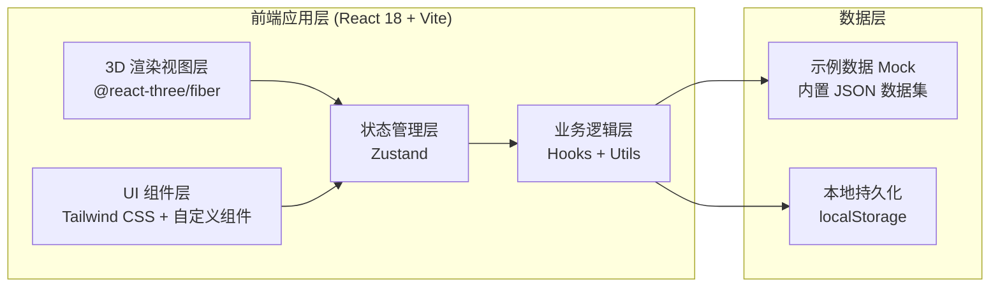
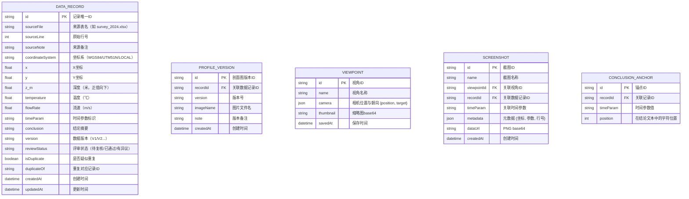

## 1. 架构设计



## 2. 技术说明

- **前端框架**：React@18 + TypeScript + Vite@5
- **初始化工具**：vite-init（react-ts 模板）
- **3D 渲染**：three@0.160 + @react-three/fiber@8 + @react-three/drei@9 + @react-three/postprocessing@2
- **样式方案**：tailwindcss@3 + 自定义 CSS Variables（设计令牌）
- **状态管理**：zustand@4（分模块：sceneStore / dataStore / reviewStore）
- **图标库**：lucide-react
- **后端**：无后端，纯前端，数据用内置 Mock + localStorage 持久化
- **数据库**：无数据库，使用 JSON 文件作为初始示例数据

## 3. 路由定义

| 路由 | 用途 |
|------|------|
| `/` | 主应用（3D 渲染 + 评审面板，单页应用唯一入口） |

## 4. 数据模型

### 4.1 数据模型定义



### 4.2 初始示例数据

首次打开自动注入 6-8 条深海热液喷口勘测记录，包含：
- 2 条 WGS84 坐标系数据
- 3 条 UTM51N 坐标系数据（含 1 条与 WGS84 实际同点的疑似重复）
- 2 条 LOCAL 局部坐标系数据
- 每条记录含 1-2 个剖面图版本（V1 旧结果、V2 评审员修改后的新结果）
- 预设 3 个保存视角：全景俯视、喷口近景、剖面侧视
- 预设越界值：至少 1 条温度/流速超出阈值，用于演示越界提示

## 5. 核心模块文件结构

```
src/
├── components/
│   ├── scene/              # 3D 场景相关
│   │   ├── HydrothermalScene.tsx    # 主场景容器
│   │   ├── Seafloor.tsx             # 海底地形（程序化生成）
│   │   ├── Vent.tsx                 # 单个热液喷口
│   │   ├── VentParticles.tsx        # 热液粒子系统
│   │   ├── SectionPlane.tsx         # 剖面切面
│   │   ├── DataMarker.tsx           # 数据标注点
│   │   └── SceneLights.tsx          # 灯光设置
│   ├── panels/             # 侧栏面板
│   │   ├── DataPanel.tsx            # 左侧数据记录列表
│   │   ├── ReviewPanel.tsx          # 右侧评审面板
│   │   ├── ProfileCompare.tsx       # 剖面图版本对比
│   │   ├── TimeAxis.tsx             # 时间轴+参数联动
│   │   └── ConclusionEditor.tsx     # 结论编辑器（锚点）
│   ├── toolbar/            # 顶部工具栏
│   │   ├── ViewpointMenu.tsx        # 视角保存/切换
│   │   ├── LegendToggle.tsx         # 颜色图例
│   │   ├── AlertBadge.tsx           # 越界提示徽章
│   │   └── ExportButton.tsx         # 截图导出入口
│   ├── modals/             # 弹窗
│   │   └── ScreenshotExportModal.tsx
│   └── common/             # 通用组件
│       ├── StatusBar.tsx            # 底部状态栏
│       └── DataCard.tsx             # 数据卡片
├── store/                # Zustand 状态
│   ├── sceneStore.ts            # 3D 场景状态（视角、选中点）
│   ├── dataStore.ts             # 数据记录（含去重逻辑）
│   └── reviewStore.ts           # 评审状态（时间轴、结论、截图）
├── hooks/                # 自定义 Hooks
│   ├── useCameraAnimation.ts     # 相机缓动动画
│   ├── useDuplicateCheck.ts      # 重复数据检测
│   └── useScreenshot.ts          # 截图捕获
├── utils/                # 工具函数
│   ├── noise.ts                 # Perlin 噪声（海底地形）
│   ├── coordinateTransform.ts   # 坐标系转换
│   └── exportUtils.ts           # 导出工具（PNG + JSON）
├── data/                 # Mock 示例数据
│   └── sampleRecords.ts
├── types/                # TypeScript 类型
│   └── index.ts
├── App.tsx
├── main.tsx
└── index.css
```

## 6. 关键技术决策

1. **3D 粒子方案**：使用 `@react-three/drei` 的 `<Points>` + 自定义 shader 实现热液柱上升效果，性能优先于真实感
2. **海底地形**：纯程序化生成（2D Perlin 噪声 + 顶点位移），无需加载外部模型资源
3. **坐标系去重**：基于坐标距离阈值（≤0.5m 视为同点）+ 时间参数匹配，自动标记疑似重复并提示合并
4. **结论锚点机制**：结论文本中用 `{{time:2024-03-15T10:00}}` 语法标记锚点，渲染为可点击链接，点击跳转时间轴并高亮对应记录
5. **截图元数据**：每张导出 PNG 嵌入 EXIF 或伴随同名 JSON，包含时间参数、视角名、来源表行号、坐标系、数据版本
6. **本地持久化**：评审员修改、视角保存、截图记录均写入 localStorage，刷新不丢失

