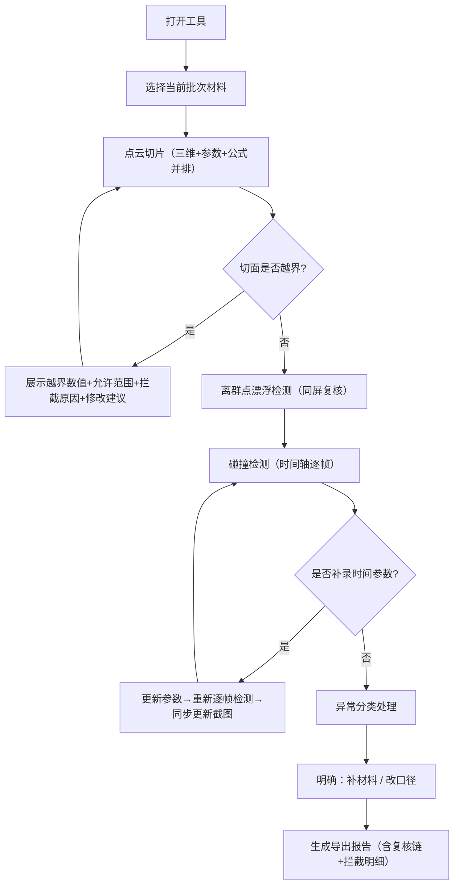

## 1. 产品概述

柔性机械臂避障训练系统是面向运维组的专业计算工具，而非评审文档。系统核心目标是让运维人员打开即用，快速处理点云切片、离群点漂浮检测与碰撞检测任务，所有公式、单位、适用范围和失败原因均在显著位置呈现。

- 目标用户：运维组、运维主管
- 核心价值：将专业的避障训练转化为日常可用工具，提供透明的计算逻辑、明确的异常处理指引、可复核的完整流程

## 2. 核心功能

### 2.1 用户角色

| 角色 | 说明 | 核心权限 |
|------|------|----------|
| 运维主管 | 审核避障训练结果 | 全部功能：点云切片、离群点检测、碰撞检测、复核、报告导出 |
| 运维人员 | 执行日常避障训练操作 | 数据录入、点云切片、离群点检测、碰撞检测、报告预览 |

### 2.2 功能模块

1. **工具主面板**：快速入口卡片，打开即用，点云切片/离群点漂浮/碰撞检测三大核心任务并列展示
2. **点云切片模块**：三维点云可视化、剖切面参数调整、切片计算（含公式/单位/适用范围/失败原因）、越界拦截解释
3. **离群点漂浮模块**：三维视图展示、离群点检测算法、明细解释面板（非仅靠颜色）、同一轮复核
4. **碰撞检测模块**：连续性检测（非一次性判断）、时间轴补录、截图导出联动更新
5. **异常处理中心**：分类异常展示、明确指引（补材料/改口径）、非单一红色数字
6. **报告导出模块**：完整复核链、剖切面越界拦截原因明细、可独立阅读

### 2.3 页面详情

| 页面名称 | 模块名称 | 功能描述 |
|-----------|-------------|---------------------|
| 工具主面板 | 任务入口卡 | 三大核心任务并列展示，当前批次状态一览，异常待处理高亮提示 |
| 工具主面板 | 计算信息条 | 公式速查、单位说明、适用范围速览（常驻顶部，非弹窗隐藏） |
| 点云切片 | 三维点云视图 | 可旋转/缩放点云模型，剖切面实时预览，旁边配参数明细解释面板 |
| 点云切片 | 切片参数面板 | 切面位置(mm)、法向量、厚度(mm)、间距；每项含公式、单位、范围、失败案例 |
| 点云切片 | 越界拦截解释 | 拦截时展示：越界数值、允许范围、为什么拦、怎么改 |
| 离群点漂浮 | 三维复核视图 | 三维模型、测量记录、离群点标记同一视图展示，旁边配每项离群点明细 |
| 离群点漂浮 | 离群点明细卡 | 每个离群点：编号、坐标(mm)、距离均值偏差(σ)、疑似原因、建议处理 |
| 碰撞检测 | 时间轴检测 | 非一次性判断，按时间序列(0s~Ts)逐帧检测，可补录时间参数，检测结果随参数实时更新 |
| 碰撞检测 | 截图导出联动 | 时间轴拖动到任一帧，截图同步更新，导出报告包含对应帧碰撞状态 |
| 异常处理中心 | 分类异常列表 | 按"缺数据"/"参数错"/"算法超限"分类，每条异常附：下一步是补材料还是改口径 |
| 报告导出 | 完整复核链 | 三维模型参数、测量记录、离群点处理记录、碰撞检测全过程，按同一轮复核组织 |

## 3. 核心流程

运维人员打开系统 → 选择当前批次材料 → 进入点云切片（三维视图+参数面板+公式说明并排）→ 系统实时计算，若越界则展示拦截原因和修改建议 → 确认切片后进入离群点漂浮检测（三维模型/测量记录/离群点同屏复核，每点有明细）→ 进入碰撞检测（时间轴逐帧，可补录时间参数，截图随帧更新）→ 异常分类处理（明确补材料/改口径）→ 生成导出报告（含所有拦截原因和复核链）

## 4. 用户界面设计

### 4.1 设计风格
- **主色调**：工业深蓝（#0F2B46）为基，警示橙（#E67E22）标注异常，通过绿（#27AE60）标识正常
- **辅助色**：中性灰系列（#2C3E50、#7F8C8D、#BDC3C7）承载文本和边框
- **按钮风格**：硬朗工业风，直角微圆角（2px），悬浮边框加粗
- **字体**：标题用 JetBrains Mono（等宽工业感），正文用 Noto Sans SC（清晰可读）
- **布局风格**：左右分栏（左操作/右三维视图+明细解释面板并排），信息密度高但层级清晰
- **图标**：lucide-react 线性图标，统一16px/20px尺寸

### 4.2 页面设计概览

| 页面名称 | 模块名称 | UI元素 |
|-----------|-------------|-------------|
| 工具主面板 | 任务入口卡 | 深蓝卡片+白字+状态徽章，悬停微抬升，异常橙色边框脉动 |
| 工具主面板 | 计算信息条 | 浅灰底固定顶部，三列：公式速查/单位说明/适用范围 |
| 点云切片 | 双栏布局 | 左40%参数面板（每项参数下附公式+单位+范围+失败案例），右60%三维视图+右侧200px明细解释 |
| 点云切片 | 越界拦截提示 | 嵌入参数面板的橙色卡片，非弹窗，含数值对比、原因、下一步 |
| 离群点漂浮 | 同屏复核视图 | 三维画布居中，右侧纵向排列离群点明细卡，每卡可点击高亮对应三维点 |
| 碰撞检测 | 时间轴控制 | 底部横向时间轴，帧节点可点击，拖动时右侧截图预览同步更新 |
| 异常处理中心 | 分类列表 | 三列卡片（缺数据/参数错/算法超限），每卡底部按钮：补材料 / 改口径 |
| 报告导出 | 复核链时间线 | 左侧时间线串起本批次所有操作，右侧对应截图和参数 |

### 4.3 响应式
- 桌面端优先（1440px及以上），核心操作依赖大屏
- 1024px~1440px：明细解释面板改为可折叠抽屉
- 1024px以下：提示建议使用桌面端，保留基础参数录入

### 4.4 三维视图指引
- **环境**：深色工业背景（#0A1628），微弱网格地面，无HDRI避免干扰
- **光照**：方向光+环境光组合，确保点云各角度清晰可见，无过曝阴影
- **相机**：默认等轴测视角，支持轨道控制、缩放、平移
- **交互**：点击离群点高亮+右侧明细滚动定位；拖动剖切面实时计算
- **后期**：轻微对比度增强，离群点外发光效果，切面半透明高亮
