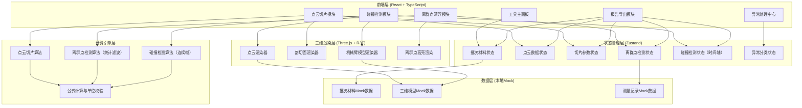
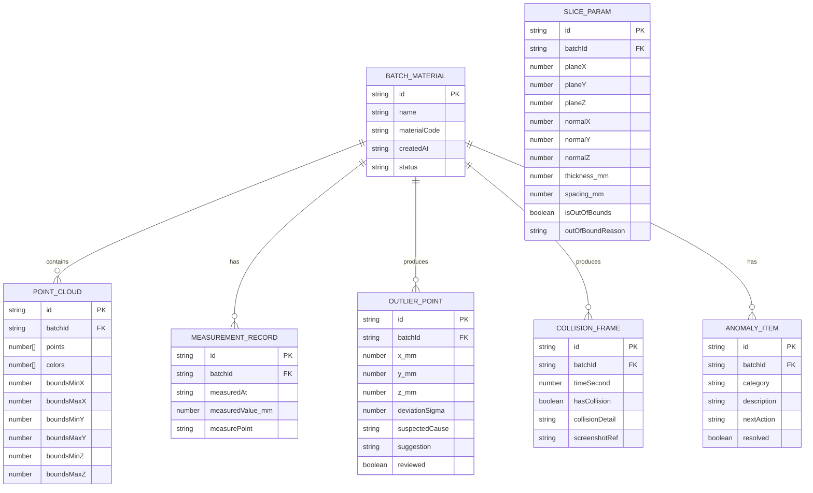

## 1. 架构设计



## 2. 技术描述

- **前端框架**：React@18 + TypeScript@5 + Vite@6
- **初始化工具**：vite-init
- **后端**：无后端，纯前端应用，数据使用本地Mock
- **三维渲染**：three@^0.160.0 + @react-three/fiber@^8.15.0 + @react-three/drei@^9.92.0
- **状态管理**：zustand@^4.4.0
- **样式方案**：tailwindcss@3
- **图标**：lucide-react@^0.294.0
- **报告导出**：html2canvas + jspdf（截图生成PDF报告）
- **图表**：recharts（碰撞检测时间轴趋势图）

## 3. 路由定义

| 路由 | 用途 |
|-------|---------|
| / | 工具主面板（默认页，三大任务入口+状态一览） |
| /slice | 点云切片处理页 |
| /outlier | 离群点漂浮检测页 |
| /collision | 碰撞检测页 |
| /anomaly | 异常处理中心 |
| /export | 报告导出预览页 |

## 4. 数据模型

### 4.1 核心数据模型



### 4.2 状态Store结构

```typescript
// 批次材料状态
interface BatchState {
  currentBatch: BatchMaterial | null;
  batchList: BatchMaterial[];
  selectBatch: (id: string) => void;
}

// 点云切片状态
interface SliceState {
  params: SliceParam;
  updateParam: (key: keyof SliceParam, value: number) => void;
  validateBounds: () => { valid: boolean; reason?: string };
}

// 离群点状态
interface OutlierState {
  points: OutlierPoint[];
  selectedPointId: string | null;
  toggleReview: (id: string) => void;
  selectPoint: (id: string | null) => void;
}

// 碰撞检测状态
interface CollisionState {
  frames: CollisionFrame[];
  currentTime: number;
  timeStep: number;
  totalDuration: number;
  setTime: (t: number) => void;
  updateDuration: (sec: number) => void;
  recomputeAllFrames: () => void;
}

// 异常状态
interface AnomalyState {
  items: AnomalyItem[];
  markResolved: (id: string) => void;
  getByCategory: (cat: string) => AnomalyItem[];
}
```

## 5. 核心算法定义

### 5.1 点云切片算法
```
输入：点云P={p_i(x_i,y_i,z_i)}, 切面法向量n=(a,b,c), 切面位置d, 厚度t(mm)
公式：|a*x_i + b*y_i + c*z_i - d| ≤ t/2
输出：落在切面厚度范围内的点集S
单位：所有坐标与厚度统一为毫米(mm)
适用范围：切面法向量需归一化|n|=1，厚度≥0.1mm
失败原因：①切面完全在点云外 ②厚度为0或负数 ③法向量未归一化
```

### 5.2 离群点检测算法（统计滤波）
```
输入：点云P，邻域点数k，标准差倍数阈值σ
公式：对每个点p_i，计算到k个最近邻的平均距离d_i
      计算所有d_i的均值μ和标准差σ_d
      若 |d_i - μ| > σ_threshold * σ_d → 判定为离群点
单位：距离单位mm，偏差为无量纲σ倍数
适用范围：点云密度较均匀，k≥5，σ_threshold∈[1.0, 3.0]
失败原因：①点云点数不足k+1 ②点云密度极端不均
```

### 5.3 连续碰撞检测算法
```
输入：机械臂关节角度序列θ(t)，障碍物点云O，时间步长Δt
公式：对每个时间帧t_j = j*Δt，j=0..N
      计算机械臂包围盒BB_arm(t_j)
      检测 BB_arm(t_j) ∩ O 是否为空
      若非空 → 记录碰撞点坐标与最近距离
单位：时间秒(s)，距离毫米(mm)
适用范围：Δt ≤ 机械臂最小运动周期的1/5
失败原因：①时间步长过大（漏检）②障碍物点云为空
```
