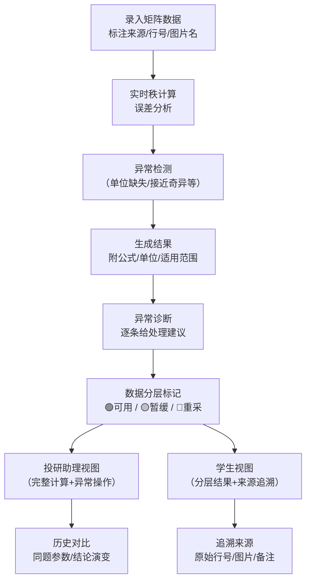

## 1. 产品概述

矩阵秩退化诊断器是一款面向投研助理和学生的专业计算工具，用于矩阵秩退化检测、误差分析、数据质量诊断与结果追溯。核心解决三类问题：计算过程透明化（公式、单位、适用范围、失败原因可见）、异常处理可操作化（单位缺失等异常标注下一步动作）、结果分层可辨识化（学生能一眼区分可直接用、需复核、需重采的数据）。

### 目标用户
- **投研助理**：日常处理题目清单与计算草稿，需要高效完成秩计算、误差分析、历史对比，并能对异常数据标注处理建议
- **学生**：查看诊断结果，关注数据可用性、来源追溯，需要清晰区分可直接引用与需复核的数据

---

## 2. 核心功能

### 2.1 用户角色

| 角色 | 识别方式 | 核心权限 |
|------|----------|----------|
| 投研助理 | 默认主操作视角 | 数据录入、编辑来源、执行计算、标注异常处理建议、查看历史对比、导出结果 |
| 学生 | 结果查看视角（切换视图） | 查看计算结果、数据可用性标识、来源备注、需要复核的数据、原始行号追溯 |

### 2.2 功能模块

1. **计算工作台**：矩阵数据输入、公式说明、单位标注、适用范围展示、实时秩计算、误差分析
2. **异常诊断面板**：单位缺失检测、数据质量分级、失败原因分析、下一步处理建议（补材料/改口径/重新采集）
3. **结果分层展示**：三色标识体系（绿色可用/黄色暂缓/红色重采）、学生视角一键切换、可直用与需复核明确区分
4. **来源追溯模块**：原始行号保留、图片名/来源备注记录、历史版本对比、结论与来源材料联动
5. **历史对比中心**：同题目历史计算记录、参数差异对比、结论演变追溯

### 2.3 页面详情

| 页面名称 | 模块名称 | 功能描述 |
|----------|----------|----------|
| 诊断工作台 | 矩阵输入区 | 支持手动输入矩阵、粘贴表格数据、上传CSV；每行标注原始行号、来源备注、图片名 |
| 诊断工作台 | 公式说明卡 | 固定位置展示秩计算公式、单位说明、适用范围（如浮点矩阵误差阈值）、常见失败原因 |
| 诊断工作台 | 计算结果区 | 实时显示矩阵秩、条件数、奇异值分布、误差估计、退化程度评级 |
| 诊断工作台 | 异常诊断条 | 逐条列出问题：单位缺失/数据异常/接近奇异，每条附带处理建议按钮（补材料/改口径/重采） |
| 诊断工作台 | 数据分层标签 | 每行数据标注：🟢可直接使用 / 🟡需投研复核 / 🔴需重新采集 |
| 来源追溯 | 来源明细列表 | 展示每条数据的原始行号、所属表格、图片名、录入人、录入时间 |
| 来源追溯 | 历史版本对比 | 并排展示同一题目的多次计算结果，高亮参数差异与结论变化 |
| 学生视图 | 精简结果页 | 隐藏计算过程，突出可用性标识、需复核清单、来源备注跳转 |

---

## 3. 核心流程

用户（投研助理）录入矩阵数据并标注来源信息 → 系统实时执行秩计算与误差分析 → 自动检测单位缺失、数据异常等问题 → 生成计算结果并附公式/单位/适用范围说明 → 对异常逐条给出处理建议（补材料/改口径/重采） → 按可用/暂缓/重采三层分级标注 → 切换学生视图仅展示分层结果与来源追溯入口 → 可进入历史对比查看同题演变。

---

## 4. 用户界面设计

### 4.1 设计风格
- **主色调**：深海靛蓝 `#0F2547`（专业理性）搭配暖琥珀 `#D97706`（警示标注）、森林绿 `#059669`（可直用）
- **辅助色**：浅灰蓝卡片底色、墨黑正文、细金色分割线
- **按钮风格**：微立体圆角按钮，悬停上浮 + 柔光阴影；异常处理按钮采用描边+图标双指示
- **字体**：标题用 "Noto Serif SC"（学术衬线感），正文/数据用 "JetBrains Mono" + "PingFang SC"（数字清晰可读）
- **布局**：左右双栏工作台，左侧输入+来源，右侧计算+诊断；卡片化信息层次，公式卡固定悬浮不遮挡结果
- **图标**：Lucide 线性图标，异常用三角警示、可用用对勾圆环、暂缓用时钟沙漏

### 4.2 页面设计概览

| 页面名称 | 模块名称 | UI 元素 |
|----------|----------|---------|
| 诊断工作台 | 矩阵输入区 | 表格化输入，左侧列固定行号+来源标签，右侧数值单元格；空单位格自动高亮琥珀色描边 |
| 诊断工作台 | 公式说明卡 | 悬浮右上，半透明毛玻璃底，衬线字体渲染 LaTeX 公式，下方小字标注单位与适用范围 |
| 诊断工作台 | 计算结果区 | 大号数字显示秩值，旁附退化程度徽章；奇异值分布迷你条形图；条件数用色阶表示稳定性 |
| 诊断工作台 | 异常诊断条 | 横向排列的胶囊状标签，红/黄/绿底色，点击展开处理建议与操作按钮 |
| 诊断工作台 | 数据分层标签 | 行首圆形色标 + 文字标签，悬停显示分层理由简述 |
| 学生视图 | 精简结果页 | 顶部大横幅展示汇总：N条可用 / M条需复核 / K条需重采；列表按分层分组展示 |

### 4.3 响应式
- 桌面优先（≥1280px）：左右双栏布局，公式卡悬浮
- 平板（768-1279px）：上下堆叠，公式卡嵌于结果顶部
- 移动端（<768px）：单列滚动，学生视图默认启用简化模式

---
