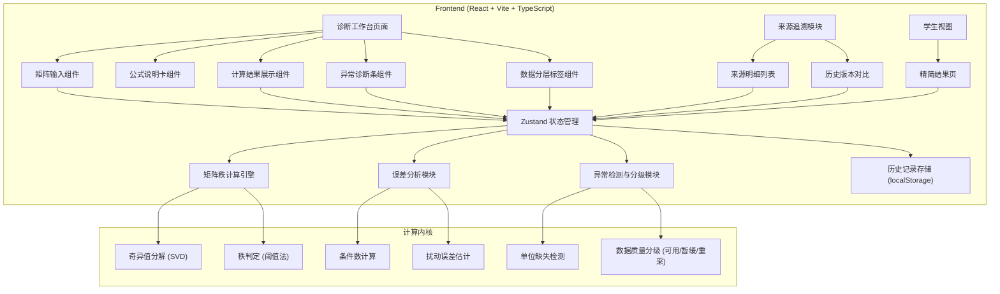

## 1. 架构设计

纯前端单页应用，使用 React 状态管理内置模拟数据与计算历史，不依赖后端服务。核心计算逻辑封装为独立工具模块，UI 层按投研助理视图 / 学生视图双模式切换。



---

## 2. 技术描述

- **前端框架**：React@18 + TypeScript + Vite
- **样式方案**：TailwindCSS@3（设计 Token 定制：靛蓝主色、琥珀警示、森林绿）
- **状态管理**：Zustand（矩阵数据、计算结果、异常诊断、视图模式、历史记录）
- **数学计算**：自研轻量矩阵运算模块（SVD 分解、秩计算、条件数、误差估计），不引入重型数值库
- **持久化**：localStorage 存储计算历史与题目草稿
- **图标**：lucide-react
- **初始化工具**：vite-init（react-ts 模板）

---

## 3. 路由定义

| 路由 | 用途 |
|------|------|
| `/` | 诊断工作台（默认页，投研助理视图） |
| `/student` | 学生精简视图 |
| `/history` | 历史对比中心 |

---

## 4. 数据模型

### 4.1 核心类型定义

```typescript
// 矩阵单元格数据（带来源追溯）
interface MatrixCell {
  value: number | null;
  unit: string;           // 单位，如 "mm"、"kg"、"—"（无量纲），空字符串表示缺失
  sourceRow: number;      // 原始行号（来自题目表/草稿）
  sourceImage?: string;   // 来源图片文件名
  sourceNote?: string;    // 来源备注
}

// 矩阵数据
interface MatrixData {
  id: string;
  title: string;          // 题目/草稿名称
  rows: number;
  cols: number;
  cells: MatrixCell[][];
  createdAt: number;
  updatedAt: number;
}

// 计算结果
interface RankResult {
  rank: number;                       // 矩阵秩
  singularValues: number[];           // 奇异值数组
  conditionNumber: number;            // 条件数
  tolerance: number;                  // 秩判定阈值
  errorEstimate: number;              // 误差估计
  degradationLevel: 'none' | 'mild' | 'moderate' | 'severe';  // 退化程度
}

// 数据可用性分层
type DataAvailability = 'available' | 'pending' | 'recollect';

// 异常诊断条目
interface AnomalyItem {
  id: string;
  type: 'unit_missing' | 'value_invalid' | 'near_singular' | 'large_error';
  severity: 'info' | 'warning' | 'error';
  cellRef?: { row: number; col: number };  // 关联单元格
  message: string;
  suggestion: 'fill_material' | 'adjust_caliber' | 'recollect' | 'review';  // 下一步处理建议
  suggestionText: string;
}

// 行级数据可用性
interface RowAvailability {
  rowIndex: number;
  availability: DataAvailability;
  reason: string;
}

// 历史记录
interface HistoryRecord {
  id: string;
  matrixId: string;
  title: string;
  timestamp: number;
  rankResult: RankResult;
  anomalyCount: number;
  availableCount: number;
  pendingCount: number;
  recollectCount: number;
}

// 全局状态
interface AppState {
  currentMatrix: MatrixData | null;
  rankResult: RankResult | null;
  anomalies: AnomalyItem[];
  rowAvailability: RowAvailability[];
  viewMode: 'analyst' | 'student';
  history: HistoryRecord[];
}
```

### 4.2 数据持久化

使用 localStorage 键 `rank-diagnostic-history` 存储 `HistoryRecord[]`，键 `rank-diagnostic-drafts` 存储 `MatrixData[]`（未完成草稿）。

---

## 5. 核心计算流程

1. **矩阵秩计算**：对输入矩阵执行 SVD 分解得到奇异值 σ₁ ≥ σ₂ ≥ ... ≥ σₙ ≥ 0，取阈值 ε = max(m,n) · σ₁ · εₘₐₙ（εₘₐₙ ≈ 2.2×10⁻¹⁶），统计 σᵢ > ε 的个数即为数值秩
2. **条件数**：κ = σ₁ / σₙ（衡量矩阵对扰动的灵敏度，κ 越大越不稳定）
3. **误差估计**：基于条件数与机器精度给出相对误差上界 ≈ κ · εₘₐₙ
4. **单位缺失检测**：遍历单元格，`unit === ''` 且 `value !== null` 标记为单位缺失
5. **数据分层**：
   - 🟢 **可直接使用**：数值有效、单位齐全、无严重异常
   - 🟡 **需投研复核**：单位缺失但数值有效、或接近奇异（κ 较大但未超限）
   - 🔴 **需重新采集**：数值无效（NaN/空）、或严重退化/超误差阈值

---

## 6. 模块划分

| 目录 | 用途 |
|------|------|
| `src/pages/` | 诊断工作台页、学生视图页、历史对比页 |
| `src/components/` | MatrixInput、FormulaCard、RankResult、AnomalyBar、AvailabilityBadge、SourceTrace、HistoryCompare |
| `src/utils/math/` | 矩阵运算、SVD 分解、秩计算、条件数、误差估计 |
| `src/utils/diagnosis/` | 异常检测、可用性分层、处理建议生成 |
| `src/store/` | Zustand store（矩阵数据、计算结果、异常、视图模式、历史） |
| `src/types/` | TypeScript 类型定义 |
| `src/data/` | 内置模拟题目与示例矩阵数据 |
