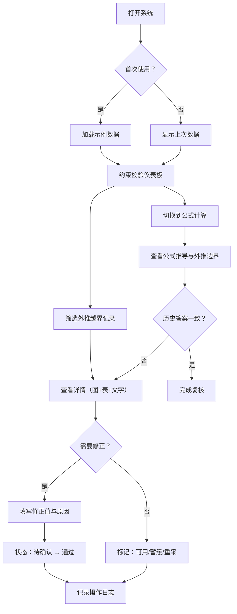

## 1. 产品概述

数列递推反例库是面向教研编辑的数学教育质量保障工具，核心解决数列递推题目中外推越界混进正常结果、历史答案与题目清单对不上、人工修正无迹可查等问题。

- 目标用户：高中数学教研编辑
- 核心价值：通过可视化校验 + 分级数据标识 + 操作留痕，让教研编辑快速识别异常数据、追溯修正历史、避免重复录入

## 2. 核心功能

### 2.1 用户角色

| 角色 | 登录方式 | 核心权限 |
|------|----------|----------|
| 教研编辑 | 账号登录（演示版免登录） | 日常约束校验、公式计算复核、人工修正、导入/补录数据、查看操作日志 |

### 2.2 功能模块

1. **约束校验页面（日常入口）**：外推越界检测仪表板、数据列表（可用/暂缓/重采三级标识）、详情面板（图+表+文字说明三者对照）
2. **公式计算解释页面（月底/课前入口）**：公式推导过程可视化、递推关系验证、异常项标注
3. **人工修正与留痕**：修正前后对比、修正备注、状态流转（待确认→通过）
4. **导入与去重**：批量导入、补录合并、重复检测与冲突提示
5. **首次体验示例数据**：首次打开自动加载示例题组，无需造表即可上手

### 2.3 页面详情

| 页面名称 | 模块名称 | 功能描述 |
|----------|----------|----------|
| 约束校验页 | 顶部导航 | 双入口切换（约束校验/公式计算）、导入按钮、操作日志入口 |
| 约束校验页 | 统计卡片 | 总数/可用数/暂缓数/需重采数四项指标卡片 |
| 约束校验页 | 数据筛选区 | 状态筛选、搜索框、外推越界专项过滤 |
| 约束校验页 | 数据列表 | 表格展示题目标识、递推公式、历史答案、当前状态、操作按钮 |
| 约束校验页 | 详情面板 | 左侧：数列折线图（标注异常点）；右上：数据对照表（历史/计算/修正）；右下：文字说明（数据分级结论） |
| 约束校验页 | 修正弹窗 | 修正值输入、修正原因、确认提交 |
| 公式计算页 | 题组选择 | 从约束校验页跳转或直接选题 |
| 公式计算页 | 公式推导区 | 递推公式展示、通项推导步骤、每步计算值表格 |
| 公式计算页 | 外推分析区 | 外推越界判定逻辑、越界项高亮、边界条件说明 |
| 操作日志页 | 时间线 | 按时间倒序展示所有操作（导入、修正、状态变更）、操作前后对比 |

## 3. 核心流程

### 3.1 日常约束校验流程
教研编辑日常打开→默认进入约束校验页→首次自动加载示例数据→通过筛选快速定位"外推越界"记录→点击查看详情（图/表/文字对照）→判断是可用/暂缓/重采→如需修正则填写修正值与原因→状态从"待确认"流转为"通过"→系统自动记录操作日志

### 3.2 月底/课前公式复核流程
从顶部切换到"公式计算"页→选题查看公式推导过程→逐项核对递推计算值→查看外推越界判定的边界条件→对照历史答案确认是否一致→不一致则跳转回约束校验页发起修正

### 3.3 导入与去重流程
点击"导入数据"→上传/粘贴题目清单→系统自动按题目标识+递推公式去重→重复项提示"已存在，是否覆盖/合并"→新记录默认状态为"待确认"→导入结果汇总（新增/更新/跳过数量）

## 4. 用户界面设计

### 4.1 设计风格
- **主色**：墨蓝 `#1e3a5f`（学术严谨感）
- **辅色**：警示红 `#e03131`（外推越界）、确认绿 `#2f9e44`（数据可用）、预警橙 `#f59f00`（数据暂缓）
- **中性色**：象牙白 `#fafaf7` 背景、石墨灰 `#495057` 正文
- **按钮风格**：圆角 6px，1px 描边，悬停时 2px 阴影上移 1px
- **字体**：标题用 "Noto Serif SC"（衬线体体现数学学术感），正文用 "Noto Sans SC"（清晰易读）
- **布局风格**：左侧导航 + 右侧主内容区，卡片式布局带细边框与浅阴影
- **图标**：Lucide 图标库，配合数学符号（Σ、→、∞ 等）

### 4.2 页面设计概览

| 页面名称 | 模块名称 | UI 元素 |
|----------|----------|---------|
| 约束校验页 | 统计卡片 | 四色横向卡片，数字大号衬线体，底部小字描述，悬停轻微上浮 |
| 约束校验页 | 数据列表 | 斑马行表格，状态列带彩色标签徽章，外推越界行背景浅红 |
| 约束校验页 | 详情面板 | 三栏栅格：左 50% 折线图（异常点红圈标注），右上 25% 对照表，右下 25% 文字说明 |
| 约束校验页 | 修正弹窗 | 居中模态框，表单字段带标签，修正前后对比预显区 |
| 公式计算页 | 推导区 | 步骤编号圆圈，公式 LaTeX 风格排版，等号对齐，异常值红色高亮 |
| 操作日志页 | 时间线 | 左侧竖线 + 圆点，卡片按时间倒序，修正项展开显示 diff 对比 |

### 4.3 响应式
- Desktop-first，最小适配宽度 1280px
- 详情面板在 <1024px 时改为上下堆叠
- 表格在移动端允许横向滚动

### 4.4 动效
- 页面加载：统计卡片从下向上依次淡入（stagger 80ms）
- 状态标签：hover 时放大 1.05 倍
- 折线图：异常点脉冲动画（2s 循环）
- 弹窗：缩放淡入 200ms ease-out
