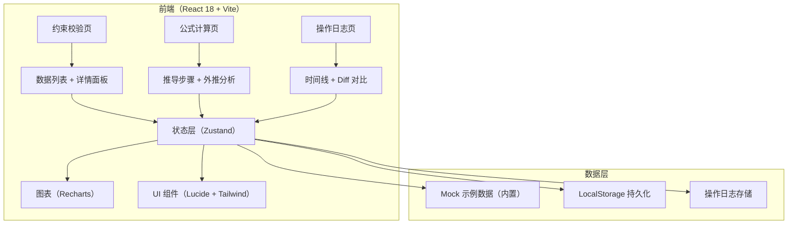
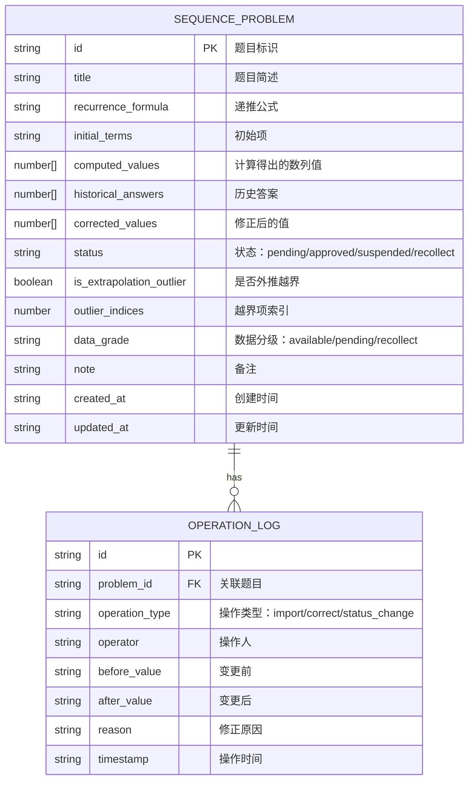

## 1. 架构设计



## 2. 技术说明

- **前端**：React@18 + TypeScript + Vite@5
- **样式**：TailwindCSS@3
- **状态管理**：Zustand
- **路由**：react-router-dom@6
- **图表**：Recharts（折线图、散点图）
- **图标**：lucide-react
- **后端**：无（纯前端，数据存 LocalStorage）
- **数据库**：LocalStorage + 内置 Mock 数据
- **初始化工具**：vite-init（react-ts 模板）

## 3. 路由定义

| 路由 | 用途 |
|------|------|
| `/` | 约束校验页（默认首页/日常入口） |
| `/formula` | 公式计算解释页（月底/课前入口） |
| `/logs` | 操作日志页 |

## 4. 数据模型

### 4.1 数据模型定义



### 4.2 TypeScript 类型定义

```typescript
export type DataGrade = 'available' | 'pending' | 'recollect';
export type ProblemStatus = 'pending' | 'approved' | 'suspended' | 'recollect';
export type OperationType = 'import' | 'correct' | 'status_change' | 'merge';

export interface SequenceProblem {
  id: string;
  title: string;
  recurrenceFormula: string;
  initialTerms: number[];
  computedValues: number[];
  historicalAnswers: number[];
  correctedValues?: number[];
  status: ProblemStatus;
  isExtrapolationOutlier: boolean;
  outlierIndices: number[];
  dataGrade: DataGrade;
  note: string;
  createdAt: string;
  updatedAt: string;
}

export interface OperationLog {
  id: string;
  problemId: string;
  operationType: OperationType;
  operator: string;
  beforeValue: string;
  afterValue: string;
  reason?: string;
  timestamp: string;
}

export interface StoreState {
  problems: SequenceProblem[];
  logs: OperationLog[];
  selectedProblemId: string | null;
  filters: {
    status?: ProblemStatus;
    onlyOutliers: boolean;
    search?: string;
  };
}
```

## 5. 核心目录结构

```
src/
├── components/
│   ├── layout/
│   │   ├── TopNav.tsx
│   │   └── PageContainer.tsx
│   ├── constraint/
│   │   ├── StatCard.tsx
│   │   ├── FilterBar.tsx
│   │   ├── ProblemTable.tsx
│   │   ├── DetailPanel.tsx
│   │   ├── SequenceChart.tsx
│   │   ├── CompareTable.tsx
│   │   ├── GradeNote.tsx
│   │   └── CorrectModal.tsx
│   ├── formula/
│   │   ├── FormulaDerivation.tsx
│   │   ├── ExtrapolationAnalysis.tsx
│   │   └── ProblemSelector.tsx
│   ├── logs/
│   │   ├── LogTimeline.tsx
│   │   └── DiffView.tsx
│   └── common/
│       ├── StatusBadge.tsx
│       └── GradeBadge.tsx
├── pages/
│   ├── ConstraintPage.tsx
│   ├── FormulaPage.tsx
│   └── LogsPage.tsx
├── store/
│   └── useStore.ts
├── data/
│   └── mockData.ts
├── utils/
│   ├── sequence.ts
│   ├── dedup.ts
│   └── format.ts
├── types/
│   └── index.ts
├── App.tsx
├── main.tsx
└── index.css
```

## 6. 关键业务逻辑说明

### 6.1 外推越界检测算法
```
输入：computedValues[], 阈值 threshold = 均值 ± 3σ（或人工设定）
步骤：
  1. 计算前 N 项（非外推区）的均值 μ 和标准差 σ
  2. 遍历后续项，若 |value - μ| > 3σ，则标记为越界
  3. 记录 outlierIndices 并设置 isExtrapolationOutlier = true
```

### 6.2 去重逻辑
```
去重键 = hash(problemId + recurrenceFormula)
导入时：
  - 若 key 已存在且 computedValues 完全一致 → 跳过
  - 若 key 已存在但值不一致 → 提示冲突（覆盖/合并/保留两者）
  - 若 key 不存在 → 新增
```

### 6.3 状态流转规则
```
pending (待确认)
  ├── 人工修正 + 确认 → approved (通过)
  ├── 标记暂缓 → suspended (暂缓)
  └── 标记重采 → recollect (需重新采集)
approved (通过)
  └── 再次修正 → 记录新日志，仍为 approved
```
