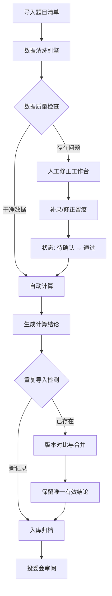

## 1. 产品概述

"线性规划配餐约束"是面向投研助理的专业计算工具，用于处理题目清单中的不规范数据记录，通过线性规划模型完成配餐约束计算，并提供完整的审计追踪能力。

- 核心问题：题目清单中存在空值、重复、备注混写、单位缺失等不规范数据，需要工具辅助清洗、计算、复核
- 目标用户：投研助理日常使用，投委会最终审阅
- 产品价值：规范化计算流程、消除重复结论冲突、提供人工修正留痕、确保结果可追溯

## 2. 核心功能

### 2.1 用户角色

| 角色 | 说明 | 核心权限 |
|------|------|----------|
| 投研助理 | 日常使用者 | 公式计算、数据导入、人工修正、批量复核 |
| 投委会成员 | 审阅者 | 查看计算结果、复核历史、变更记录 |

### 2.2 功能模块

1. **公式计算页（日常入口）**：单条记录计算、公式展示、单位校验、适用范围说明、失败原因诊断
2. **数据导入与清洗**：批量导入题目清单、自动检测空值/重复/备注混写、单位缺失标记
3. **人工修正工作台**：待确认记录列表、修正表单、变更留痕、状态流转（待确认→通过）
4. **批量复核页**：月底/课前使用、批次对比、结论一致性校验、异常标记
5. **版本管理中心**：重复导入去重、版本对比、冲突解决、计算草稿管理

### 2.3 页面详情

| 页面名称 | 模块名称 | 功能描述 |
|----------|----------|----------|
| 公式计算页 | 计算输入区 | 支持手动输入或从草稿选择单条记录进行计算 |
| 公式计算页 | 公式说明区 | 展示线性规划公式、单位定义、适用范围、约束条件 |
| 公式计算页 | 结果展示区 | 展示计算结果，失败时显示具体失败原因和修正建议 |
| 数据导入页 | 文件上传区 | 支持 CSV/Excel 导入题目清单 |
| 数据导入页 | 数据预览区 | 导入后预览数据，高亮标记空值、重复、备注混写、单位缺失 |
| 人工修正页 | 待处理列表 | 列出所有需要人工确认的记录，按问题类型分组 |
| 人工修正页 | 修正表单 | 支持补录单位、调整数值、添加备注，自动记录变更前后值 |
| 人工修正页 | 变更历史 | 展示每条记录的所有修正历史，包含操作人、时间、变更内容 |
| 批量复核页 | 批次概览 | 展示当前批次统计：总数、通过数、待确认数、异常数 |
| 批量复核页 | 一致性校验 | 检测同一批次内是否存在冲突结论，标记异常条目 |
| 版本管理页 | 草稿列表 | 展示所有导入批次，标注版本号和导入时间 |
| 版本管理页 | 版本对比 | 对比两次导入的差异，自动合并相同记录，标记冲突项 |

## 3. 核心流程

### 3.1 日常计算流程
投研助理进入公式计算页，输入或选择一条记录，系统校验单位完整性，执行线性规划计算，展示结果或失败原因。若单位缺失，记录进入"待确认"状态，由投研助理补录后重新计算。

### 3.2 批量导入流程
投研助理上传题目清单，系统自动清洗数据（检测空值、重复、备注混写、单位缺失），生成数据预览。干净数据自动计算，问题数据进入人工修正工作台。修正完成后批量计算，生成最终结论。

### 3.3 重复导入流程
同一批草稿第二次导入时，系统通过关键字段（如题目ID、材料名称组合）进行去重匹配。相同记录自动关联到已有版本，差异记录标记为"待对比"，由用户选择保留新版本或保留旧版本，确保同一件事只有一份有效结论。

## 4. 用户界面设计

### 4.1 设计风格

- **主色调**：深海蓝 #1e3a5f（专业、稳重），搭配琥珀金 #d4a574（强调、警示）
- **辅助色**：成功绿 #2d8a5e、警告橙 #d97706、错误红 #b91c1c、信息蓝 #2563eb
- **背景**：浅灰底色 #f8fafc，卡片使用纯白 #ffffff，细边框 #e2e8f0
- **按钮风格**：直角轻微圆角（radius: 4px），2px边框强调，悬停时微上浮阴影
- **字体**：标题使用 Noto Serif SC（衬线体，专业感），正文使用 Noto Sans SC（无衬线，易读性）
- **布局风格**：左右分栏主布局，左侧导航+内容区，卡片式模块组织，表格为核心数据展示方式
- **图标风格**：线性简约图标，统一 1.5px 线宽，与文字同色系

### 4.2 页面设计概述

| 页面名称 | 模块名称 | UI 元素 |
|----------|----------|----------|
| 公式计算页 | 顶部导航 | 深色横条导航，品牌Logo + 页面标题 + 操作按钮 |
| 公式计算页 | 公式说明卡片 | 左侧固定卡片，显示公式（KaTeX渲染）、单位列表、适用范围、约束条件 |
| 公式计算页 | 计算操作区 | 右侧主区域，表单输入、实时校验提示、计算按钮 |
| 公式计算页 | 结果展示区 | 计算结果以大号数字突出展示，失败时红色边框卡片展示失败原因和修正建议 |
| 人工修正页 | 问题分组标签 | 顶部标签页切换：单位缺失 / 空值 / 重复 / 备注混写 / 全部 |
| 人工修正页 | 数据表格 | 斑马纹表格，问题单元格黄色高亮，操作列包含修正按钮 |
| 人工修正页 | 修正抽屉 | 右侧滑出抽屉，展示原值、新值输入、备注、变更历史时间线 |
| 版本管理页 | 版本时间线 | 垂直时间线展示各批次导入，标注版本号、记录数、操作人 |
| 版本管理页 | 差异对比表格 | 双列对比展示，新增行绿色背景、删除行删除线+红色、变更行黄色 |

### 4.3 响应式设计

- 桌面优先设计（≥1280px），适配 1440px 及以上专业显示器
- 平板端（≥768px）：左右分栏改为上下堆叠，表格支持横向滚动
- 移动端：简化展示，核心操作保留，表格切换为卡片列表视图

### 4.4 交互细节

- 数据表格行悬停：浅蓝背景高亮
- 修正操作：抽屉滑入动画 300ms ease-out
- 状态徽章：不同颜色实心圆角标签，带状态图标
- 计算按钮：点击后显示加载动画，结果渐入展示
- 版本差异：变更内容使用黄色高亮淡入效果
