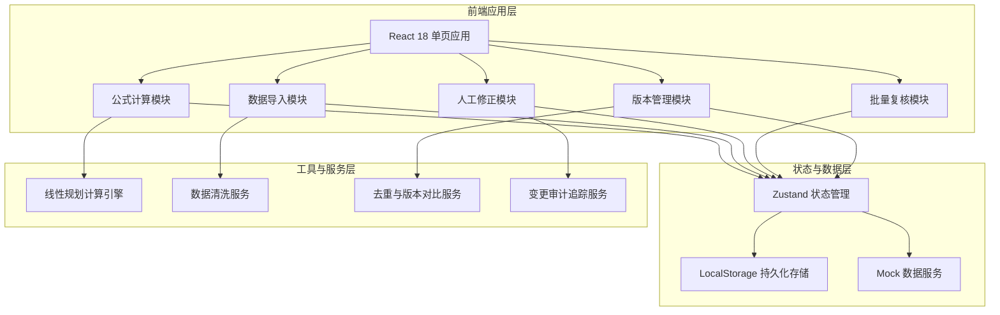

## 1. 架构设计

```mermaid
graph TD
    subgraph "前端应用层"
        A["React 18 单页应用"]
        A1["公式计算模块"]
        A2["数据导入模块"]
        A3["人工修正模块"]
        A4["批量复核模块"]
        A5["版本管理模块"]
    end

    subgraph "状态与数据层"
        B["Zustand 状态管理"]
        C["LocalStorage 持久化存储"]
        D["Mock 数据服务"]
    end

    subgraph "工具与服务层"
        E["线性规划计算引擎"]
        F["数据清洗服务"]
        G["去重与版本对比服务"]
        H["变更审计追踪服务"]
    end

    A --> A1 & A2 & A3 & A4 & A5
    A1 & A2 & A3 & A4 & A5 --> B
    B --> C
    A1 --> E
    A2 --> F
    A5 --> G
    A3 --> H
    B --> D
```

## 2. 技术描述

- **前端框架**：React@18 + TypeScript
- **构建工具**：V