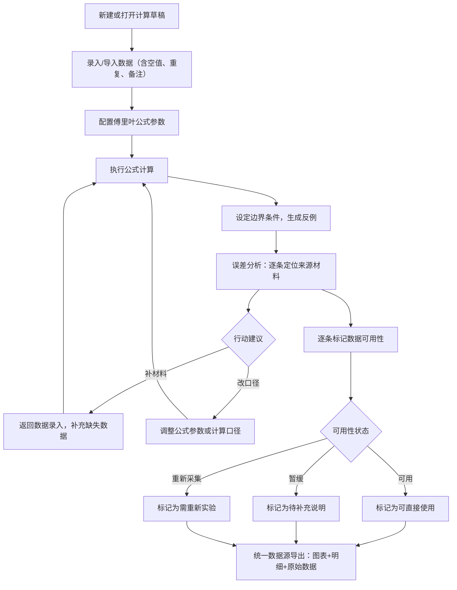

## 1. 产品概述

傅里叶噪声滤波台是面向建模社助教的专业计算看板，将零散的便签式处理流程标准化为可追溯、可复核的计算草稿系统。核心解决：评分修改、边界样例调整前后差异丢失问题；反例生成与公式计算稳定性保障；空值/重复/备注混写等脏数据的友好处理；以及面向运营同事的数据可用性分层呈现。

- 目标用户：建模社助教（核心用户）、运营同事（次级用户）
- 核心价值：计算过程全链路可追溯，数据可用性分层清晰，异常可诊断可行动

---

## 2. 核心功能

### 2.1 用户角色

| 角色 | 接入方式 | 核心权限 |
|------|----------|----------|
| 建模社助教 | 本地启动应用 | 草稿编辑、公式计算、反例生成、误差分析、结果复核、数据下载 |
| 运营同事 | 只读视图 | 查看可用性分层结果、识别需复核项 |

### 2.2 功能模块

1. **计算草稿看板**：草稿列表、版本差异对比、编辑区
2. **公式计算台**：傅里叶变换公式输入、参数配置、批量计算、计算结果追踪
3. **反例生成器**：边界条件设定、反例自动生成、覆盖率统计
4. **误差分析面板**：误差来源追踪、与原始材料对照、修正建议（补材料/改口径）
5. **数据可用性看板**：三态分层（可用/暂缓/重新采集）、运营视图一键切换
6. **结果导出**：图表、明细、原始数据统一打包下载

### 2.3 页面详情

| 页面名称 | 模块名称 | 功能描述 |
|----------|----------|----------|
| 主工作台 | 草稿时间线 | 按修改时间排列的草稿卡片，显示版本号、修改人、备注摘要 |
| 主工作台 | 快捷操作栏 | 新建草稿、导入数据、切换运营视图、批量导出 |
| 主工作台 | 数据可用性总览 | 三态统计卡片（可用/暂缓/重新采集），带数量与占比 |
| 草稿详情页 | 草稿编辑区 | 支持空值标记、备注混排、重复项高亮，不自动清理脏数据 |
| 草稿详情页 | 公式计算面板 | 傅里叶公式配置、参数校验、计算过程分步展示、结果溯源 |
| 草稿详情页 | 反例生成区 | 边界条件输入、生成进度、反例列表、覆盖率统计 |
| 草稿详情页 | 误差分析面板 | 误差项逐条列出，每条附带行动建议（补材料/改口径），来源材料引用 |
| 草稿详情页 | 图表展示区 | 频谱图、滤波前后对比、误差分布，数据与明细表同源 |
| 草稿详情页 | 明细表格 | 每行带可用性标签、编辑记录、复核状态 |
| 运营视图 | 可用性分层列表 | 三态分区展示，项级标注：直接用/找助教复核 |
| 运营视图 | 复核跳转 | 需复核项一键定位到助教草稿详情对应位置 |

---

## 3. 核心流程

### 3.1 助教主流程

助教从创建或打开草稿开始，录入或导入计算数据（允许空值、重复、备注），在公式计算台配置傅里叶变换参数并执行计算，反例生成器按边界条件产生反例样本，误差分析面板逐条给出修正建议（补材料或改口径），助教根据建议调整后完成复核，最终标记每条数据的可用性状态（可用/暂缓/重新采集），一键导出图表+明细+原始数据包。

### 3.2 运营同事流程

运营同事从运营视图进入，看到按三态分区的结果列表，绿色区直接可用的数据可直接下载使用，黄色区标注需找助教复核的数据可点击跳转到对应草稿位置与助教沟通。

---

## 4. 用户界面设计

### 4.1 设计风格

- **主色调**：深靛蓝 `#1e1b4b`（专业计算工具基调），辅助色：琥珀金 `#f59e0b`（暂缓/复核提醒），翡翠绿 `#10b981`（可用），朱砂红 `#dc2626`（重新采集/异常）
- **按钮风格**：方中带圆角（`rounded-lg`），悬浮微抬高阴影，按下内陷
- **字体**：标题用思源宋体（学术感），正文用 JetBrains Mono（计算数据等宽对齐）
- **布局风格**：左侧草稿时间线导航 + 中间三栏工作区（编辑/计算/分析）+ 右侧图表与明细
- **图标**：Lucide 线性图标，保持纤细克制

### 4.2 页面设计概述

| 页面名称 | 模块名称 | UI 元素 |
|----------|----------|----------|
| 主工作台 | 草稿时间线 | 深色侧边栏，卡片式草稿条目带版本徽标，修改时间轴连接线 |
| 主工作台 | 可用性总览 | 三张色块卡片横向排列，数字+占比环形图，hover 显示明细分类 |
| 草稿详情页 | 草稿编辑区 | 类 Excel 网格，空值灰斜体、重复项橙色边框、备注蓝色气泡角标 |
| 草稿详情页 | 公式计算面板 | 公式 LaTeX 渲染，参数滑块 + 数字输入，分步计算过程折叠展开 |
| 草稿详情页 | 误差分析面板 | 每条误差为独立卡片，顶部行动建议标签（补材料/改口径），底部来源材料引用块 |
| 草稿详情页 | 图表区 | 双栏频谱对比图（滤波前/后），下方误差分布直方图 |
| 运营视图 | 分层列表 | 三列瀑布流，绿/黄/红色卡，需复核项带箭头跳转按钮 |

### 4.3 响应式

桌面端优先设计，1440px 为最佳宽度。1024px 以下切换为上下堆叠布局，运营视图降为单列。触摸设备长按可替代 hover 显示详情。
