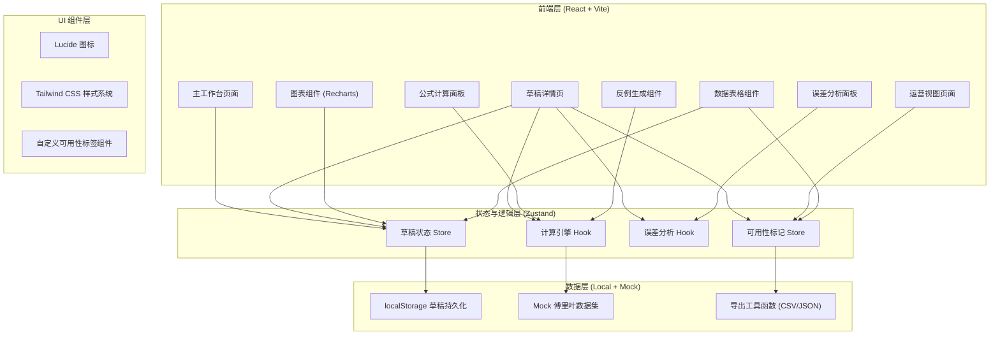
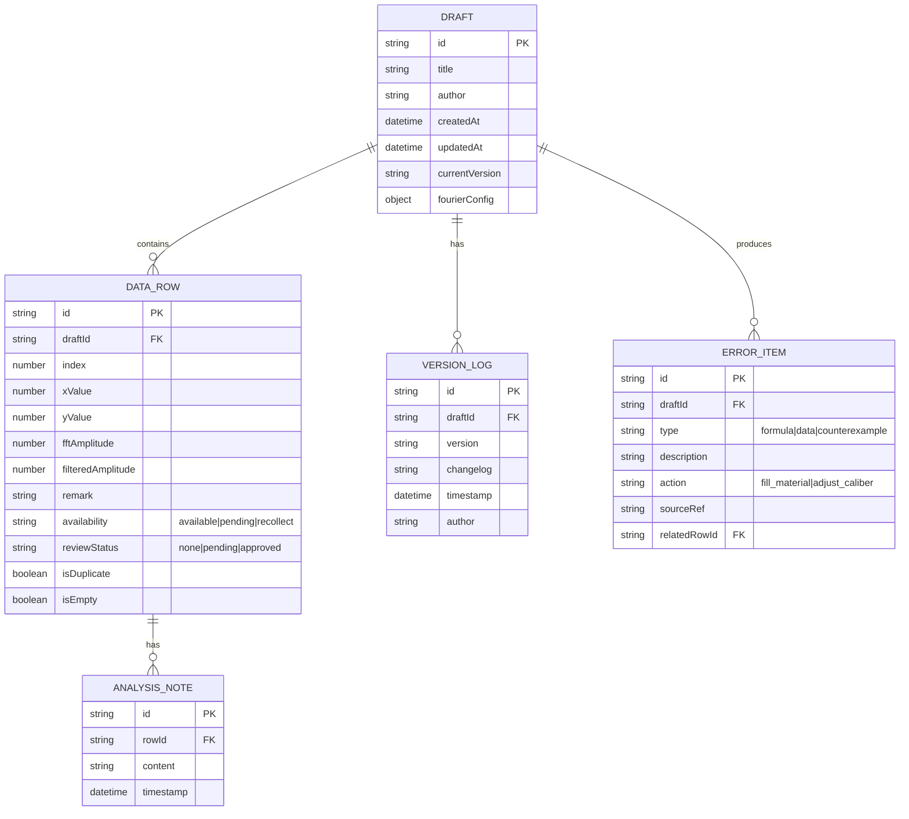

## 1. 架构设计



---

## 2. 技术描述

- **前端框架**：React 18 + TypeScript 5 + Vite 5
- **样式方案**：Tailwind CSS 3
- **状态管理**：Zustand 4
- **路由**：React Router DOM 6
- **图表库**：Recharts 2（频谱图、直方图、对比图）
- **图标**：Lucide React
- **数据持久化**：localStorage（草稿、版本记录）
- **导出格式**：CSV（明细）、JSON（原始数据+图表配置）
- **后端**：无，纯前端实现，内置 Mock 数据
- **初始化工具**：vite-init

---

## 3. 路由定义

| 路由 | 页面用途 |
|------|----------|
| `/` | 主工作台：草稿列表、可用性总览、快捷操作 |
| `/draft/:id` | 草稿详情：公式计算、反例生成、误差分析、图表、明细 |
| `/operation` | 运营视图：三态分层结果展示、复核跳转 |

---

## 4. 数据模型

### 4.1 数据模型定义



### 4.2 TypeScript 类型定义

```typescript
type AvailabilityStatus = 'available' | 'pending' | 'recollect';
type ReviewStatus = 'none' | 'pending' | 'approved';
type ErrorAction = 'fill_material' | 'adjust_caliber';
type ErrorType = 'formula' | 'data' | 'counterexample';

interface DataRow {
  id: string;
  draftId: string;
  index: number;
  xValue: number | null;
  yValue: number | null;
  fftAmplitude: number | null;
  filteredAmplitude: number | null;
  remark?: string;
  availability: AvailabilityStatus | null;
  reviewStatus: ReviewStatus;
  isDuplicate: boolean;
  isEmpty: boolean;
}

interface Draft {
  id: string;
  title: string;
  author: string;
  createdAt: string;
  updatedAt: string;
  currentVersion: string;
  fourierConfig: FourierConfig;
  dataRows: DataRow[];
  versionLogs: VersionLog[];
  errorItems: ErrorItem[];
}

interface FourierConfig {
  sampleRate: number;
  windowSize: number;
  lowPassCutoff: number;
  highPassCutoff: number;
  windowFunction: 'hanning' | 'hamming' | 'blackman' | 'rectangular';
}

interface ErrorItem {
  id: string;
  draftId: string;
  type: ErrorType;
  description: string;
  action: ErrorAction;
  sourceRef: string;
  relatedRowId?: string;
}

interface VersionLog {
  id: string;
  draftId: string;
  version: string;
  changelog: string;
  timestamp: string;
  author: string;
}
```

---

## 5. 核心模块职责

| 模块 | 文件路径 | 职责 |
|------|----------|------|
| 草稿 Store | `src/store/draftStore.ts` | 草稿 CRUD、版本记录、本地持久化 |
| 傅里叶计算 Hook | `src/hooks/useFourier.ts` | FFT 计算、滤波、反例生成算法 |
| 误差分析 Hook | `src/hooks/useErrorAnalysis.ts` | 误差检测、行动建议生成、来源追踪 |
| 可用性 Store | `src/store/availabilityStore.ts` | 可用性状态管理、运营视图数据聚合 |
| 导出工具 | `src/utils/export.ts` | CSV/JSON 导出，图表数据统一打包 |
| Mock 数据 | `src/mock/drafts.ts` | 内置示例草稿，包含脏数据样例 |
