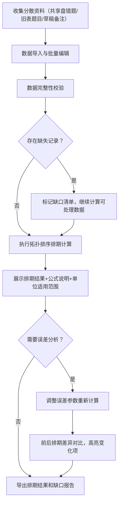

## 1. 产品概述

拓扑排序发布排期计算工具是一款面向投研助理和运营同事的专业计算工具，用于根据题目依赖关系、难度评分、学生错题率等多维度数据，通过拓扑排序算法智能生成题目发布排期。工具解决了当前资料分散（错题在共享盘、题目清单在旧表、人工备注夹在草稿）导致的排期效率低下、计算不透明等问题。

- 核心价值：将分散资料整合为可追溯的排期计算，公式透明、容错性强、便于复核
- 目标用户：投研助理（主要使用者、数据维护者）、运营同事（排期结果查阅者）

## 2. 核心功能

### 2.1 用户角色

| 角色 | 注册方式 | 核心权限 |
|------|----------|----------|
| 投研助理 | 系统内置 | 上传/编辑题目数据、执行排期计算、查看误差分析、处理数据缺口、导出结果 |
| 运营同事 | 系统内置 | 查看排期结果、查看公式说明、批量复核前后对比 |

### 2.2 功能模块

1. **数据导入与编辑页**：题目清单导入、依赖关系设置、评分数据录入、批量编辑
2. **排期计算仪表板**：拓扑排序可视化、公式说明面板、单位/适用范围展示、实时计算结果
3. **误差分析与批量复核**：误差参数调整、前后排期差异对比、变化高亮标注
4. **数据缺口与异常报告**：单位缺失记录、评分缺失记录、边界案例展示、修复建议

### 2.3 页面详情

| 页面名称 | 模块名称 | 功能描述 |
|----------|----------|----------|
| 数据导入与编辑页 | 题目列表表格 | 展示题目ID、名称、难度评分、所属章节、单位、错题率、依赖关系，支持行内编辑 |
| 数据导入与编辑页 | 批量导入区 | 支持CSV/Excel导入、数据格式校验、导入预览 |
| 数据导入与编辑页 | 依赖关系可视化 | 有向无环图展示题目前置依赖，支持拖拽调整 |
| 排期计算仪表板 | 公式说明卡 | 展示排期计算公式、单位说明、适用范围、失败原因，位置醒目 |
| 排期计算仪表板 | 排期结果甘特图 | 按拓扑顺序展示题目发布日期、批次、间隔、置信度 |
| 排期计算仪表板 | 计算详情面板 | 每题得分明细、权重拆解、排序位次、原始数据溯源 |
| 误差分析与批量复核 | 误差参数滑块 | 难度容差、错题率权重、批次间隔阈值可调 |
| 误差分析与批量复核 | 前后差异对比表 | 并排展示调整前后的排期位次变化，高亮标注改变结果的记录 |
| 数据缺口与异常报告 | 缺口清单 | 列出单位缺失、评分缺失、依赖冲突的记录，逐条说明缺失字段和影响 |
| 数据缺口与异常报告 | 边界案例展示 | 2-3个真实边界案例（排序不稳定、单位缺失等），每条演示如何改变最终结果 |

## 3. 核心流程

投研助理从分散数据源收集题目数据 → 导入工具并校验完整性 → 系统自动标记数据缺口但不中断计算 → 执行拓扑排序排期计算 → 展示公式透明的排期结果 → 调整误差参数进行复核 → 对比前后差异 → 导出最终排期和缺口清单补录。

## 4. 用户界面设计

### 4.1 设计风格

- 主色调：专业深蓝 `#1e3a5f` 搭配琥珀金 `#d4a24c`，传达金融投研的严谨与品质感
- 辅助色：数据可视化用翠玉绿 `#2d936c`（正常）、珊瑚红 `#c85353`（异常/缺口）、晴空蓝 `#4a8ec2`（对比变化）
- 按钮风格：圆角 4px，带细微阴影的扁平设计，主按钮深蓝填充，危险按钮珊瑚红描边
- 字体：标题用 Source Serif Pro（衬线、学术感），正文用 JetBrains Mono（等宽、数据可读性），数据表格用 IMB Plex Sans
- 布局风格：三栏式仪表板布局，左侧导航、中间核心工作区、右侧公式/详情面板
- 图标风格：Lucide 线性图标，配合琥珀金色调，数据卡片用细描边边框

### 4.2 页面设计概览

| 页面名称 | 模块名称 | UI 元素 |
|----------|----------|---------|
| 数据导入与编辑页 | 题目列表表格 | 斑马纹表格、行内编辑输入框、错误单元格红边标注、顶部粘性筛选栏、琥珀金数据缺口角标 |
| 排期计算仪表板 | 公式说明卡 | 深蓝边框卡片、公式用等宽字体琥珀金高亮、单位标签用圆角徽章、适用范围用引用块样式、失败原因用珊瑚红提示条 |
| 排期计算仪表板 | 排期结果甘特图 | 时间轴横向布局、批次用不同深浅蓝色、置信度用透明度、悬停显示计算详情、关键路径用琥珀金加粗 |
| 误差分析与批量复核 | 前后差异对比表 | 左右并排双列表格、变化行用晴空蓝背景高亮、位次上升/下降用箭头图标+数字、未变化项灰色淡化 |
| 数据缺口与异常报告 | 边界案例展示 | 卡片列表布局、每个案例用 before/after 双栏对比、结果变化处用珊瑚红圆圈标注、案例说明用 Source Serif Pro 斜体 |

### 4.3 响应式设计

- 桌面端优先（最小宽度 1280px），三栏固定布局
- 平板端（1024px）折叠右侧面板为可展开抽屉
- 移动端（768px）单栏流式布局，表格转为卡片式展示，甘特图简化为排序列表

### 4.4 动效与交互

- 页面加载：模块渐入（0.3s ease-out），导航栏先于内容区
- 数据计算：甘特图条形逐根从左向右生长动画（stagger 0.1s）
- 参数调整：滑块拖动时结果实时预览（debounce 200ms），差异对比表行淡入高亮
- 悬停反馈：表格行背景色微变、卡片阴影加深、图标琥珀金高亮
- 缺口标记：红圈脉冲动画（2s 循环）提醒用户注意缺失数据
