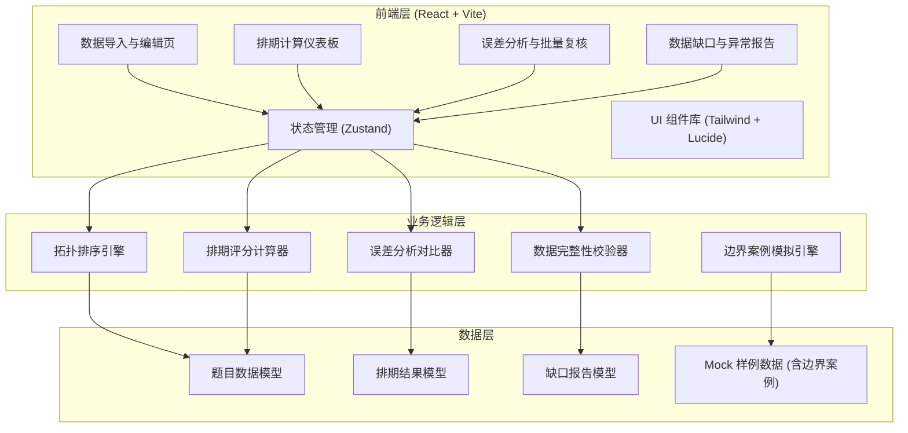
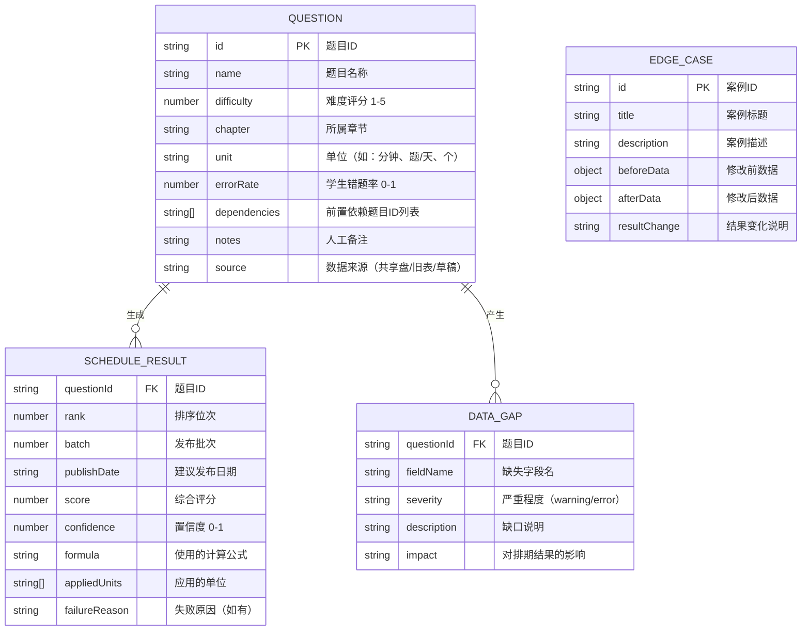

## 1. 架构设计



## 2. 技术说明

- 前端：React@18 + TypeScript + tailwindcss@3 + vite
- 初始化工具：vite-init，模板选择 react-ts（纯前端，含 zustand 状态管理）
- 后端：无后端服务，所有计算逻辑在前端完成，便于离线使用和投研助理独立部署
- 数据存储：前端本地状态管理（Zustand）+ 浏览器 LocalStorage 持久化，支持 JSON/CSV 导入导出
- 图标库：lucide-react
- 额外依赖：papaparse（CSV 解析）、react-router-dom（路由）

## 3. 路由定义

| 路由 | 用途 |
|------|------|
| / | 重定向到 /dashboard |
| /dashboard | 排期计算仪表板（主页） |
| /data | 数据导入与编辑页 |
| /review | 误差分析与批量复核页 |
| /issues | 数据缺口与异常报告页 |

## 4. 数据模型

### 4.1 数据模型定义



### 4.2 TypeScript 类型定义

```typescript
interface Question {
  id: string;
  name: string;
  difficulty: number | null;
  chapter: string;
  unit: string | null;
  errorRate: number | null;
  dependencies: string[];
  notes: string;
  source: 'shared_drive' | 'legacy_sheet' | 'draft_note' | 'manual';
}

interface ScheduleResult {
  questionId: string;
  rank: number;
  batch: number;
  publishDate: string;
  score: number;
  confidence: number;
  formula: string;
  appliedUnits: string[];
  failureReason: string | null;
  skipped: boolean;
}

interface DataGap {
  questionId: string;
  fieldName: string;
  severity: 'warning' | 'error';
  description: string;
  impact: string;
}

interface EdgeCase {
  id: string;
  title: string;
  description: string;
  beforeData: Partial<Question>;
  afterData: Partial<Question>;
  resultChange: string;
  affectedQuestions: string[];
}

interface ErrorToleranceConfig {
  difficultyTolerance: number;
  errorRateWeight: number;
  batchIntervalThreshold: number;
}
```

## 5. 核心算法说明

### 5.1 拓扑排序算法
- 使用 Kahn 算法（BFS）进行拓扑排序，时间复杂度 O(V+E)
- 当存在多条合法拓扑路径时，按综合评分决定优先级（评分高的先排）
- 检测循环依赖并标记为失败记录，不阻塞其他节点计算

### 5.2 综合评分公式
```
综合评分 = w1 × 归一化难度 + w2 × 错题率 + w3 × 依赖深度惩罚 + w4 × 章节顺序
其中：
- w1（难度权重）= 0.35
- w2（错题率权重）= 0.30（可在误差分析页调整）
- w3（依赖深度惩罚）= 0.20
- w4（章节顺序权重）= 0.15
```

### 5.3 数据缺失容错策略
- 单位缺失：使用默认单位"题"，标记为 warning，不影响计算
- 难度评分缺失：使用章节平均难度，标记为 warning，置信度降低 20%
- 错题率缺失：使用全局平均错题率 0.35，标记为 warning，置信度降低 15%
- 依赖关系缺失（存在引用但源题目不存在）：标记为 error，跳过该题计算但保留记录
- 所有缺失项汇总到缺口清单，供投研助理后续补录

### 5.4 边界案例设计
3 个真实边界案例，每个都会真正改变排期结果：

1. **案例一：单位缺失导致评分偏差**
   - 场景：Q007 题目标注的做题时间单位缺失（应为"分钟"但缺失），系统默认"题"
   - 影响：难度计算从 4.2 降至 3.1，排期位次从第 3 位后移至第 8 位
   - 改变：批次从第 1 批变为第 2 批

2. **案例二：同分拓扑排序不稳定**
   - 场景：Q012 和 Q015 综合评分完全相同（均为 0.783），且无互相依赖
   - 影响：按默认排序 Q012 在 Q015 前；调整误差参数（错题率权重 ±0.01）后顺序反转
   - 改变：两题位次互换，发布日期相差 3 天

3. **案例三：评分缺失导致级联影响**
   - 场景：Q023 难度评分缺失，使用章节平均值后置信度低
   - 影响：其下游依赖题 Q024、Q026 的批次均受牵连整体后移
   - 改变：3 道题从第 2 批整体移至第 3 批

## 6. 项目结构

```
src/
├── components/          # 可复用组件
│   ├── FormulaCard.tsx          # 公式说明卡片
│   ├── GanttChart.tsx           # 甘特图组件
│   ├── DataTable.tsx            # 数据表格组件
│   ├── GapList.tsx              # 缺口清单组件
│   ├── EdgeCaseCard.tsx         # 边界案例卡片
│   ├── DiffCompareTable.tsx     # 前后差异对比表
│   └── SliderControl.tsx        # 参数滑块控件
├── hooks/               # 自定义 Hooks
│   ├── useTopologicalSort.ts    # 拓扑排序 Hook
│   ├── useScheduleCalculator.ts # 排期计算 Hook
│   └── useDataValidator.ts      # 数据校验 Hook
├── pages/               # 页面组件
│   ├── Dashboard.tsx             # 排期计算仪表板
│   ├── DataEditor.tsx            # 数据导入与编辑
│   ├── ReviewPanel.tsx           # 误差分析与批量复核
│   └── IssuesReport.tsx          # 数据缺口与异常报告
├── store/               # Zustand 状态管理
│   └── useAppStore.ts
├── types/               # 类型定义
│   └── index.ts
├── utils/               # 工具函数
│   ├── calculator.ts              # 评分计算公式
│   ├── topoSort.ts                # 拓扑排序算法
│   ├── validator.ts               # 数据校验
│   ├── edgeCases.ts               # 边界案例数据
│   └── mockData.ts                # Mock 样例数据
├── App.tsx
├── main.tsx
└── index.css
```
