# 马尔可夫链课堂模拟 —— 批量分析报告

- **批次**：课堂演示样例集（批次ID：`f46d6798`）
- **生成时间**：2026-06-09 18:39:59
- **样例总数**：8
  - ✅ 成功：5
  - ❌ 失败：3

## 📋 批量概览

| 记录ID   | 标签                           | 状态    | 错误/告警                                 |
|----------|--------------------------------|---------|-------------------------------------------|
| 929fb825 | 天气模型（晴-阴-雨）           | success |                                           |
| 008bfa71 | 课堂出勤（出席/缺席）          | success |                                           |
| 87c414c2 | 赌徒资本（0 元 / 1 元 / 2 元） | success |                                           |
| 5ac7deef | 网站用户行为路径               | success |                                           |
| e30ac6da | 异常样例：空状态               | failed  | 输入的状态集合为空，无法构建马尔可夫链    |
| e8e10ac2 | 异常样例：矩阵维度错           | failed  | 转移矩阵维度 (2, 2) 与状态数 3 不匹配     |
| 895195aa | 异常样例：行和不等于1          | failed  | 第 1 行概率和为 0.900000，超出容差 ±1e-06 |
| 4b908e10 | 异常样例：初始状态名错         | success | 初始分布引用了不存在的状态 '正长'         |

## ⚠️ 缺口清单（供数据分析员补数）

以下样例未能完成计算，请按处理意见补齐或修正后重跑。

| 记录ID   | 标签                  | 错误类型                     | 错误说明                                  | 处理意见                                                                | 参数快照                                                                                                                                            |
|----------|-----------------------|------------------------------|-------------------------------------------|-------------------------------------------------------------------------|-----------------------------------------------------------------------------------------------------------------------------------------------------|
| e30ac6da | 异常样例：空状态      | EmptyStateError              | 输入的状态集合为空，无法构建马尔可夫链    | 请检查数据导入流程，至少提供 1 个状态名称；若为批量数据请标记该条跳过。 | {"label": "异常样例：空状态"}                                                                                                                       |
| e8e10ac2 | 异常样例：矩阵维度错  | InvalidTransitionMatrixError | 转移矩阵维度 (2, 2) 与状态数 3 不匹配     | 请核对转移矩阵行数/列数是否与状态列表长度完全一致。                     | {"n_states": 3, "matrix_shape": [2, 2], "label": "异常样例：矩阵维度错", "states": ["A", "B", "C"]}                                                 |
| 895195aa | 异常样例：行和不等于1 | NonStochasticMatrixError     | 第 1 行概率和为 0.900000，超出容差 ±1e-06 | 请检查该行是否全部填写，或对数值做归一化处理（允许误差 ≤ 1e-6）。       | {"row_index": 1, "row_sum": 0.8999999999999999, "tolerance": 1e-06, "label": "异常样例：行和不等于1", "state": "中", "row_values": [0.2, 0.5, 0.2]} |

## 📑 各记录详细分析


## ✅ 天气模型（晴-阴-雨）  （记录ID：`929fb825`）

- 处理状态：**success**
- 生成时间：2026-06-09 18:40:00

### 📝 普通话解释（可直接复制）

```
【模型概览】 本次分析的模型 '天气模型（晴-阴-雨）'（记录ID：929fb825）共包含 3 个状态：晴天、阴天、雨天。
【起点】 初始分布为：晴天 占 50.0%、阴天 占 30.0%、雨天 占 20.0%。
【长期趋势】 经过足够多步后，系统会收敛到一个稳定的状态分布，其中 '阴天' 出现的概率最高，约为 41.3%。
【演化过程】 在观察期内：晴天 下降 约 21.7 个百分点，阴天 上升 约 11.3 个百分点，雨天 上升 约 10.4 个百分点。
【一次随机模拟】 随机模拟 20 步的典型访问顺序为：阴天 → 雨天 → 晴天 → 雨天 → 阴天 → 雨天 → 阴天 → 晴天 → 阴天 → 雨天。
以上结论与附图、附表使用同一份计算结果，可交叉核对。
```

### 📊 参数表

- 模型ID：`7388c785`
- 状态列表：晴天, 阴天, 雨天

**初始分布：**

| 状态   |   初始概率 |
|--------|------------|
| 晴天   |     0.5000 |
| 阴天   |     0.3000 |
| 雨天   |     0.2000 |

**一步转移矩阵 P：**

| 状态\下一步   |   晴天 |   阴天 |   雨天 |
|---------------|--------|--------|--------|
| 晴天          | 0.6000 | 0.3000 | 0.1000 |
| 阴天          | 0.2000 | 0.5000 | 0.3000 |
| 雨天          | 0.1000 | 0.4000 | 0.5000 |

### 📈 计算结果表格

**稳态分布（按概率从高到低）：**

| 状态   |   稳态概率 |
|--------|------------|
| 阴天   |     0.4130 |
| 雨天   |     0.3043 |
| 晴天   |     0.2826 |

**第 10 步状态分布：**

|    步数 |   晴天 |   阴天 |   雨天 |
|---------|--------|--------|--------|
| 10.0000 | 0.2827 | 0.4130 | 0.3043 |

**一次模拟路径（20 步）：**

阴天 → 阴天 → 雨天 → 雨天 → 晴天 → 雨天 → 雨天 → 雨天 → 阴天 → 阴天 → 阴天 → 雨天 → 雨天 → 雨天 → 阴天 → 阴天 → 阴天 → 晴天 → 阴天 → 阴天 → 雨天

### 🖼 附图

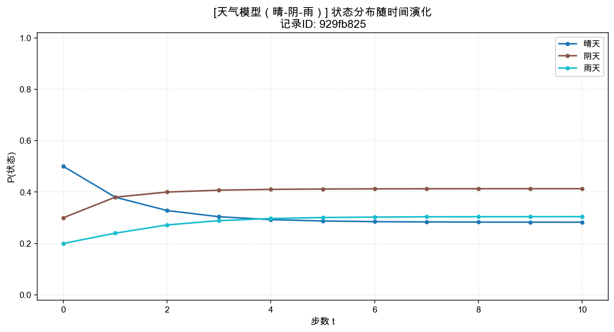

*图 1  状态分布随时间演化*

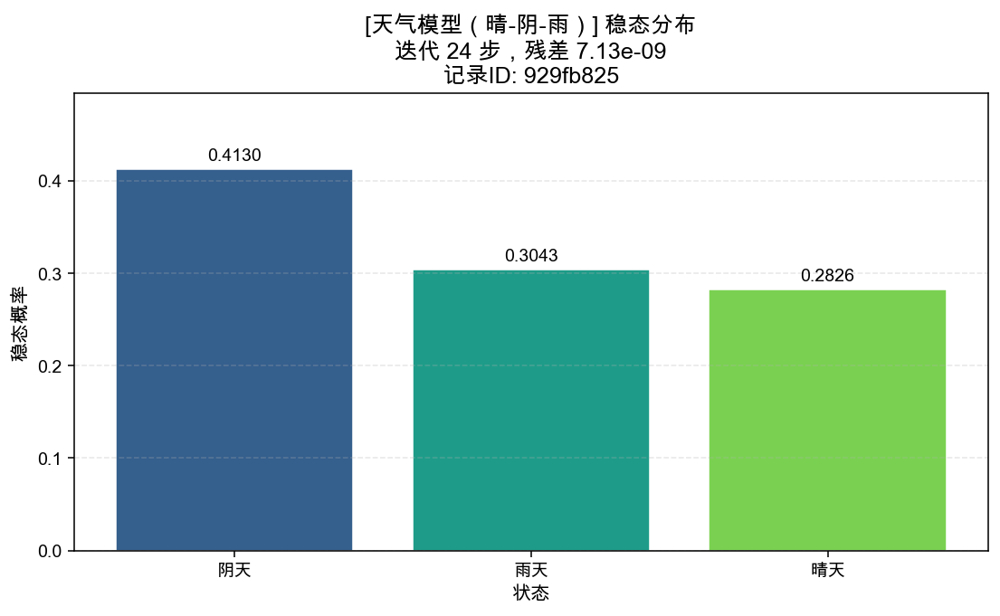

*图 2  稳态分布柱状图*

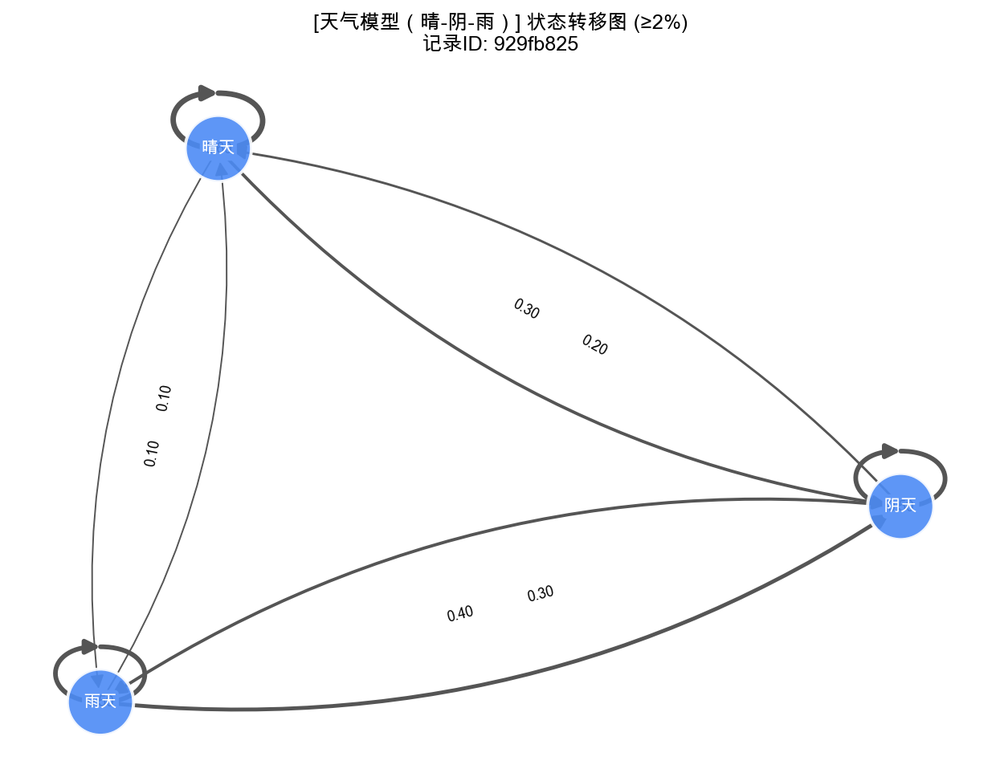

*图 3  状态转移有向图*


---


## ✅ 课堂出勤（出席/缺席）  （记录ID：`008bfa71`）

- 处理状态：**success**
- 生成时间：2026-06-09 18:40:00

### 📝 普通话解释（可直接复制）

```
【模型概览】 本次分析的模型 '课堂出勤（出席/缺席）'（记录ID：008bfa71）共包含 2 个状态：出席、缺席。
【起点】 初始分布为：出席 占 95.0%、缺席 占 5.0%。
【长期趋势】 经过足够多步后，系统会收敛到一个稳定的状态分布，其中 '出席' 出现的概率最高，约为 85.7%。
【演化过程】 在观察期内：出席 下降 约 9.3 个百分点，缺席 上升 约 9.3 个百分点。
【一次随机模拟】 随机模拟 20 步的典型访问顺序为：出席 → 缺席 → 出席 → 缺席 → 出席。
以上结论与附图、附表使用同一份计算结果，可交叉核对。
```

### 📊 参数表

- 模型ID：`f3cb7159`
- 状态列表：出席, 缺席

**初始分布：**

| 状态   |   初始概率 |
|--------|------------|
| 出席   |     0.9500 |
| 缺席   |     0.0500 |

**一步转移矩阵 P：**

| 状态\下一步   |   出席 |   缺席 |
|---------------|--------|--------|
| 出席          | 0.9000 | 0.1000 |
| 缺席          | 0.6000 | 0.4000 |

### 📈 计算结果表格

**稳态分布（按概率从高到低）：**

| 状态   |   稳态概率 |
|--------|------------|
| 出席   |     0.8571 |
| 缺席   |     0.1429 |

**第 10 步状态分布：**

|    步数 |   出席 |   缺席 |
|---------|--------|--------|
| 10.0000 | 0.8571 | 0.1429 |

**一次模拟路径（20 步）：**

出席 → 出席 → 出席 → 出席 → 出席 → 缺席 → 缺席 → 缺席 → 出席 → 出席 → 出席 → 缺席 → 缺席 → 缺席 → 出席 → 出席 → 出席 → 出席 → 出席 → 出席 → 出席

### 🖼 附图

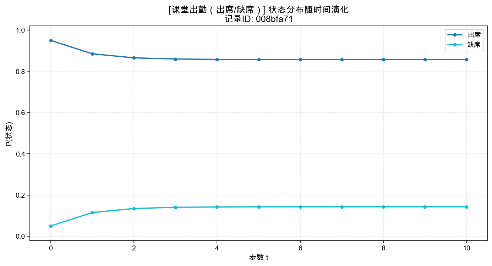

*图 1  状态分布随时间演化*

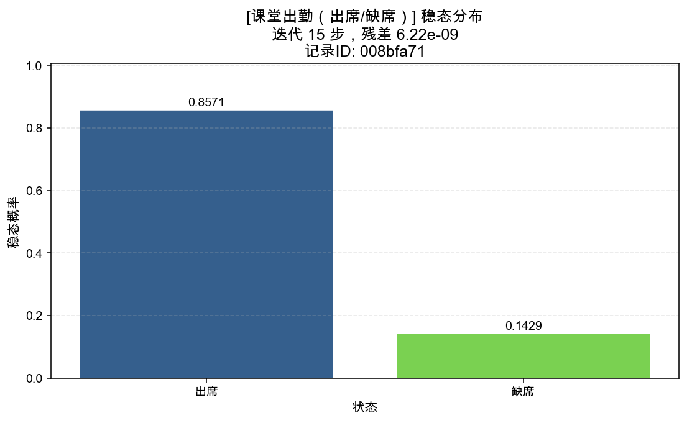

*图 2  稳态分布柱状图*

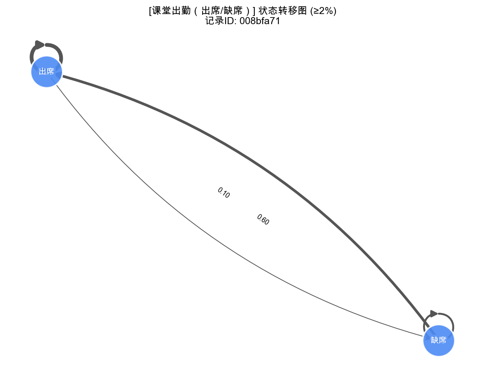

*图 3  状态转移有向图*


---


## ✅ 赌徒资本（0 元 / 1 元 / 2 元）  （记录ID：`87c414c2`）

- 处理状态：**success**
- 生成时间：2026-06-09 18:40:00

### 📝 普通话解释（可直接复制）

```
【模型概览】 本次分析的模型 '赌徒资本（0 元 / 1 元 / 2 元）'（记录ID：87c414c2）共包含 3 个状态：破产(0元)、持有1元、赢满(2元)。
【起点】 初始分布为：持有1元 占 100.0%。
【长期趋势】 经过足够多步后，系统会收敛到一个稳定的状态分布，其中 '破产(0元)' 出现的概率最高，约为 50.0%。
【演化过程】 在观察期内：破产(0元) 上升 约 50.0 个百分点，持有1元 下降 约 100.0 个百分点，赢满(2元) 上升 约 50.0 个百分点。
【一次随机模拟】 随机模拟 20 步的典型访问顺序为：持有1元 → 破产(0元)。
以上结论与附图、附表使用同一份计算结果，可交叉核对。
```

### 📊 参数表

- 模型ID：`39bae31c`
- 状态列表：破产(0元), 持有1元, 赢满(2元)

**初始分布：**

| 状态      |   初始概率 |
|-----------|------------|
| 破产(0元) |     0.0000 |
| 持有1元   |     1.0000 |
| 赢满(2元) |     0.0000 |

**一步转移矩阵 P：**

| 状态\下一步   |   破产(0元) |   持有1元 |   赢满(2元) |
|---------------|-------------|-----------|-------------|
| 破产(0元)     |      1.0000 |    0.0000 |      0.0000 |
| 持有1元       |      0.5000 |    0.0000 |      0.5000 |
| 赢满(2元)     |      0.0000 |    0.0000 |      1.0000 |

### 📈 计算结果表格

**稳态分布（按概率从高到低）：**

| 状态      |   稳态概率 |
|-----------|------------|
| 破产(0元) |     0.5000 |
| 赢满(2元) |     0.5000 |
| 持有1元   |     0.0000 |

**第 10 步状态分布：**

|    步数 |   破产(0元) |   持有1元 |   赢满(2元) |
|---------|-------------|-----------|-------------|
| 10.0000 |      0.5000 |    0.0000 |      0.5000 |

**一次模拟路径（20 步）：**

持有1元 → 破产(0元) → 破产(0元) → 破产(0元) → 破产(0元) → 破产(0元) → 破产(0元) → 破产(0元) → 破产(0元) → 破产(0元) → 破产(0元) → 破产(0元) → 破产(0元) → 破产(0元) → 破产(0元) → 破产(0元) → 破产(0元) → 破产(0元) → 破产(0元) → 破产(0元) → 破产(0元)

### 🖼 附图

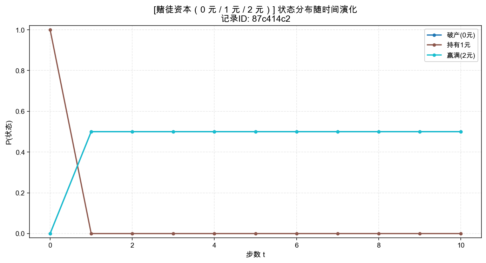

*图 1  状态分布随时间演化*

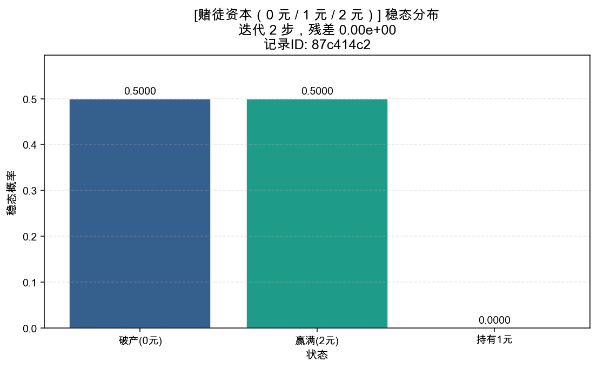

*图 2  稳态分布柱状图*

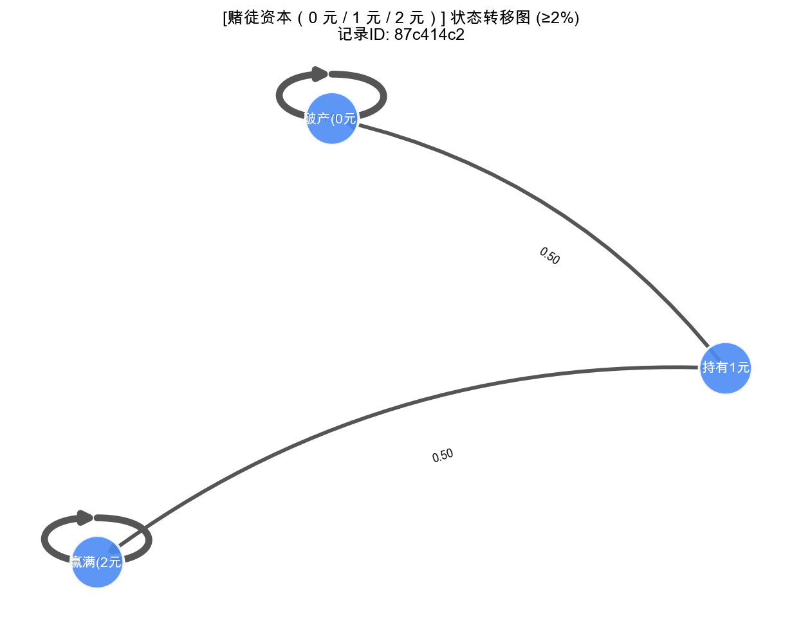

*图 3  状态转移有向图*


---


## ✅ 网站用户行为路径  （记录ID：`5ac7deef`）

- 处理状态：**success**
- 生成时间：2026-06-09 18:40:00

### 📝 普通话解释（可直接复制）

```
【模型概览】 本次分析的模型 '网站用户行为路径'（记录ID：5ac7deef）共包含 5 个状态：首页、商品页、购物车、结算、离开。
【起点】 初始分布为：首页 占 100.0%。
【长期趋势】 经过足够多步后，系统会收敛到一个稳定的状态分布，其中 '离开' 出现的概率最高，约为 100.0%。
【演化过程】 在观察期内：首页 下降 约 99.6 个百分点，商品页 上升 约 1.0 个百分点，购物车 上升 约 2.1 个百分点，结算 上升 约 7.4 个百分点，离开 上升 约 89.0 个百分点。
【一次随机模拟】 随机模拟 20 步的典型访问顺序为：首页 → 商品页 → 离开。
以上结论与附图、附表使用同一份计算结果，可交叉核对。
```

### 📊 参数表

- 模型ID：`f0d16b95`
- 状态列表：首页, 商品页, 购物车, 结算, 离开

**初始分布：**

| 状态   |   初始概率 |
|--------|------------|
| 首页   |     1.0000 |
| 商品页 |     0.0000 |
| 购物车 |     0.0000 |
| 结算   |     0.0000 |
| 离开   |     0.0000 |

**一步转移矩阵 P：**

| 状态\下一步   |   首页 |   商品页 |   购物车 |   结算 |   离开 |
|---------------|--------|----------|----------|--------|--------|
| 首页          | 0.1000 |   0.5000 |   0.1000 | 0.0500 | 0.2500 |
| 商品页        | 0.1500 |   0.2000 |   0.3500 | 0.1000 | 0.2000 |
| 购物车        | 0.0500 |   0.2000 |   0.2500 | 0.3500 | 0.1500 |
| 结算          | 0.0000 |   0.0000 |   0.1000 | 0.7000 | 0.2000 |
| 离开          | 0.0000 |   0.0000 |   0.0000 | 0.0000 | 1.0000 |

### 📈 计算结果表格

**稳态分布（按概率从高到低）：**

| 状态   |   稳态概率 |
|--------|------------|
| 离开   |     1.0000 |
| 结算   |     0.0000 |
| 购物车 |     0.0000 |
| 商品页 |     0.0000 |
| 首页   |     0.0000 |

**第 10 步状态分布：**

|    步数 |   首页 |   商品页 |   购物车 |   结算 |   离开 |
|---------|--------|----------|----------|--------|--------|
| 10.0000 | 0.0039 |   0.0105 |   0.0209 | 0.0744 | 0.8903 |

**一次模拟路径（20 步）：**

首页 → 商品页 → 离开 → 离开 → 离开 → 离开 → 离开 → 离开 → 离开 → 离开 → 离开 → 离开 → 离开 → 离开 → 离开 → 离开 → 离开 → 离开 → 离开 → 离开 → 离开

### 🖼 附图

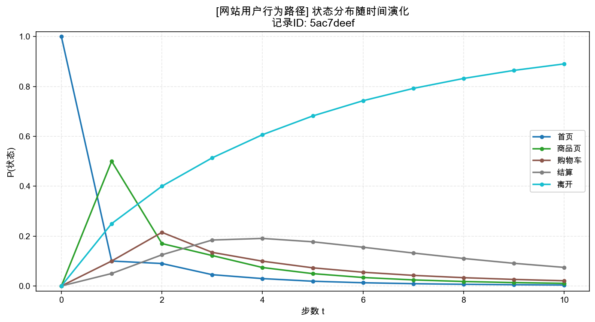

*图 1  状态分布随时间演化*

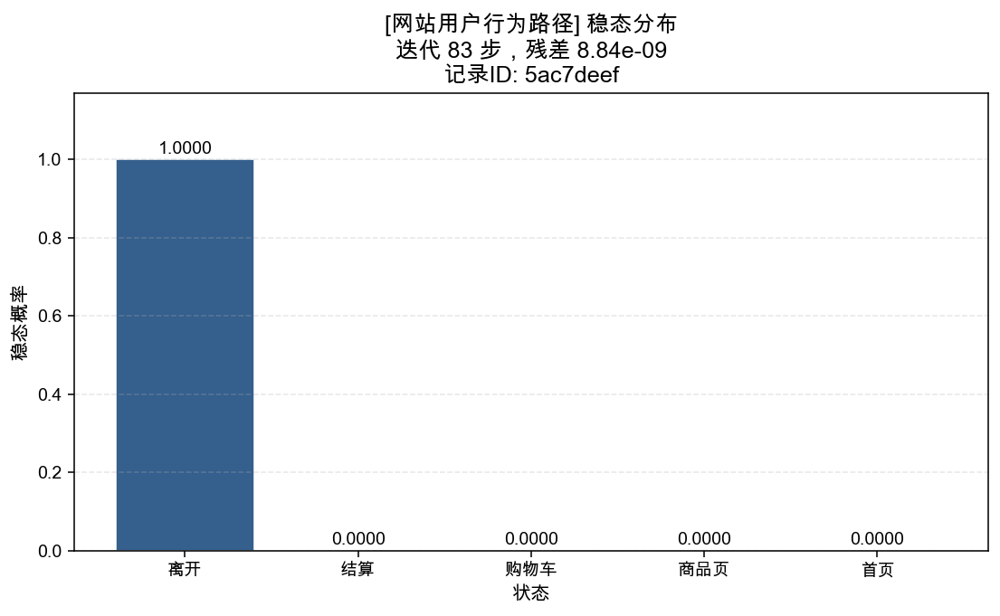

*图 2  稳态分布柱状图*

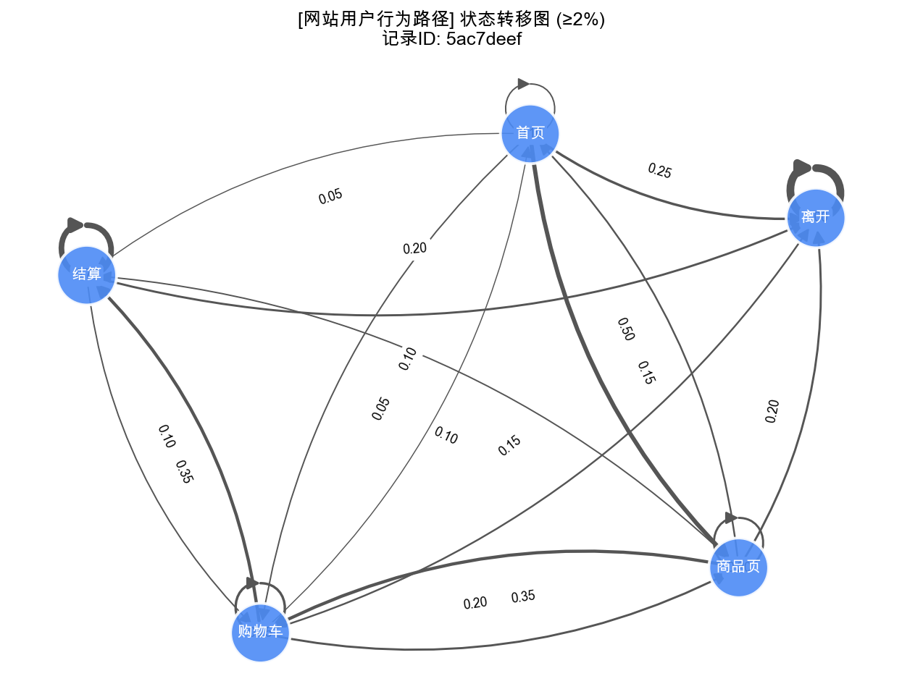

*图 3  状态转移有向图*


---


## ❌ 异常样例：空状态  （记录ID：`e30ac6da`）

- 处理状态：**failed**
- 生成时间：2026-06-09 18:40:00

### 📝 普通话解释（可直接复制）

```
【模型概览】 本次分析的模型 '异常样例：空状态'（记录ID：e30ac6da）共包含 0 个状态：。
【计算未完成】 该样例因为『输入的状态集合为空，无法构建马尔可夫链』未能完成计算。建议：请检查数据导入流程，至少提供 1 个状态名称；若为批量数据请标记该条跳过。
```


### 🔍 异常 / 告警 / 复核意见

- **错误类型**：EmptyStateError
- **错误说明**：输入的状态集合为空，无法构建马尔可夫链
- **处理意见**：请检查数据导入流程，至少提供 1 个状态名称；若为批量数据请标记该条跳过。
- **参数快照（可顺着回溯）**：
  - `label`: `异常样例：空状态`
- [失败] 请检查数据导入流程，至少提供 1 个状态名称；若为批量数据请标记该条跳过。

---


## ❌ 异常样例：矩阵维度错  （记录ID：`e8e10ac2`）

- 处理状态：**failed**
- 生成时间：2026-06-09 18:40:00

### 📝 普通话解释（可直接复制）

```
【模型概览】 本次分析的模型 '异常样例：矩阵维度错'（记录ID：e8e10ac2）共包含 3 个状态：A、B、C。
【计算未完成】 该样例因为『转移矩阵维度 (2, 2) 与状态数 3 不匹配』未能完成计算。建议：请核对转移矩阵行数/列数是否与状态列表长度完全一致。
```


### 🔍 异常 / 告警 / 复核意见

- **错误类型**：InvalidTransitionMatrixError
- **错误说明**：转移矩阵维度 (2, 2) 与状态数 3 不匹配
- **处理意见**：请核对转移矩阵行数/列数是否与状态列表长度完全一致。
- **参数快照（可顺着回溯）**：
  - `n_states`: `3`
  - `matrix_shape`: `(2, 2)`
  - `label`: `异常样例：矩阵维度错`
  - `states`: `['A', 'B', 'C']`
- [失败] 请核对转移矩阵行数/列数是否与状态列表长度完全一致。

---


## ❌ 异常样例：行和不等于1  （记录ID：`895195aa`）

- 处理状态：**failed**
- 生成时间：2026-06-09 18:40:00

### 📝 普通话解释（可直接复制）

```
【模型概览】 本次分析的模型 '异常样例：行和不等于1'（记录ID：895195aa）共包含 3 个状态：低、中、高。
【计算未完成】 该样例因为『第 1 行概率和为 0.900000，超出容差 ±1e-06』未能完成计算。建议：请检查该行是否全部填写，或对数值做归一化处理（允许误差 ≤ 1e-6）。
```


### 🔍 异常 / 告警 / 复核意见

- **错误类型**：NonStochasticMatrixError
- **错误说明**：第 1 行概率和为 0.900000，超出容差 ±1e-06
- **处理意见**：请检查该行是否全部填写，或对数值做归一化处理（允许误差 ≤ 1e-6）。
- **参数快照（可顺着回溯）**：
  - `row_index`: `1`
  - `row_sum`: `0.8999999999999999`
  - `tolerance`: `1e-06`
  - `label`: `异常样例：行和不等于1`
  - `state`: `中`
  - `row_values`: `[0.2, 0.5, 0.2]`
- [失败] 请检查该行是否全部填写，或对数值做归一化处理（允许误差 ≤ 1e-6）。

---


## ✅ 异常样例：初始状态名错  （记录ID：`4b908e10`）

- 处理状态：**success**
- 生成时间：2026-06-09 18:40:01

### 📝 普通话解释（可直接复制）

```
【模型概览】 本次分析的模型 '异常样例：初始状态名错'（记录ID：4b908e10）共包含 2 个状态：正常、故障。
【起点】 初始分布为：正常 占 100.0%。
【长期趋势】 经过足够多步后，系统会收敛到一个稳定的状态分布，其中 '正常' 出现的概率最高，约为 88.9%。
【演化过程】 在观察期内：正常 下降 约 11.1 个百分点，故障 上升 约 11.1 个百分点。
【一次随机模拟】 随机模拟 20 步的典型访问顺序为：正常 → 故障 → 正常。
以上结论与附图、附表使用同一份计算结果，可交叉核对。
```

### 📊 参数表

- 模型ID：`e3a2c4dd`
- 状态列表：正常, 故障

**初始分布：**

| 状态   |   初始概率 |
|--------|------------|
| 正常   |     1.0000 |
| 故障   |     0.0000 |

**一步转移矩阵 P：**

| 状态\下一步   |   正常 |   故障 |
|---------------|--------|--------|
| 正常          | 0.9500 | 0.0500 |
| 故障          | 0.4000 | 0.6000 |

### 📈 计算结果表格

**稳态分布（按概率从高到低）：**

| 状态   |   稳态概率 |
|--------|------------|
| 正常   |     0.8889 |
| 故障   |     0.1111 |

**第 10 步状态分布：**

|    步数 |   正常 |   故障 |
|---------|--------|--------|
| 10.0000 | 0.8892 | 0.1108 |

**一次模拟路径（20 步）：**

正常 → 正常 → 正常 → 正常 → 正常 → 故障 → 故障 → 故障 → 正常 → 正常 → 正常 → 正常 → 正常 → 正常 → 正常 → 正常 → 正常 → 正常 → 正常 → 正常 → 正常

### 🖼 附图

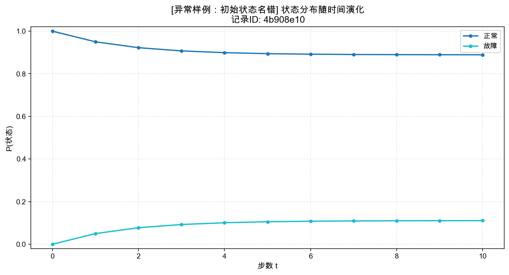

*图 1  状态分布随时间演化*

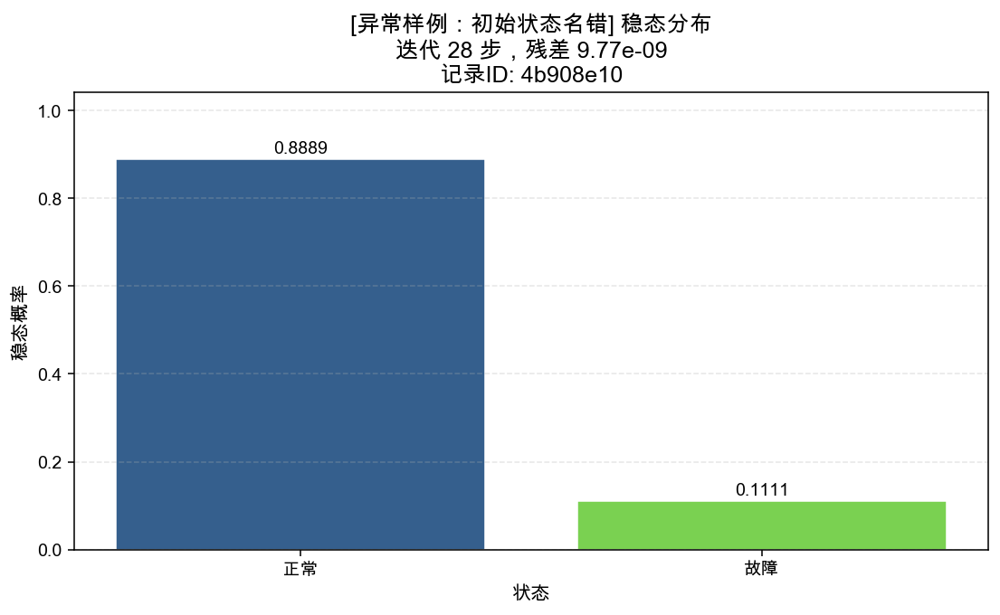

*图 2  稳态分布柱状图*

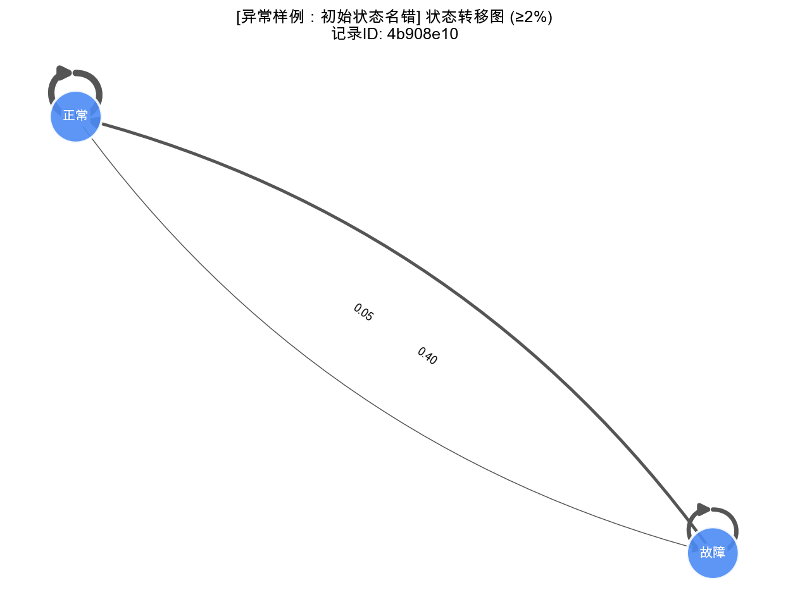

*图 3  状态转移有向图*


### 🔍 异常 / 告警 / 复核意见

- **错误类型**：StateNotFoundError
- **错误说明**：初始分布引用了不存在的状态 '正长'
- **处理意见**：请核对初始分布的状态名是否拼写正确，或补充缺失状态定义。
- **参数快照（可顺着回溯）**：
  - `state_name`: `正长`
  - `available_states`: `['正常', '故障']`
  - `label`: `异常样例：初始状态名错`
  - `initial_dist`: `{'正长': 1.0}`
- [失败] 请核对初始分布的状态名是否拼写正确，或补充缺失状态定义。
- [复核] 修正初始分布拼写错误：正长→正常
- [复核] 复核时覆盖参数: ['initial_dist']

---


## 🔧 复核入口

如需复核或修正某条记录：
1. 记下该条的 **记录ID**（见上方表格或各章节标题）；
2. 在命令行工具中执行 `python main.py review <记录ID>`，可重跑并覆盖参数；
3. 复核意见会自动写入该条记录，生成的新报告中会同步显示。

所有图表、表格、文字说明均基于同一份 `ProcessingRecord` 计算结果，不存在各算各的情况；顺着任何一条异常均可在本节中找到参数快照和处理意见。