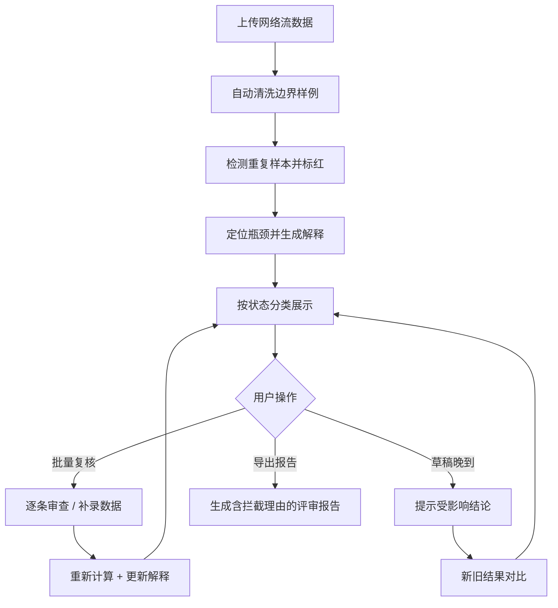

## 1. 产品概述

"网络流瓶颈定位"是面向算法工程师与教学评审场景的智能分析工具，解决网络流算法中边界样例清洗繁琐、重复样本人工标红效率低下、分析结论缺乏可解释性等核心痛点。系统自动识别异常数据、检测重复样本、生成可解释结论，并在数据增量更新时智能提示受影响结论，同时支持面向投委会的专业报告导出。

- 目标用户：算法工程师、算法课程教师、学生、技术评审委员会
- 核心价值：将半天的人工清洗工作压缩到分钟级，让分析结论自带解释，数据更新可追溯，报告可直接用于评审

## 2. 核心功能

### 2.1 用户角色

| 角色 | 使用场景 | 核心需求 |
|------|----------|----------|
| 算法工程师 | 日常网络流瓶颈分析 | 自动清洗边界样例、重复样本检测、可解释结论、草稿增量更新提示 |
| 课程教师 | 批改学生作业、课堂讲解 | 批量复核、结论解释可直接用于教学、错题补录后自动更新 |
| 学生 | 自查作业、错题复习 | 理解结论为什么得出、补录后看到更新 |
| 投委会成员 | 项目评审 | 通过导出报告快速理解重复样本拦截原因等关键决策 |

### 2.2 功能模块

1. **分析工作台**：数据上传、样例列表展示、状态筛选、批量操作
2. **结果详情面板**：瓶颈定位可视化、解释说明区、重复样本标红展示
3. **草稿增量管理**：草稿到达提示、受影响结论标记、新旧结果对比
4. **批量复核中心**：逐条复核、状态流转、补录后自动刷新解释
5. **报告导出**：面向投委会的专业 PDF 报告，含重复样本拦截理由

### 2.3 页面详情

| 页面名称 | 模块名称 | 功能描述 |
|----------|----------|----------|
| 分析工作台 | 顶部导航栏 | 项目切换、草稿状态提示、报告导出入口 |
| 分析工作台 | 数据上传区 | 支持 JSON/CSV 格式上传，自动校验格式 |
| 分析工作台 | 样例列表卡片 | 每条记录显示状态标签（正常/待确认/坏数据）、瓶颈摘要、重复标记 |
| 分析工作台 | 筛选工具栏 | 按状态、重复、时间筛选，批量复核入口 |
| 结果详情面板 | 瓶颈可视化区 | 网络图/流路径展示，瓶颈节点高亮 |
| 结果详情面板 | 解释说明区 | 1-2 句通俗解释瓶颈成因及影响，适合教学讲解 |
| 结果详情面板 | 重复样本区 | 标红展示重复对，附相似度分数与拦截理由 |
| 草稿增量管理 | 草稿提示条 | 顶部醒目标识"有 X 条草稿晚到"，点击展开详情 |
| 草稿增量管理 | 受影响结论列表 | 标记哪些结论因草稿数据变化，可查看前后对比 |
| 批量复核中心 | 复核队列 | 逐条展示待复核记录，支持通过/打回/补录 |
| 批量复核中心 | 补录触发区 | 学生错题补录入口，补录后自动重新计算并刷新解释 |
| 报告导出页 | 报告预览 | 在线预览报告内容，含重复样本拦截专题章节 |
| 报告导出页 | 导出配置 | 选择导出范围、格式（PDF）、是否包含原始数据 |

## 3. 核心流程

### 3.1 日常分析流程

算法工程师上传网络流数据 → 系统自动清洗边界样例并检测重复 → 工程师查看每条结果的瓶颈定位与解释说明 → 对异常数据进行复核 → 草稿晚到后系统提示受影响结论 → 导出报告供投委会审阅

### 3.2 教学复核流程

教师上传学生作业数据 → 系统批量分析并生成每条记录的解释 → 教师在批量复核中心逐条审查 → 学生补录错题数据 → 系统自动重新计算并更新解释 → 教师查看更新后的结果

## 4. 用户界面设计

### 4.1 设计风格

- **主色调**：深海蓝 `#0F2540` 作为背景主色，搭配青蓝 `#00B4D8` 高亮瓶颈，警示红 `#E63946` 标红重复与坏数据
- **辅助色**：琥珀黄 `#F4A261` 标记待确认，森林绿 `#2A9D8F` 标记正常记录
- **按钮风格**：微圆角（6px），正常状态有细微阴影，hover 时轻微上浮
- **字体**：标题使用 "JetBrains Mono" 等宽字体凸显工程感，正文使用 "Noto Sans SC" 保证中文可读性
- **布局风格**：左侧导航 + 右侧工作台的经典工程布局，卡片化展示每条样例，状态标签左对齐
- **视觉细节**：背景使用低噪点网格纹理，瓶颈节点有脉冲发光效果，重复样本有红色对角条纹覆盖
- **图标风格**：使用 Lucide 线性图标，保持与工程气质一致

### 4.2 页面设计概览

| 页面名称 | 模块名称 | UI 元素 |
|----------|----------|---------|
| 分析工作台 | 样例卡片网格 | 三列栅格布局，卡片高度一致，状态标签角标定位，hover 卡片轻微上浮并显示解释预览 |
| 结果详情面板 | 瓶颈可视化 | 左侧 SVG 网络图，瓶颈节点发光脉冲动画，右侧文字解释 1-2 句，解释下方附 "用于讲解" 提示 |
| 结果详情面板 | 重复样本区 | 红色半透明覆盖层 + 对角条纹，两条记录并排对比显示，中间相似度分数，下方拦截理由说明 |
| 草稿增量管理 | 顶部提示条 | 琥珀黄色背景，左侧草稿图标，文字 "3 条草稿已到达，可能影响 2 条结论"，右侧"查看详情"按钮 |
| 报告导出页 | 重复样本拦截章节 | 独立章节标题，表格展示重复对、相似度、拦截理由，附可视化示意图 |

### 4.3 响应式设计

- 桌面端优先：1280px 以上三列卡片，1024-1279px 两列，1024px 以下单列
- 侧边栏在 768px 以下收起为汉堡菜单
- 瓶颈可视化区域最小保留 400px 宽度，窄屏下自动折行
- 触摸优化：按钮最小点击区域 44x44px，卡片间距在移动端增大
