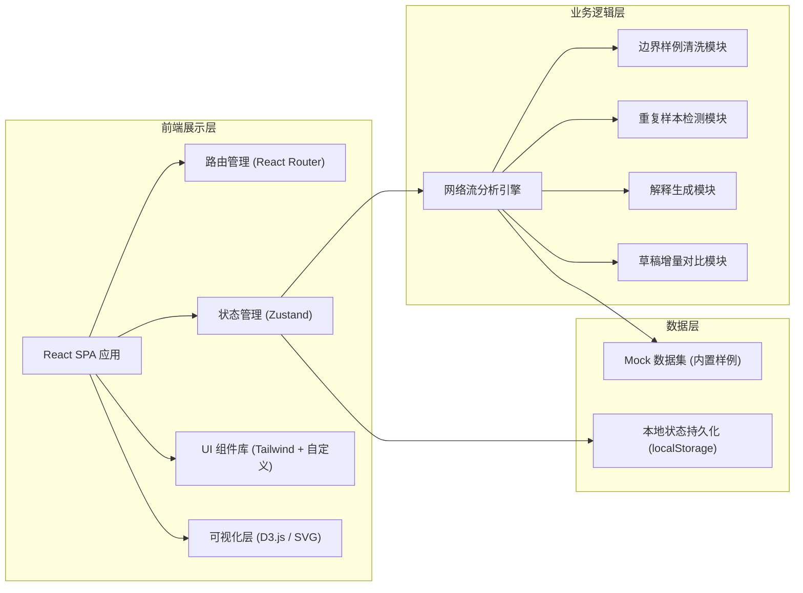

## 1. 架构设计



## 2. 技术描述

- **前端框架**：React@18 + TypeScript
- **构建工具**：Vite@5
- **样式方案**：Tailwind CSS@3 + CSS 变量主题系统
- **路由**：React Router@6
- **状态管理**：Zustand（轻量级，适合工程类工具）
- **可视化**：原生 SVG + D3.js（用于网络图绘制）
- **图标库**：Lucide React
- **后端**：无后端，全部逻辑在前端实现，使用 Mock 数据
- **数据存储**：localStorage 持久化用户复核状态

## 3. 路由定义

| 路由 | 页面名称 | 用途 |
|------|----------|------|
| `/` | 分析工作台 | 主页，展示样例列表、筛选、上传入口 |
| `/sample/:id` | 结果详情页 | 单条样例的瓶颈定位、解释说明、重复样本详情 |
| `/review` | 批量复核中心 | 待复核队列、逐条审查、补录入口 |
| `/draft` | 草稿增量管理 | 草稿到达提示、受影响结论对比 |
| `/export` | 报告导出页 | 报告预览、导出配置与下载 |

## 4. 核心数据类型定义

```typescript
// 样例状态枚举
type SampleStatus = 'normal' | 'pending' | 'bad_data';

// 网络流节点
interface FlowNode {
  id: string;
  label: string;
  capacity: number;
  flow: number;
  isBottleneck?: boolean;
  x: number;
  y: number;
}

// 网络流边
interface FlowEdge {
  id: string;
  from: string;
  to: string;
  capacity: number;
  flow: number;
}

// 重复样本对
interface DuplicatePair {
  sampleId1: string;
  sampleId2: string;
  similarityScore: number; // 0-1
  reason: string; // 拦截理由说明
}

// 瓶颈解释
interface BottleneckExplanation {
  summary: string;        // 一句话瓶颈总结
  teachingNote: string;   // 用于讲解的 1-2 句通俗解释
  affectedNodes: string[];
  maxFlow: number;
  bottleneckValue: number;
}

// 分析样例
interface AnalysisSample {
  id: string;
  name: string;
  status: SampleStatus;
  nodes: FlowNode[];
  edges: FlowEdge[];
  source: string;
  sink: string;
  explanation: BottleneckExplanation | null;
  isDuplicate: boolean;
  duplicateOf?: string;
  reviewed: boolean;
  reviewStatus?: 'approved' | 'rejected' | 'pending_review';
  createdAt: string;
  updatedAt: string;
}

// 草稿数据
interface DraftData {
  id: string;
  sampleId: string;
  nodes: FlowNode[];
  edges: FlowEdge[];
  arrivedAt: string;
  impacts: string[]; // 受影响的结论 ID 列表
}

// 导出报告
interface ExportReport {
  generatedAt: string;
  samples: AnalysisSample[];
  duplicates: DuplicatePair[];
  summary: {
    total: number;
    normal: number;
    pending: number;
    badData: number;
    duplicates: number;
  };
}
```

## 5. 核心模块设计

### 5.1 网络流分析引擎

- 实现最大流算法（Edmonds-Karp）
- 识别瓶颈节点/边（剩余容量为 0 或接近容量上限的边）
- 输出标准化的分析结果

### 5.2 边界样例清洗模块

- 检测非连通图
- 检测源点无法到达汇点的情况
- 检测负容量、自环等非法数据
- 输出清洗标记与坏数据理由

### 5.3 重复样本检测模块

- 基于图结构相似度（节点/边数量、度序列）
- 基于容量分布的数值相似度
- 综合评分阈值判断（>0.9 视为重复）
- 生成可解释的拦截理由

### 5.4 解释生成模块

- 根据瓶颈位置自动生成 1-2 句通俗解释
- 区分教学场景与工程场景的解释深度
- 补录数据后自动重新生成解释

### 5.5 草稿增量对比模块

- 检测晚到草稿与已有数据的差异
- 标记受影响的分析结论
- 提供新旧结果的并排对比视图
- 不自动覆盖旧结果，等待用户确认

## 6. 预置 Mock 数据

内置三条样例用于演示核心功能：

1. **顺利记录（sample-001）**：正常连通图，瓶颈在中间节点，最大流可计算
2. **待确认记录（sample-002）**：数据部分缺失，容量值异常高，需要人工复核
3. **明显坏数据（sample-003）**：源汇不连通，含负容量边，自动标记为坏数据

另预置一条重复样本（sample-004），与 sample-001 结构相似度 0.95，用于演示重复标红与拦截理由。
预置两条草稿数据，用于演示晚到提示与受影响结论对比。
