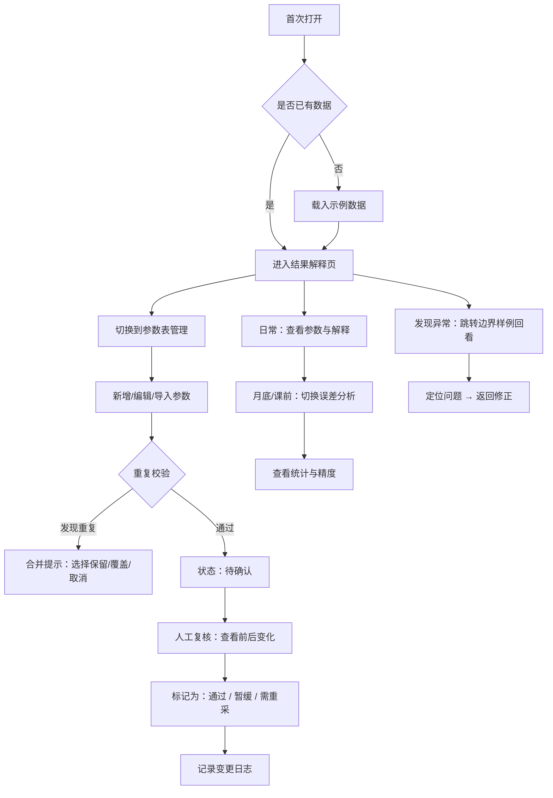

## 1. 产品概述

条件概率教学卡是面向数据分析员、教师和工程师的数据整理与教学辅助工具，用于日常管理条件概率参数表、输出可解释的计算结果、追踪数据质量与人工审核记录。

- **核心问题**：数据分析员在维护条件概率参数时缺乏系统化的入口，数据状态混乱、修正无留痕、重复导入易产生冲突结论
- **目标用户**：数据分析员（主要使用者）、教师/工程师（教学讲解、复核）

## 2. 核心功能

### 2.1 用户角色

| 角色 | 使用方式 | 核心权限 |
|------|----------|----------|
| 数据分析员 | 日常操作 | 全部功能：参数整理、导入、人工修正、状态切换 |
| 教师/工程师 | 查看与讲解 | 查看结果、解释说明、误差分析、边界样例回看 |

### 2.2 功能模块

1. **结果解释（默认首页 / 日常入口）**：参数表展示、条件概率计算结果、一两句可解释说明、数据状态标签（可用/暂缓/需重采）
2. **参数表管理**：新建/编辑/导入参数行、批量处理、防重复校验
3. **人工审核与留痕**：待确认→通过状态流转、变更前后对比、操作日志
4. **边界样例回看**：异常/边界案例快速检索、问题溯源、处理入口
5. **误差分析**：月底/课前集中查看模块，计算精度评估、数据质量统计

### 2.3 页面详情

| 页面名称 | 模块名称 | 功能描述 |
|----------|----------|----------|
| 结果解释（首页） | 顶部导航 | 切换：结果解释、参数表管理、误差分析 |
| 结果解释（首页） | 参数卡片列表 | 每行显示参数、计算值、一两句解释、状态标签、操作按钮 |
| 结果解释（首页） | 首次打开引导 | 无数据时自动载入示例数据，展示完整使用流程 |
| 结果解释（首页） | 状态筛选 | 按「可用/暂缓/需重新采集」筛选参数 |
| 参数表管理 | 数据表格 | 行内编辑、批量选择、新增行 |
| 参数表管理 | 导入校验 | 导入CSV/JSON、去重合并、冲突提示、避免重复结论 |
| 参数表管理 | 人工修正面板 | 标注「待确认」、填写修正理由、切换为「通过」后保留对比记录 |
| 边界样例回看 | 案例列表 | 标记为边界/异常的条目、附带问题描述、处理入口 |
| 边界样例回看 | 详情展开 | 显示历史变更、前后对比、处理建议 |
| 误差分析 | 统计概览 | 整体精度、各状态数量占比、修正次数统计 |
| 误差分析 | 时间维度 | 按月/周查看数据质量趋势 |

## 3. 核心流程

## 4. 用户界面设计

### 4.1 设计风格

- **主色调**：深靛蓝 `#1e3a5f`（专业、数据感）、辅助色琥珀 `#d97706`（警示/待确认）、翠绿 `#059669`（通过/可用）、玫红 `#be123c`（需重采）
- **风格基调**：学术编辑室 + 数据仪表盘，沉稳不沉闷
- **按钮样式**：圆角 6px，中等高度，悬停微浮起；状态按钮使用对应色调的浅色填充 + 深边框
- **字体**：标题使用 Source Serif Pro（衬线、学术感），正文使用 IBM Plex Sans（清晰易读的等宽感无衬线）
- **布局**：顶部导航 + 卡片式主内容区，左侧筛选区在宽屏展开，窄屏折叠为抽屉
- **图标/emoji**：Lucide 图标，状态用彩色圆点徽章辅助

### 4.2 页面设计概览

| 页面名称 | 模块名称 | UI 元素 |
|----------|----------|----------|
| 结果解释（首页） | 顶部导航 | 深色底 + 白色文字，当前页下划线高亮，右侧显示数据状态计数徽章 |
| 结果解释（首页） | 参数卡片 | 白底卡片、顶部参数名、中部概率值 + 一两句解释、底部状态标签条 + 操作按钮 |
| 结果解释（首页） | 示例引导 | 首次使用时顶部出现浅蓝提示条，说明示例数据可随时重置 |
| 参数表管理 | 数据表 | 斑马纹、悬停高亮、行内编辑输入框、状态下拉选择 |
| 参数表管理 | 导入区 | 拖拽上传区 + 去重开关 + 导入预览对比表 |
| 参数表管理 | 修正对比 | 左右两栏：修改前 vs 修改后，中间箭头，下方修正理由文本框 |
| 边界样例回看 | 案例卡片 | 左侧红色/琥珀色边框，展开后显示时间线形式的变更日志 |
| 误差分析 | 图表区 | 简洁柱状图 + 环形占比图，使用主色调渐变 |

### 4.3 响应式

- 桌面端（≥1280px）：三栏布局，筛选侧边栏 + 主内容 + 详情面板
- 平板（768-1279px）：两栏布局，主内容自适应，筛选/详情用抽屉
- 移动端（<768px）：单栏堆叠，顶部标签切换模块

