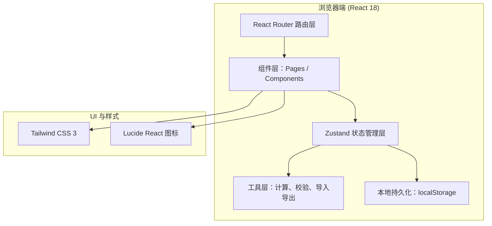

## 1. 架构设计



## 2. 技术说明

- **前端框架**：React@18 + TypeScript + Vite
- **初始化工具**：vite-init，选用 `react-ts` 模板（纯前端，数据存 localStorage）
- **状态管理**：zustand，存储参数表、审核日志、筛选条件、UI 状态
- **路由**：react-router-dom，3 个主路由
- **样式**：tailwindcss@3，自定义主题色板（靛蓝/琥珀/翠绿/玫红）
- **图标**：lucide-react
- **后端**：无（纯前端，所有数据浏览器本地持久化，便于演示）
- **数据持久化**：localStorage，首次打开检测无数据时注入示例数据

## 3. 路由定义

| 路由 | 页面 | 说明 |
|------|------|------|
| `/` | 结果解释页（首页） | 默认入口，展示参数卡片 + 解释 + 状态筛选 |
| `/params` | 参数表管理 | 表格编辑、导入导出、人工审核修正、去重合并 |
| `/analysis` | 误差分析 | 统计概览、状态占比、边界样例回看入口 |

## 4. 数据模型

### 4.1 核心类型定义

```typescript
export type DataStatus = 'available' | 'pending' | 'recollect';
export type ReviewStatus = 'pending' | 'approved' | 'rejected';

export interface CondProbParam {
  id: string;
  condition: string;          // 条件 A 描述，如 "用户注册满30天"
  outcome: string;            // 结果 B 描述，如 "完成首次付费"
  jointCount: number;         // A∩B 样本数
  conditionCount: number;     // A 样本数
  probability: number;        // P(B|A) = jointCount / conditionCount
  status: DataStatus;         // 可用 / 暂缓 / 需重新采集
  reviewStatus: ReviewStatus; // 待确认 / 通过 / 驳回
  explanation: string;        // 一两句解释说明
  isBoundary: boolean;        // 是否为边界/异常样例
  boundaryNote?: string;      // 边界问题描述
  createdAt: number;
  updatedAt: number;
}

export interface ChangeLog {
  id: string;
  paramId: string;
  field: string;              // 变更字段
  oldValue: string;
  newValue: string;
  reason: string;             // 修正理由
  operator: string;           // 操作人（默认"数据分析员"）
  timestamp: number;
  beforeStatus: ReviewStatus;
  afterStatus: ReviewStatus;
}

export interface ImportConflict {
  incoming: CondProbParam;
  existing: CondProbParam;
  resolution: 'keep' | 'overwrite' | 'skip'; // 保留现有 / 覆盖 / 跳过
}
```

### 4.2 Zustand Store 切片

- `params`：参数数组 CRUD
- `changelogs`：变更日志记录与查询
- `ui`：当前页、筛选条件、展开的卡片 ID、模态框状态
- `import`：导入缓冲区、冲突列表、去重开关

## 5. 关键业务逻辑

### 5.1 防重复导入
- 唯一键 = `condition + outcome`（规范化：去空格、统一大小写）
- 导入时逐条比对已有数据，冲突进入 `ImportConflict` 列表
- 用户逐条选择：保留现有 / 覆盖（生成变更日志）/ 跳过

### 5.2 人工修正留痕
- 任意字段变更自动生成 `ChangeLog` 记录
- `reviewStatus` 从 `pending` → `approved` 时，强制要求填写 `reason`
- 变更对比面板：左右两栏展示 oldValue vs newValue，附带时间戳与操作人

### 5.3 首次打开示例数据
- 启动时检查 localStorage，若无 `cond_prob_params` 键则注入 8 条预置样例
- 覆盖 `available / pending / recollect` 三种状态，含 2 条边界样例
- 顶部可随时「重置为示例数据」

### 5.4 概率解释自动生成
- 根据 `probability` 区间和 `status` 生成一两句模板说明
  - 高概率（≥0.7）+ 可用："该条件下结果出现概率较高，数据量充足，可直接用于教学演示。"
  - 中等概率（0.3–0.7）+ 暂缓："概率处于中间区间，样本量中等，建议复核后再使用。"
  - 低概率（<0.3）+ 需重采："概率极低且样本量不足，建议重新采集数据以避免误导。"

