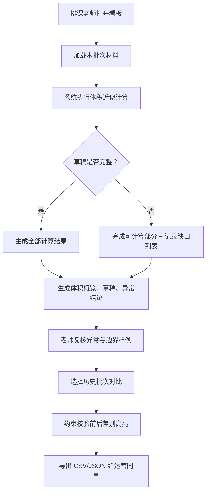

## 1. 产品概述

物流装箱体积近似是一款面向排课老师和运营同事的数据分析看板，用于对课程材料装箱体积进行近似估算、校验异常、对比历史数据，并以"说人话"的方式将题目清单、计算草稿和异常结论串联呈现。

- 目标用户：排课老师（复核）、运营同事（使用结论）
- 解决痛点：原流程样例通用、草稿缺失整批失败、历史对比无差别展示、图表与下载数据不同源

## 2. 核心功能

### 2.1 用户角色

| 角色 | 注册方式 | 核心权限 |
|------|----------|----------|
| 排课老师 | 无需注册，本地工具使用 | 导入材料清单、调整近似参数、复核异常、补全草稿缺口、导出结果 |
| 运营同事 | 无需注册，本地工具使用 | 查看体积结论、浏览异常明细、下载打包结果 |

### 2.2 功能模块

1. **总览看板**：参数表、体积概览卡片、历史对比趋势、异常结论汇总
2. **材料清单**：题目清单表格，支持空集合、除零等边界样例高亮，同批数据驱动图表与下载
3. **计算草稿**：逐条展示近似计算公式、中间变量、草稿缺失缺口列表（不阻塞批量计算）
4. **异常结论**：误差过大、除零边界、空集合等异常的"人话"描述与处置建议
5. **历史对比**：选择历史批次，约束校验前后差别高亮显示
6. **结果导出**：CSV/JSON 下载，与图表、明细完全同源

### 2.3 页面详情

| 页面名称 | 模块名称 | 功能描述 |
|----------|----------|----------|
| 总览看板 | 参数表卡 | 展示当前批次近似参数（填充率、箱体尺寸、 rounding 规则），与边界样例同轮展示 |
| 总览看板 | 体积概览 | 四个关键数字：总体积近似、材料条目数、异常条数、草稿缺口数 |
| 总览看板 | 历史趋势图 | 近 N 批体积折线图，支持点击切换批次查看约束校验差别 |
| 总览看板 | 异常汇总 | 异常类型分布条形图，点击联动到异常结论明细 |
| 材料清单 | 清单表格 | 材料名称、长宽高、数量、真实体积、近似体积、误差率；边界样例（空集合、除零、坏数据）行底色区分 |
| 计算草稿 | 草稿面板 | 每条记录的公式展开（近似系数×长×宽×高×数量），中间变量可折叠 |
| 计算草稿 | 缺口列表 | 草稿缺失条目汇总，标注"缺什么"与"补全后预计影响" |
| 异常结论 | 结论卡片 | 每条异常的"人话"说明（如"纸箱 A-07 体积近似误差 38%，超过 15% 阈值，建议复核实测尺寸"） |
| 历史对比 | 对比视图 | 左右分栏：旧批次 vs 新批次，约束校验通过/失败状态前后差别用颜色标注 |
| 结果导出 | 下载区 | CSV、JSON 两种格式，文件名含批次号与时间戳，与看板展示数据完全一致 |

## 3. 核心流程

排课老师打开看板 → 加载/选择本批次材料 → 系统自动近似计算（跳过草稿缺失项但记录缺口）→ 生成体积概览、草稿、异常结论 → 老师复核异常、补全草稿缺口 → 选择历史批次对比约束校验差别 → 导出结果给运营同事

## 4. 用户界面设计

### 4.1 设计风格

- **主色**：深墨蓝 `#0F2743`（物流行业专业感）
- **辅色**：琥珀金 `#D4A24C`（强调异常与对比差别）、雾青 `#4A8B8B`（正常状态）
- **警示色**：砖红 `#C14B3C`（异常/误差过大）、米黄 `#E8D8A8`（草稿缺口/待补）
- **按钮风格**：扁平化微圆角（4px），hover 时轻微上浮 + 阴影加深
- **字体**：标题用 "Noto Serif SC"（人文感、"说人话"调性），正文与数据用 "JetBrains Mono"（表格对齐）
- **布局风格**：卡片式栅格布局，顶部导航 + 左侧参数栏 + 主内容区三栏
- **图标风格**：lucide-react 线性图标，异常用实心琥珀/砖红图标点缀

### 4.2 页面设计概述

| 页面名称 | 模块名称 | UI 元素 |
|----------|----------|---------|
| 总览看板 | 参数表卡 | 细边框卡片，参数名左对齐等宽字体，数值琥珀色，hover 显示参数说明 tooltip |
| 总览看板 | 体积概览 | 2×2 数字卡片，数字大号 JetBrains Mono，副标题小号 Noto Serif SC，入场错峰动画 |
| 总览看板 | 历史趋势图 | 自定义 SVG 折线，节点可点击，当前批次琥珀色高亮，旧批次灰蓝虚线 |
| 总览看板 | 异常汇总 | 水平条形图，条宽按数量比例，hover 展开异常条数与占比 |
| 材料清单 | 清单表格 | 斑马纹表格，边界样例行左侧琥珀竖条标记，异常行砖红底色淡染 |
| 计算草稿 | 草稿面板 | 可折叠手风琴，公式用等宽字体分色块显示，中间变量下标小字 |
| 计算草稿 | 缺口列表 | 米黄底色卡片列表，每项带"补全"按钮与影响预估值 |
| 异常结论 | 结论卡片 | 砖红/琥珀左粗边卡片，第一行"人话"大字号，下方技术细节小字折叠 |
| 历史对比 | 对比视图 | 左右两栏同结构表格，行内差别用琥珀色背景 span 高亮，差异箭头 ↑↓ |
| 结果导出 | 下载区 | 两个下载按钮并排，显示文件大小预估与记录条数 |

### 4.3 响应性

桌面端优先设计（最小宽度 1280px），平板端左侧参数栏收为顶部抽屉，移动端表格横向滚动，卡片堆叠单列。

### 4.4 交互细节

- 卡片入场：`staggered fade-up` 动画（delay 60ms 级差）
- 异常结论卡片：hover 时轻微放大 1.01 + 阴影外扩
- 历史对比差异行：背景色琥珀呼吸闪烁 2 次后稳定
- 表格行：hover 行边框左侧出现 3px 琥珀色指示条
