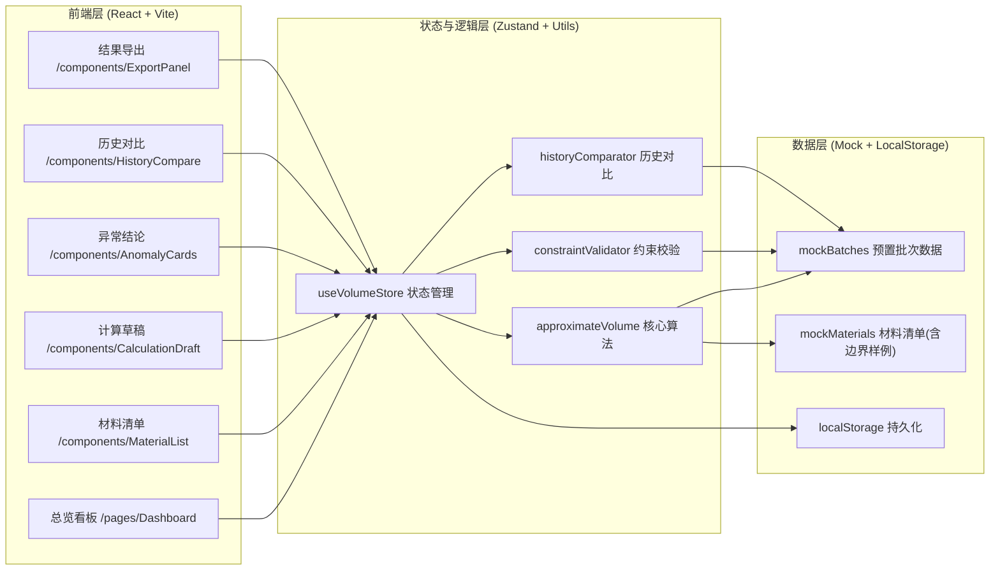
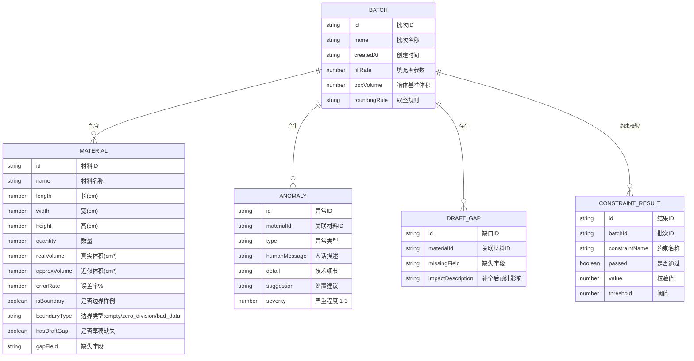

## 1. 架构设计



## 2. 技术说明

- **前端**：React@18 + TypeScript + Vite + TailwindCSS@3 + Zustand
- **初始化工具**：vite-init
- **后端**：无（纯前端本地工具，数据预置在 mock 里 + localStorage 持久化用户修改）
- **数据存储**：内置 mock 数据（含 2-3 个边界样例、真实坏数据、除零场景），用户操作写入 localStorage
- **图表**：自定义 SVG 实现（折线图、条形图），不引入额外图表库以保持轻量
- **图标**：lucide-react

## 3. 路由定义

| 路由 | 用途 |
|------|------|
| / | 总览看板（默认页，包含所有模块的一体化视图） |

由于是单页看板工具，所有模块在同一页面内通过 Tabs / 分区切换展示，不做多路由拆分。

## 4. 数据模型

### 4.1 数据模型定义



### 4.2 预置 Mock 数据说明

- **正常材料**：10-12 条真实感强的课程材料（教材箱、教具箱、试卷包等）
- **边界样例 1 - 空集合**：quantity = 0，name = "备用空纸箱（未装料）"，确保结果改变（体积=0，但占用填充配额逻辑不同）
- **边界样例 2 - 除零风险**：fillRate 参数临时为 0 时的降级处理（记录异常，用默认值 0.8 兜底），材料 name = "密度校准件（参数校验用）"
- **边界样例 3 - 真实坏数据**：length = "abc"（字符串混入）或 height = -5（负数），name = "手工登记-临时箱 B-38"，模拟平时材料里混进来的小麻烦
- **草稿缺失样例**：2 条材料缺少 width 或 height 字段，计算时跳过但列入缺口列表

## 5. 核心算法模块

### 5.1 approximateVolume（体积近似算法）

输入：Material + BatchParams → 输出：{ approxVolume, errorRate, calculationSteps[], hasGap, gapField? }

规则：
1. 若关键字段（长/宽/高/数量）缺失 → 标记 hasGap，跳过计算但不抛异常
2. 若字段非数值或负数 → 视为坏数据，记录异常，approxVolume = 0
3. 若 fillRate = 0 → 除零保护，用默认 0.8，记录异常
4. 公式：approxVolume = ceil((length × width × height × quantity) / fillRate / boxVolume) × boxVolume
5. errorRate = |approxVolume - realVolume| / realVolume × 100%
6. 返回每一步中间变量用于计算草稿展示

### 5.2 constraintValidator（约束校验）

输入：Batch → 输出：ConstraintResult[]

校验项：
- 总体积 ≤ 运输配额
- 单条误差率 ≤ 15%
- 草稿缺口率 ≤ 10%
- 异常条数 ≤ 3

### 5.3 historyComparator（历史对比）

输入：batchA, batchB → 输出：{ diffs[], changedConstraints[] }

逐条对比 ConstraintResult，状态变化的用琥珀高亮。

## 6. 目录结构

```
src/
├── pages/
│   └── Dashboard.tsx          # 主看板页面
├── components/
│   ├── ParamCard.tsx          # 参数表卡
│   ├── VolumeOverview.tsx     # 体积概览卡片组
│   ├── TrendChart.tsx         # 历史趋势 SVG 图
│   ├── AnomalyBarChart.tsx    # 异常汇总条形图
│   ├── MaterialList.tsx       # 材料清单表格
│   ├── CalculationDraft.tsx   # 计算草稿 + 缺口列表
│   ├── AnomalyCards.tsx       # 异常结论卡片
│   ├── HistoryCompare.tsx     # 历史对比视图
│   └── ExportPanel.tsx        # 下载导出面板
├── store/
│   └── useVolumeStore.ts      # Zustand 全局状态
├── utils/
│   ├── approximateVolume.ts   # 核心算法
│   ├── constraintValidator.ts # 约束校验
│   ├── historyComparator.ts   # 历史对比
│   └── exportData.ts          # CSV/JSON 导出
├── data/
│   └── mockBatches.ts         # 预置批次与材料（含边界样例）
├── types/
│   └── index.ts               # 类型定义
├── App.tsx
├── main.tsx
└── index.css
```
