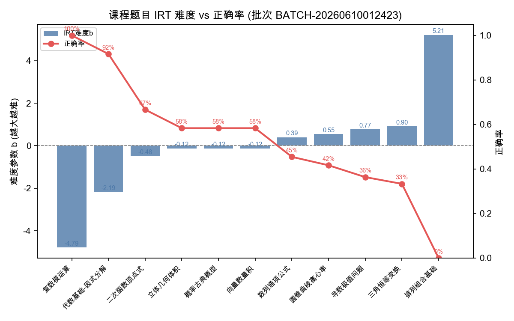
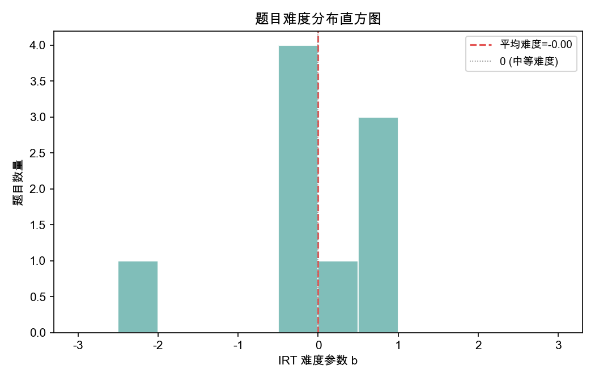
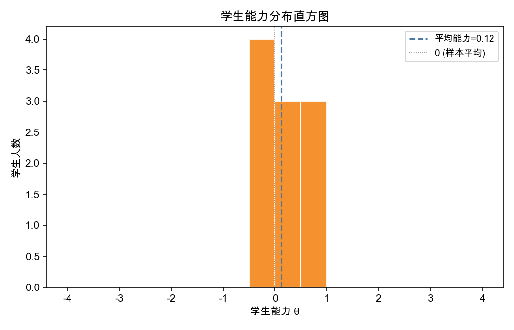
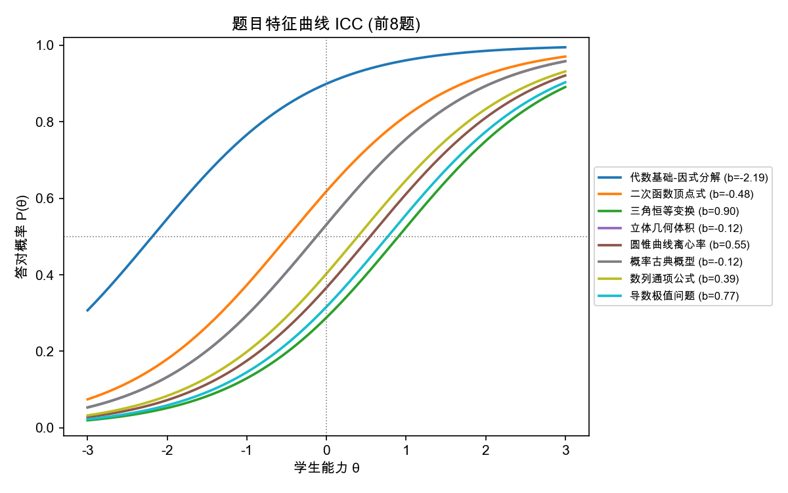

# 课程难度 IRT 校准报告

> 报告生成时间: 2026-06-10 01:24:24
> 批次号: BATCH-20260610012423  |  处理记录ID: REC-2216d48c
> 原始数据来源: /Users/mac/pro/solo/workspaces/y12747/samples/math_quiz_2026.csv

## 一、普通话解读（可直接转发同事）

各位同事好：本批次共收集 14 名学生对 11 道题的答题数据，其中 108 条记录完整可用，4 条因答案缺失交由风控补录，已不影响本次计算。 题目难度方面：最易题 b=-4.79，最难题 b=5.21，平均 b=0.00。难度跨度约 10.00 个 logit，难度分布较均匀。 学生能力方面：能力值 θ > 1 的优等生 2 人，θ < -1 的薄弱生 2 人，其余 10 人处于中等水平。 模型拟合 RMSE=0.402（概率尺度，0~1），拟合一般，建议结合人工复核使用。 注意：当前仍有 16 条问题未处理、0 道题排序存在波动，风控分析师可通过复核入口修正后重新校准。

## 二、样本概览

| 指标 | 数值 | 说明 |
|------|------|------|
| 学生总数 | 14 | 参与答题的学生 |
| 题目总数 | 11 | 被作答的题目 |
| 有效答题记录 | 108 | 答案完整、可参与计算 |
| 排除/缺失记录 | 4 | 答案缺失或字段不全 |
| 需风控补录缺口 | 4 | 已单独导出缺口清单 |
| 模型方法 | 1PL/Rasch | 单参数逻辑斯蒂模型，难度参数b |

## 三、题目难度排序表（与图1对应）

| 排名 | 题目ID | 题目名称 | IRT难度b | 正确率 | 作答人数 | 稳定性标记 |
|------|--------|----------|----------|--------|----------|------------|
| 1 | Q010 | 复数模运算 | -4.788 | 100.0% | 1 |  |
| 2 | Q001 | 代数基础-因式分解 | -2.186 | 91.7% | 12 |  |
| 3 | Q002 | 二次函数顶点式 | -0.481 | 66.7% | 12 |  |
| 4 | Q004 | 立体几何体积 | -0.125 | 58.3% | 12 |  |
| 5 | Q006 | 概率古典概型 | -0.125 | 58.3% | 12 |  |
| 6 | Q009 | 向量数量积 | -0.125 | 58.3% | 12 |  |
| 7 | Q007 | 数列通项公式 | 0.394 | 45.5% | 11 |  |
| 8 | Q005 | 圆锥曲线离心率 | 0.548 | 41.7% | 12 |  |
| 9 | Q008 | 导数极值问题 | 0.771 | 36.4% | 11 |  |
| 10 | Q003 | 三角恒等变换 | 0.905 | 33.3% | 12 |  |
| 11 | Q011 | 排列组合基础 | 5.212 | 0.0% | 1 |  |

## 四、学生能力排序表（与图3对应）

| 排名 | 学生ID | 能力θ | 标准误SE | 有效答题数 |
|------|--------|-------|----------|------------|
| 1 | S002 | 5.000 | 3333.333 | 9 |
| 2 | S013 | 5.000 | 10000.000 | 1 |
| 3 | S006 | 0.646 | 0.707 | 9 |
| 4 | S008 | 0.646 | 0.707 | 9 |
| 5 | S010 | 0.646 | 0.707 | 9 |
| 6 | S001 | 0.361 | 0.730 | 8 |
| 7 | S005 | 0.176 | 0.671 | 9 |
| 8 | S011 | 0.176 | 0.671 | 9 |
| 9 | S007 | -0.102 | 0.707 | 8 |
| 10 | S003 | -0.270 | 0.671 | 9 |
| 11 | S009 | -0.270 | 0.671 | 9 |
| 12 | S012 | -0.270 | 0.671 | 9 |
| 13 | S004 | -5.000 | 3333.333 | 9 |
| 14 | S014 | -5.000 | 10000.000 | 1 |

## 五、图表

### 图1：题目难度 vs 正确率（与第三节排序表对应）

说明：蓝色柱为IRT难度参数b，越大越难；红色折线为实际正确率。
两者应当呈负相关——难度越高，正确率越低。

### 图2：题目难度分布直方图

### 图3：学生能力分布直方图（与第四节排序表对应）

### 图4：题目特征曲线 ICC（Item Characteristic Curve）

说明：每条曲线代表一道题，横坐标为学生能力θ，纵坐标为该生答对此题的概率。
曲线越靠左，说明题目越简单；越靠右，题目越难。

## 六、约束校验（与误差分析共用同一批处理记录）

| 校验项 | 结果 | 详细说明 | 级别 |
|--------|------|----------|------|
| 有效答题记录数>0 | ✅ 通过 | 有效记录=108，排除记录=4 | info |
| 题目[代数基础-因式分解]答题人数≥5 | ✅ 通过 | 12人作答 | info |
| 题目[代数基础-因式分解]正确率∈(0,1) | ✅ 通过 | 正确率=0.9167，无除零风险 | info |
| 题目[二次函数顶点式]答题人数≥5 | ✅ 通过 | 12人作答 | info |
| 题目[二次函数顶点式]正确率∈(0,1) | ✅ 通过 | 正确率=0.6667，无除零风险 | info |
| 题目[三角恒等变换]答题人数≥5 | ✅ 通过 | 12人作答 | info |
| 题目[三角恒等变换]正确率∈(0,1) | ✅ 通过 | 正确率=0.3333，无除零风险 | info |
| 题目[立体几何体积]答题人数≥5 | ✅ 通过 | 12人作答 | info |
| 题目[立体几何体积]正确率∈(0,1) | ✅ 通过 | 正确率=0.5833，无除零风险 | info |
| 题目[圆锥曲线离心率]答题人数≥5 | ✅ 通过 | 12人作答 | info |
| 题目[圆锥曲线离心率]正确率∈(0,1) | ✅ 通过 | 正确率=0.4167，无除零风险 | info |
| 题目[概率古典概型]答题人数≥5 | ✅ 通过 | 12人作答 | info |
| 题目[概率古典概型]正确率∈(0,1) | ✅ 通过 | 正确率=0.5833，无除零风险 | info |
| 题目[数列通项公式]答题人数≥5 | ✅ 通过 | 11人作答 | info |
| 题目[数列通项公式]正确率∈(0,1) | ✅ 通过 | 正确率=0.4545，无除零风险 | info |
| 题目[导数极值问题]答题人数≥5 | ✅ 通过 | 11人作答 | info |
| 题目[导数极值问题]正确率∈(0,1) | ✅ 通过 | 正确率=0.3636，无除零风险 | info |
| 题目[向量数量积]答题人数≥5 | ✅ 通过 | 12人作答 | info |
| 题目[向量数量积]正确率∈(0,1) | ✅ 通过 | 正确率=0.5833，无除零风险 | info |
| 题目[复数模运算]答题人数≥5 | ⚠️ 未通过 | 实际1人，低于阈值，估计结果不稳定 | warning |
| 题目[复数模运算]正确率<1 | ⚠️ 未通过 | 该题全员答对（正确率≈1），除零风险 | warning |
| 题目[排列组合基础]答题人数≥5 | ⚠️ 未通过 | 实际1人，低于阈值，估计结果不稳定 | warning |
| 题目[排列组合基础]正确率>0 | ⚠️ 未通过 | 该题全员答错（正确率≈0），除零风险 | warning |
| 学生[S013]有效答题数≥3 | ⚠️ 未通过 | 仅1题，能力估计不稳定 | warning |
| 学生[S014]有效答题数≥3 | ⚠️ 未通过 | 仅1题，能力估计不稳定 | warning |
| 至少2道有效题 | ✅ 通过 | 有效题目数=11 | critical |
| 至少2名有效学生 | ✅ 通过 | 有效学生数=14 | critical |
| 难度排序与正确率排序一致性 | ✅ 通过 | 所有题目两种排序差异≤1位，结果稳定 | info |

## 七、误差分析

| 指标 | 数值 | 单位 | 说明 |
|------|------|------|------|
| 模型均方误差 MSE | 0.161275 | 概率² | 基于108条有效答题记录，模型预测与实际对错的平均平方偏差 |
| 模型根均方误差 RMSE | 0.401591 | 概率 | MSE开方，便于在0~1概率尺度上解读 |
| 对数似然 LogLik | -50.601926 | nats | 值越接近0拟合越好，AIC/BIC可由该值推导 |
| 平均残差 | 0.161275 | 概率 | 单条记录平均预测误差 |

## 八、问题清单（风控复核入口）

| 问题ID | 类型 | 严重度 | 描述 | 处理建议 | 状态 |
|--------|------|--------|------|----------|------|
| ISS-b4146fbe | 历史答案缺失 | medium | 学生 S001 / 题目 Q008: 历史答案缺失，已暂存，不影响其他记录计算 | 风控分析师可在复核界面补录该题对错，或确认排除 | 🔴待处理 |
| ISS-33e7c173 | 历史答案缺失 | medium | 学生 S007 / 题目 Q007: 历史答案缺失，已暂存，不影响其他记录计算 | 风控分析师可在复核界面补录该题对错，或确认排除 | 🔴待处理 |
| ISS-14d7867e | 历史答案缺失 | high | 第110行: 学生/题目标识缺失，无法处理 | 请风控分析师补充 student_id 和 item_id 后重新导入或在复核界面修正 | 🔴待处理 |
| ISS-c216e43b | 历史答案缺失 | high | 第112行: 学生/题目标识缺失，无法处理 | 请风控分析师补充 student_id 和 item_id 后重新导入或在复核界面修正 | 🔴待处理 |
| ISS-48d14adb | 答题人数不足 | medium | 题目 复数模运算(Q010) 仅1人作答，低于建议阈值5 | 参数估计已计算，但结果仅供参考，建议积累更多数据 | 🔴待处理 |
| ISS-73af3924 | 除零风险 | high | 题目 复数模运算 全员答对，正确率=1，参数估计时出现除零边界 | 已使用(1-EPSILON)替代1值继续计算，但建议人工复核该题区分度 | 🔴待处理 |
| ISS-0a88c637 | 答题人数不足 | medium | 题目 排列组合基础(Q011) 仅1人作答，低于建议阈值5 | 参数估计已计算，但结果仅供参考，建议积累更多数据 | 🔴待处理 |
| ISS-02c7bcb3 | 除零风险 | high | 题目 排列组合基础 全员答错，正确率=0，参数估计时出现除零边界 | 已使用EPSILON=1e-8替代0值继续计算，但建议人工复核该题是否存在缺陷 | 🔴待处理 |
| ISS-8a210e25 | 答题人数不足 | low | 学生 S013 只答对1题，能力估计可靠性低 | 能力参数已给出，但建议补充更多答题数据后复算 | 🔴待处理 |
| ISS-32a09575 | 答题人数不足 | low | 学生 S014 只答对1题，能力估计可靠性低 | 能力参数已给出，但建议补充更多答题数据后复算 | 🔴待处理 |
| ISS-4d0ad900 | 除零风险 | medium | 题目 复数模运算(Q010) 原始难度估计 b=-18.421，因正确率接近边界(=1.0)，已截断为-5.0 | 该题出现全对/全错极端情况，建议人工复核题目质量或积累更多作答数据 | 🔴待处理 |
| ISS-f552f580 | 除零风险 | medium | 题目 排列组合基础(Q011) 原始难度估计 b=18.421，因正确率接近边界(=0.0)，已截断为5.0 | 该题出现全对/全错极端情况，建议人工复核题目质量或积累更多作答数据 | 🔴待处理 |
| ISS-3e82c8af | 能力值异常 | low | 学生 S002 原始能力估计 θ=18.374，超出±5.0范围，已截断为5.0 | 该生出现全对或全错极端情况，原始logit值发散，建议结合其能力稳定性人工判断 | 🔴待处理 |
| ISS-96450182 | 能力值异常 | low | 学生 S004 原始能力估计 θ=-18.468，超出±5.0范围，已截断为-5.0 | 该生出现全对或全错极端情况，原始logit值发散，建议结合其能力稳定性人工判断 | 🔴待处理 |
| ISS-f6678796 | 能力值异常 | low | 学生 S013 原始能力估计 θ=13.632，超出±5.0范围，已截断为5.0 | 该生出现全对或全错极端情况，原始logit值发散，建议结合其能力稳定性人工判断 | 🔴待处理 |
| ISS-1d80cc48 | 能力值异常 | low | 学生 S014 原始能力估计 θ=-13.209，超出±5.0范围，已截断为-5.0 | 该生出现全对或全错极端情况，原始logit值发散，建议结合其能力稳定性人工判断 | 🔴待处理 |

## 十、计算草稿与溯源

- 逐题逐生计算草稿（含θ、b、P(θ)、残差）：`assets/calculation_draft.csv`
- 完整处理记录JSON（含校验、误差、问题、参数）：`assets/processing_record.json`
- 缺口补录清单（单独导出）：见风控分析师缺口文件

**异常回溯指引**：顺着任一问题ID → 看第八节中的关联学生/题目 → 打开calculation_draft.csv过滤该学生或题目 → 对照processing_record.json中的raw_materials追溯原始导入行。
