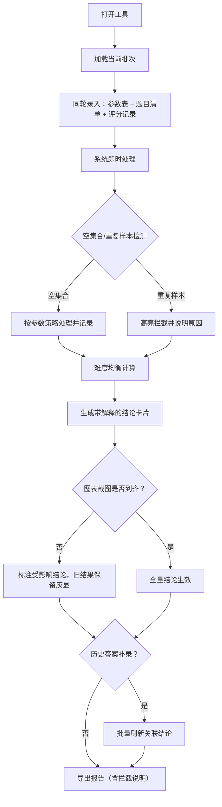

## 1. 产品概述

"竞赛题难度均衡"是一款面向数据分析员、老师、工程师及运营同事的日常工作工具，用于复核竞赛题目难度分布是否均衡，处理参数配置、题目清单、评分记录和空集合输入，并生成可解释、可追溯、可导出的复核结论。

- 核心价值：将晦涩的评审文档思维转化为日常可用的工具操作，让数据分析员打开即能处理数据，结论可讲、可追溯、可批量更新
- 目标用户：数据分析员（主力用户）、老师/工程师（复核讲解）、运营同事（导出报告查阅）

## 2. 核心功能

### 2.1 用户角色

| 角色 | 登录方式 | 核心权限 |
|------|----------|----------|
| 数据分析员 | 本地启动 | 全量操作：参数配置、数据导入、难度计算、复核调整、报告导出 |
| 老师/工程师 | 本地启动 | 查阅复核结果、理解结论解释、用于对外讲解 |
| 运营同事 | 本地启动 | 查阅导出报告、理解重复样本拦截原因、看清当轮处理材料 |

### 2.2 功能模块

1. **主工作台**：参数表输入区、题目清单导入、评分记录录入、空集合处理面板
2. **难度均衡复核**：实时难度计算、结果卡片（带解释）、可追溯结论链
3. **异常分级处理**：异常按"补材料/改口径"分类展示，非单红色数字
4. **图表迟到提示**：缺失图表截图时提示受影响结论，旧结果保留不覆盖
5. **批量复核更新**：历史答案补录后自动关联更新同批次结论
6. **报告导出**：包含重复样本拦截说明、当轮材料全景视图的 PDF/HTML 报告

### 2.3 页面详情

| 页面名称 | 模块名称 | 功能描述 |
|-----------|-------------|---------------------|
| 主工作台 | 顶部状态栏 | 当前批次编号、处理进度、异常数、图表到齐状态 |
| 主工作台 | 参数表配置区 | 难度分段阈值、各难度目标占比、重复判定规则、空集合策略 |
| 主工作台 | 题目清单面板 | 批量导入/手动录入、重复样本高亮拦截、题目难度标签 |
| 主工作台 | 评分记录面板 | 分数分布统计、异常分数标记、与题目关联展示 |
| 主工作台 | 空集合处理区 | 空集合检测、策略选择（跳过/告警/填充默认）、处理日志 |
| 复核结果页 | 难度分布卡片 | 实际vs目标占比对比、差距说明一至两句话 |
| 复核结果页 | 结论解释链 | 每个结论附带数据依据、计算口径、可讲给他人的话术 |
| 复核结果页 | 受影响提示条 | 图表未到齐时逐条列出受影响结论、旧结果灰显保留 |
| 复核结果页 | 异常分级面板 | "需补材料"类异常、"需改口径"类异常分别列出并附操作指引 |
| 复核结果页 | 历史答案补录区 | 关联同批次题目、补录后自动刷新所有相关结论 |
| 报告导出 | 报告预览 | 当轮材料全景、重复样本拦截明细、难度均衡结论、异常清单 |
| 报告导出 | 导出操作 | 导出 HTML/PDF，运营同事可读 |

## 3. 核心流程

数据分析员打开工具后，在同一轮复核中录入参数表、题目清单、评分记录，系统即时处理空集合和重复样本，计算难度分布并给出带解释的结论。图表截图迟到时，系统标注受影响结论而不覆盖旧结果。历史答案补录后批量更新关联结论。最后导出含完整说明的报告供运营查阅。

## 4. 用户界面设计

### 4.1 设计风格

- 主色调：深蓝（#1e3a5f）作为专业工作基调，搭配琥珀色（#d97706）标注异常与待办，青绿（#0d9488）表示通过/正常
- 辅色：浅灰蓝（#e8eef5）背景，白色卡片，深灰文字
- 按钮风格：方角微圆（4px），实心主按钮 + 描边次按钮，hover 时轻微上浮阴影
- 字体：标题用 "Noto Serif SC" 宋体衬线体现专业稳重，正文用 "Noto Sans SC" 无衬线确保易读
- 布局风格：三栏工作台式布局（左参数、中数据、右结论），卡片化模块，强调信息密度
- 图标：lucide-react 线性图标，与字体颜色一致

### 4.2 页面设计概览

| 页面名称 | 模块名称 | UI 元素 |
|-----------|-------------|-------------|
| 主工作台 | 顶部状态栏 | 胶囊式状态标签、进度条、异常计数徽章、图表到齐指示灯 |
| 主工作台 | 参数表配置区 | 分组表单、数值滑块 + 输入框、实时预览难度分段色条 |
| 主工作台 | 题目清单面板 | 数据表格、重复行红色斜纹背景、难度标签胶囊、批量操作栏 |
| 主工作台 | 评分记录面板 | 直方图缩略、异常点红圈标注、与题目行联动高亮 |
| 主工作台 | 空集合处理区 | 黄色提示卡片、策略选择 Radio、处理记录时间线 |
| 复核结果页 | 难度分布卡片 | 横向对比条形图（目标 vs 实际）、下方一至两句解释文字 |
| 复核结果页 | 结论解释链 | 折叠面板：结论 → 数据依据 → 计算口径 → 讲解话术 |
| 复核结果页 | 受影响提示条 | 黄色/橙色告警条、旧结果灰显 50% 透明度、新结果并排展示 |
| 复核结果页 | 异常分级面板 | 两列卡片："需补材料"（琥珀色边）、"需改口径"（蓝灰色边），每项附下一步按钮 |
| 复核结果页 | 历史答案补录区 | 题目搜索、答案输入、关联结论预览刷新 |
| 报告导出 | 报告预览 | 报告排版模拟 A4、含重复样本拦截专门章节 |
| 报告导出 | 导出操作 | 导出按钮带格式选择、文件命名含批次号和日期 |

### 4.3 响应式

- 桌面端优先（≥1440px）：三栏并列布局，最大化信息密度
- 平板端（768px–1439px）：左右两栏折叠为可抽屉，中间数据区保留
- 移动端（<768px）：单栏纵向滚动，顶部 Tab 切换模块

### 4.4 动画与交互

- 页面加载：模块按左→中→右顺序淡入上移（stagger 80ms）
- 结论卡片生成：骨架屏 → 数字滚动到位 → 解释文字逐行显现
- 异常出现：红色数字脉冲闪烁 2 次后稳定
- 图表迟到提示：黄色提示条从顶部滑入，受影响行高亮闪烁
- 历史补录刷新：关联结论卡片边框短暂发光后更新数值
