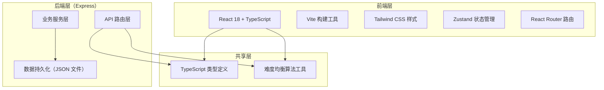
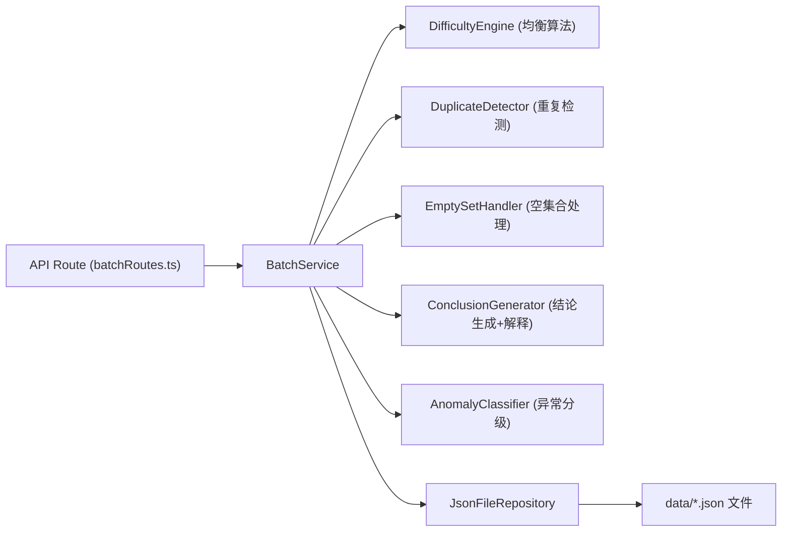
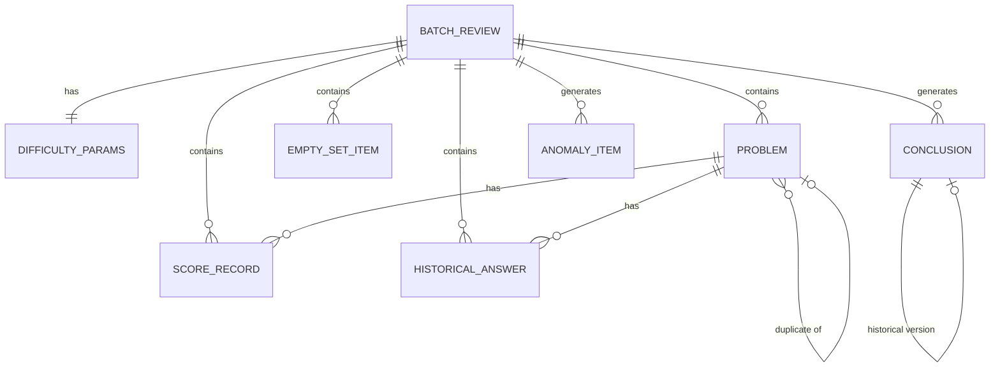

## 1. 架构设计



## 2. 技术描述

- 前端：React@18 + TypeScript + Vite + Tailwind CSS@3 + Zustand + React Router DOM + Lucide React
- 后端：Express@4 + TypeScript
- 初始化工具：vite-init（react-express-ts 模板）
- 数据存储：本地 JSON 文件（无需外部数据库，便于单机日常使用）
- 导出：前端生成 HTML + 浏览器打印为 PDF

## 3. 路由定义

| 路由 | 用途 |
|-------|---------|
| / | 主工作台（参数配置 + 题目清单 + 评分记录 + 空集合处理） |
| /review | 复核结果页（难度分布 + 结论解释 + 异常分级 + 受影响提示 + 历史补录） |
| /export | 报告预览与导出页 |

## 4. API 定义

```typescript
// 共享类型定义 shared/types.ts

export interface DifficultyParams {
  batchId: string;
  easyMin: number;
  easyMax: number;
  mediumMin: number;
  mediumMax: number;
  hardMin: number;
  hardMax: number;
  targetEasyRatio: number;
  targetMediumRatio: number;
  targetHardRatio: number;
  duplicateDetectionFields: string[];
  emptySetStrategy: 'skip' | 'warn' | 'fill';
  emptySetDefaultValue?: number;
}

export interface Problem {
  id: string;
  code: string;
  title: string;
  difficulty: 'easy' | 'medium' | 'hard' | null;
  score: number | null;
  tags: string[];
  isDuplicate: boolean;
  duplicateOf?: string;
  duplicateReason?: string;
  source: 'import' | 'manual';
}

export interface ScoreRecord {
  id: string;
  problemId: string;
  respondentId: string;
  score: number;
  timestamp: string;
  isAnomaly: boolean;
  anomalyReason?: string;
}

export interface EmptySetItem {
  id: string;
  field: string;
  problemId?: string;
  strategy: 'skip' | 'warn' | 'fill';
  filledValue?: number;
  handledAt: string;
}

export interface Conclusion {
  id: string;
  key: string;
  title: string;
  value: string;
  passed: boolean;
  explanation: string;
  dataBasis: string;
  formula: string;
  speakingScript: string;
  affectedByMissingCharts: boolean;
  affectedChartNames: string[];
  historicalVersion?: Conclusion;
  createdAt: string;
  updatedAt: string;
}

export interface AnomalyItem {
  id: string;
  category: 'need_material' | 'need_criteria';
  title: string;
  description: string;
  nextStep: string;
  relatedProblemIds: string[];
  resolved: boolean;
}

export interface HistoricalAnswer {
  id: string;
  problemId: string;
  answer: string;
  source: string;
  recordedAt: string;
}

export interface BatchReview {
  batchId: string;
  createdAt: string;
  params: DifficultyParams;
  problems: Problem[];
  scores: ScoreRecord[];
  emptySets: EmptySetItem[];
  conclusions: Conclusion[];
  anomalies: AnomalyItem[];
  historicalAnswers: HistoricalAnswer[];
  chartsAvailable: string[];
  chartsMissing: string[];
  status: 'draft' | 'processing' | 'chart_pending' | 'completed';
}

export interface ExportReport {
  batchId: string;
  exportedAt: string;
  overview: string;
  problemSummary: { total: number; duplicates: number; byDifficulty: Record<string, number> };
  difficultyBalance: { target: Record<string, number>; actual: Record<string, number>; gap: Record<string, number> };
  duplicateDetails: { code: string; reason: string; duplicateOf: string }[];
  conclusions: { title: string; result: string; explanation: string }[];
  anomalies: { category: string; title: string; nextStep: string }[];
}
```

### 后端 API 端点

| 方法 | 路径 | 说明 |
|------|------|------|
| GET | /api/batches | 获取所有批次列表 |
| POST | /api/batches | 创建新批次 |
| GET | /api/batches/:id | 获取单批次完整数据 |
| PUT | /api/batches/:id | 更新批次（参数、题目、评分等） |
| POST | /api/batches/:id/compute | 触发难度均衡计算，返回结论 |
| POST | /api/batches/:id/historical-answers | 补录历史答案并刷新关联结论 |
| GET | /api/batches/:id/export | 生成导出报告数据 |

## 5. 服务器架构图



## 6. 数据模型

### 6.1 数据模型关系



### 6.2 初始数据与存储

采用 JSON 文件存储，文件路径 `api/data/batches.json`，结构为 `BatchReview[]`。首次启动时如文件不存在则创建含演示批次的初始数据，演示批次包含：题目清单、评分记录、参数配置、重复样本示例、空集合示例、异常示例，确保用户打开即可看到完整工作流效果。
