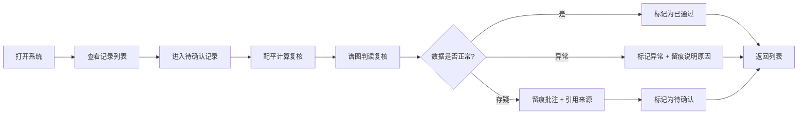

## 1. 产品概述

酸碱滴定终点复核系统是面向环境监测实验室的专业数据复核工具，解决滴定实验中配平计算校验、谱图（滴定曲线）判读、异常数据追溯等核心痛点。系统服务于环境监测员（复核者）、学生（使用者）、教师/工程师（讲解者）三类用户。

- 核心价值：将复核经验固化为可重复的判断逻辑，确保每一条滴定数据可追溯、可解释
- 目标场景：环境监测实验室水质分析、教学实验数据审核

## 2. 核心功能

### 2.1 用户角色

| 角色 | 使用方式 | 核心权限 |
|------|----------|----------|
| 环境监测员 | 主使用者，逐条复核实验数据 | 完整功能：查看原始行号/图片名/来源备注、配平计算、谱图判读、标记异常、导出复核结论 |
| 学生 | 数据提交者，查看复核结果 | 查看自己的数据、一眼区分"可直接用"与"需找监测员复核"、无法修改复核标记 |
| 教师/工程师 | 讲解者，使用系统教学 | 所有监测员权限 + 用内置解释给他人讲解判断逻辑 |

### 2.2 功能模块

1. **记录列表页**：实验记录总览、按状态筛选（顺利/待确认/坏数据）、来源追溯
2. **记录详情页**：配平计算面板、谱图（滴定曲线）判读面板、异常留痕面板、原始来源引用
3. **样例中心**：三条标准样例（顺利、待确认、坏数据），每条附带教师版讲解文案
4. **角色切换**：顶部一键切换角色视角，体验不同权限下的界面差异

### 2.3 页面详情

| 页面名称 | 模块名称 | 功能描述 |
|----------|----------|----------|
| 记录列表页 | 状态筛选区 | 三档状态标签：全部 / 已通过（绿色） / 待确认（黄色） / 异常（红色），右上角计数徽标 |
| 记录列表页 | 记录卡片列表 | 每条记录显示：样品编号、滴定类型、原始行号、谱图文件名缩略、状态标签、复核人、一两句解释气泡 |
| 记录列表页 | 来源备注悬浮层 | 悬停原始行号时，弹出表格片段或原始记录照片引用 |
| 记录详情页 | 配平计算面板 | 展示化学方程式配平过程、浓度计算步骤、误差范围校验，每步可展开解释 |
| 记录详情页 | 谱图判读面板 | SVG 渲染滴定曲线（pH-V 图），标注终点位置、突跃范围识别，支持缩放查看 |
| 记录详情页 | 异常留痕面板 | 时间线展示复核人每一条批注，关联到具体计算步骤或谱图坐标点 |
| 记录详情页 | 原始来源区 | 固定在底部：原始 Excel 行号、谱图文件名、实验记录本页码、采样时间 |
| 样例中心页 | 样例卡片 | 三条预置样例：顺利记录（绿）、待确认记录（黄）、明显坏数据（红），卡片展开即教师讲解文案 |
| 角色切换栏 | 视角切换 | 顶部胶囊按钮：监测员视角 / 学生视角，学生视角下异常数据灰色遮罩 + "请联系监测员"提示 |

## 3. 核心流程

### 主要用户流程（环境监测员）

环境监测员打开系统 → 查看记录列表（按待确认优先排序） → 点击进入某条记录 → 先核对配平计算步骤 → 再判读滴定曲线谱图 → 若发现异常在对应位置留痕 → 引用原始行号/图片名 → 标记最终状态（通过/待确认/异常） → 返回列表继续下一条。

### 学生查看流程

学生打开系统 → 切换至学生视角 → 看到自己的数据按颜色区分（绿色=可直接用，黄色/红色=需找监测员） → 绿色数据可查看完整计算过程，黄色/红色数据显示"请联系环境监测员 XXX，原始记录行号 N"。

## 4. 用户界面设计

### 4.1 设计风格

- **主色调**：实验室蓝 `#1E3A5F`（深蓝稳重），辅助色：实验绿 `#2E7D5B`（通过）、警示黄 `#D4A017`（待确认）、危险红 `#C0392B`（异常）
- **中性色**：象牙白纸感 `#F7F5F0` 背景 + 暖灰文字，避免冷白刺眼
- **按钮风格**：微圆角（6px），点击有下沉阴影，状态色填充
- **字体**：标题用 `Playfair Display`（学术衬线感），正文用 `Source Sans 3`（易读无衬线），数据/化学式用 `JetBrains Mono`（等宽）
- **布局风格**：左侧窄栏导航 + 右侧主内容卡片网格，记录详情为双栏（左计算右谱图）
- **图标**：Lucide 线性图标，配平用 `FlaskConical`，谱图用 `LineChart`，异常用 `AlertTriangle`，来源用 `FileText`

### 4.2 页面设计概述

| 页面名称 | 模块名称 | UI 元素 |
|----------|----------|----------|
| 记录列表页 | 顶部栏 | 深蓝背景，左侧系统名"滴定复核工作台"，右侧角色切换胶囊 + 当前用户名 |
| 记录列表页 | 筛选标签 | 大号圆角标签，选中状态色填充 + 右侧计数数字徽标 |
| 记录列表页 | 记录卡片 | 白色卡片带左边框色条（状态色），左上样品编号大字号，右上状态标签，底部一两句解释气泡用浅灰背景斜体 |
| 记录详情页 | 双栏布局 | 左栏 55% 配平计算（步骤折叠面板），右栏 45% 谱图 SVG，下方异常留痕时间线 |
| 记录详情页 | 原始来源区 | 页面底部固定浅米色条，左侧图标+文字："来源：实验记录簿 B-2024-06 第 17 行 · 谱图：titration_042.png" |
| 样例中心页 | 样例三栏 | 并排三张卡片，各自对应状态色边框和大图标，展开后内嵌教师讲解段落（楷体感字体） |
| 学生视角遮罩 | 异常/待确认行 | 半透明灰蒙层 + 居中黄色/红色警示框，框内说明 + 监测员联系方式 |

### 4.3 响应式

桌面端优先（1280px 起），内容最大宽度 1440px。平板端详情双栏变单栏上下堆叠。移动端只保留列表查看功能，详情页折叠。

### 4.4 动效细节

- 页面进入：卡片依次向上淡入（stagger 60ms）
- 状态标签：hover 时轻微放大 + 阴影加深
- 谱图曲线：页面加载时从左到右描边动画（1.2s ease-out）
- 异常留痕时间线：新批注添加时节点脉冲闪烁一次
