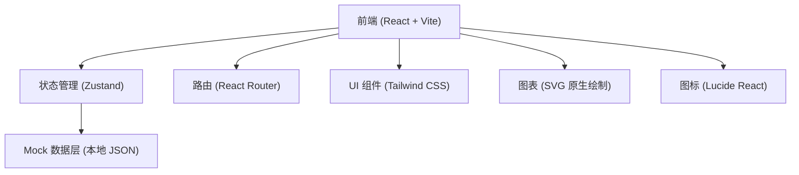
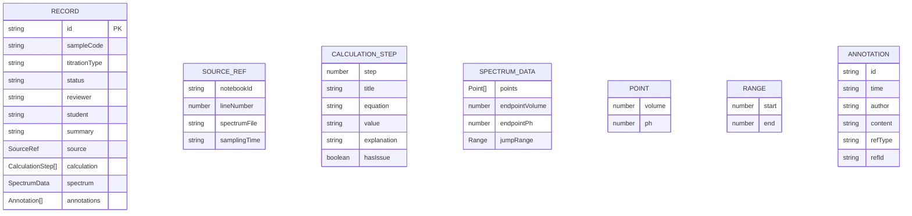

## 1. 架构设计



纯前端单页应用，无需后端。所有数据使用本地 Mock 数据模拟，包含三类样例记录。状态通过 Zustand 管理，路由管理三个主要页面。

## 2. 技术描述

- **前端**：React@18 + TypeScript@5 + Tailwind CSS@3 + Vite@5
- **初始化工具**：vite-init（选用 react-ts 模板）
- **后端**：无（纯前端 Mock）
- **数据库**：无（使用 TypeScript 数据结构 + localStorage 模拟持久化）
- **状态管理**：Zustand（全局状态：当前角色、记录列表、筛选条件）
- **路由**：react-router-dom@6
- **图表绘制**：原生 SVG（滴定曲线 pH-V 图），不引入额外图表库以保持简洁
- **图标**：lucide-react

## 3. 路由定义

| 路由 | 页面组件 | 用途 |
|------|----------|------|
| `/` | `RecordList` | 记录列表页（首页），展示所有滴定记录卡片 |
| `/record/:id` | `RecordDetail` | 记录详情页，配平计算 + 谱图判读 + 异常留痕 |
| `/samples` | `SampleCenter` | 样例中心，三条标准样例 + 教师讲解文案 |

## 4. 数据模型（Mock 数据）

### 4.1 数据结构定义



### 4.2 初始 Mock 数据

预置 5 条记录，涵盖三种状态：
- 2 条"已通过"（绿色）：配平计算正确，谱图突跃明显
- 2 条"待确认"（黄色）：浓度偏差接近阈值，谱图略不规整
- 1 条"异常"（红色）：浓度填错数量级，谱图无明显突跃

## 5. 目录结构

```
src/
├── components/
│   ├── layout/
│   │   ├── Header.tsx          # 顶部导航栏（含角色切换）
│   │   └── Sidebar.tsx         # 左侧导航
│   ├── record/
│   │   ├── RecordCard.tsx      # 列表页记录卡片
│   │   ├── StatusBadge.tsx     # 状态标签
│   │   ├── SourceTooltip.tsx   # 来源悬浮提示
│   │   └── StudentMask.tsx     # 学生视角遮罩
│   ├── calculation/
│   │   └── CalculationPanel.tsx # 配平计算面板
│   ├── spectrum/
│   │   └── SpectrumChart.tsx   # 滴定曲线 SVG 图
│   └── annotation/
│       └── AnnotationTimeline.tsx # 异常留痕时间线
├── pages/
│   ├── RecordList.tsx
│   ├── RecordDetail.tsx
│   └── SampleCenter.tsx
├── store/
│   └── useAppStore.ts          # Zustand 全局状态
├── data/
│   └── mockRecords.ts          # Mock 数据
├── types/
│   └── index.ts                # TypeScript 类型定义
├── utils/
│   └── spectrum.ts             # 谱图计算工具函数
├── App.tsx
├── main.tsx
└── index.css
```

## 6. 核心技术要点

1. **谱图绘制**：使用原生 SVG `<polyline>` 绘制 pH-V 曲线，通过计算二阶导数识别突跃点，支持 `viewBox` 缩放。
2. **配平计算展示**：步骤折叠面板（`<details>` 原生标签），每步化学方程式用 JetBrains Mono 等宽字体。
3. **角色权限控制**：Zustand 存储 `currentRole`，学生视角下通过 `<StudentMask>` 组件包裹敏感数据，条件渲染遮罩。
4. **异常留痕**：每条批注携带 `refType`（calculation/spectrum）和 `refId`，点击批注可高亮对应计算步骤或谱图坐标。
5. **来源追溯**：所有记录的 `source` 对象不可编辑，详情页底部固定展示，包含 `lineNumber` 和 `spectrumFile`。
