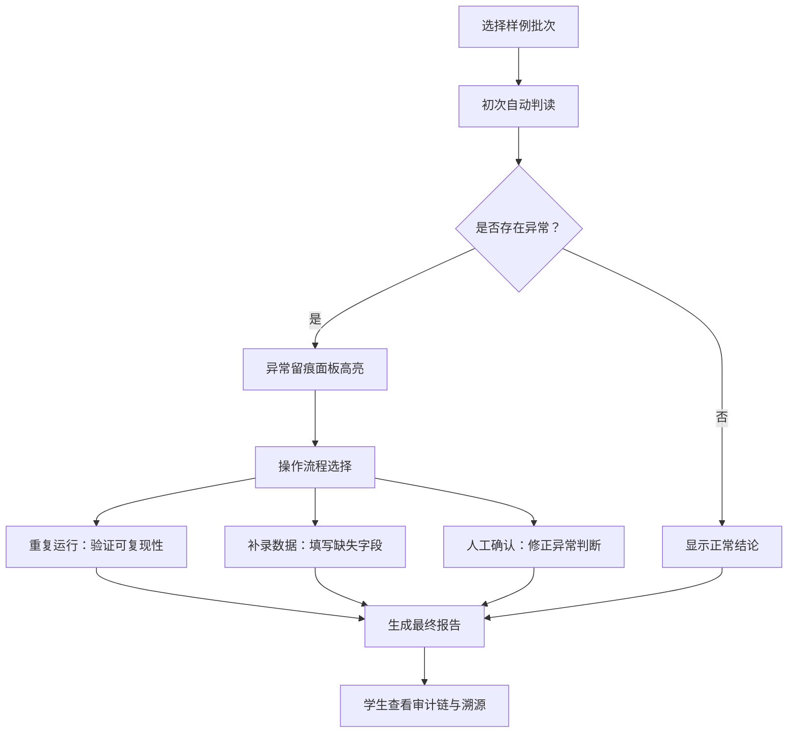

## 1. 产品概述

面向高中/大学化学实验室的"金属离子络合判读"教学演示系统，将分散的安全备注、谱图数据、批次报告整合到统一工作台。通过真实可复现的样例数据，让学生在重复运行、补录、人工确认的完整流程中理解金属离子络合反应判读逻辑，同时追踪异常数据对浓度换算与最终判断的影响。

## 2. 核心功能

### 2.1 用户角色

| 角色 | 说明 | 核心权限 |
|------|------|----------|
| 化学教师 | 系统管理员 / 演示者 | 导入样例、运行判读、人工确认、查看完整审计追踪 |
| 学生 | 学习者 | 浏览结果、对比图/表/文、查看异常留痕与数据来源 |

### 2.2 功能模块

1. **判读工作台主页**：批次总览、运行控制、三种操作入口（重复运行/补录/人工确认）
2. **数据整合面板**：谱图曲线、浓度数据表、安全备注侧栏、批次报告文字说明，四区域联动高亮
3. **异常追踪面板**：异常留痕列表、浓度换算前后对比、判断结果变更记录
4. **批号审计视图**：重复批号检测、漏记字段高亮、材料来源溯源链路
5. **操作流程演示**：分步引导三种操作流程，每步显示数据流转变化

### 2.3 页面详情

| 页面名称 | 模块名称 | 功能描述 |
|----------|----------|----------|
| 判读工作台 | 批次选择器 | 选择不同批次样例，显示批次状态（正常/异常/待确认） |
| 判读工作台 | 运行控制区 | 开始判读、重复运行、补录数据、人工确认四个按钮及操作历史 |
| 判读工作台 | 谱图显示区 | 可交互的吸收光谱曲线，支持悬停查看数据点、异常点高亮标记 |
| 判读工作台 | 浓度数据表 | 原始数据/修正数据切换、单位标注、漏填单元格高亮 |
| 判读工作台 | 安全备注侧栏 | 化学品安全信息、操作注意事项、与当前数据行联动 |
| 判读工作台 | 文字报告区 | 自动生成的判读结论，可追溯到具体数据来源 |
| 异常追踪面板 | 异常留痕列表 | 时间线式展示所有异常事件（异常数据、补录、人工修改） |
| 异常追踪面板 | 浓度换算对比 | 左右对照显示异常修正前后的浓度数值与计算过程 |
| 异常追踪面板 | 判断变更记录 | 络合反应判读结论的变更历史与原因 |
| 批号审计视图 | 重复批号检测 | 以卡片分组显示同批号的多条记录，标注差异字段 |
| 批号审计视图 | 漏记字段追踪 | 红色高亮缺失字段，显示该字段应来自哪份原始材料 |
| 批号审计视图 | 材料溯源链路 | 流程图展示一份最终报告的数据来自哪些原始材料文件 |
| 操作流程演示 | 流程引导层 | 分步骤高亮界面元素，解释"重复运行/补录/人工确认"操作目的与效果 |

## 3. 核心流程

教师导入或选择预设样例批次 → 系统执行初次判读（自动生成图、表、文） → 显示异常标记与初步结论 → 教师演示三种操作：
  ① 重复运行：相同参数重新计算，对比结果波动
  ② 补录数据：补填漏记字段（如反应时间），观察数据完整化过程
  ③ 人工确认：对异常标记进行人工判断修正 → 生成最终报告，学生可查看完整审计链与所有变更记录

## 4. 用户界面设计

### 4.1 设计风格
- **主色**：深墨蓝 `#1a2744`（实验室严肃感），搭配铜橙色 `#d97706`（金属离子特征色）作为强调色
- **辅助色**：警示红 `#dc2626`（异常标记）、确认绿 `#059669`（正常数据）、补录黄 `#ca8a04`（待补录）
- **背景**：浅灰 `#f1f5f9` 基底，带细微噪点纹理模拟实验室记录本质感
- **按钮风格**：微立体圆角，悬停有轻微上浮与阴影加深
- **字体**：标题用 Noto Serif SC（学术出版物感），正文与数据用 JetBrains Mono（等宽字体便于数字对齐）
- **布局风格**：三栏工作台布局，左侧安全备注/审计链，中间主视图（谱图+表格可切换），右侧报告与操作
- **装饰元素**：谱图网格线、烧杯/试管线条图标、淡色化学分子式水印

### 4.2 页面设计概述

| 页面名称 | 模块名称 | UI 元素 |
|----------|----------|---------|
| 判读工作台 | 谱图显示区 | SVG 交互式曲线、异常点橙色光晕标记、悬停数据气泡、网格背景 |
| 判读工作台 | 浓度数据表 | 斑马纹行、漏记单元格红色斜纹背景、修正数据绿色删除线+新值、单位列带下拉校验 |
| 判读工作台 | 安全备注侧栏 | 黄色警示条（GHS 危险品标识风格）、化学品卡片、与当前行联动高亮 |
| 异常追踪面板 | 浓度换算对比 | 左右两列对照卡片，中间箭头指向变更，计算公式分步展开 |
| 批号审计视图 | 材料溯源链路 | 节点式流程图，节点悬停显示原始材料缩略内容，缺失节点红色虚线边框 |
| 操作流程演示 | 流程引导层 | 半透明遮罩 + 聚光灯高亮目标区域 + 说明气泡 + 上一步/下一步按钮 |

### 4.3 响应式
桌面端为三栏工作台布局（≥1280px）；平板端折叠为上下布局（谱图在上，数据在下）；移动端以标签页切换各模块。所有图表基于 SVG，可无损缩放。
