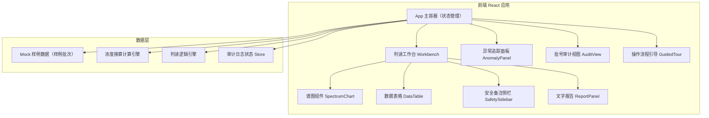
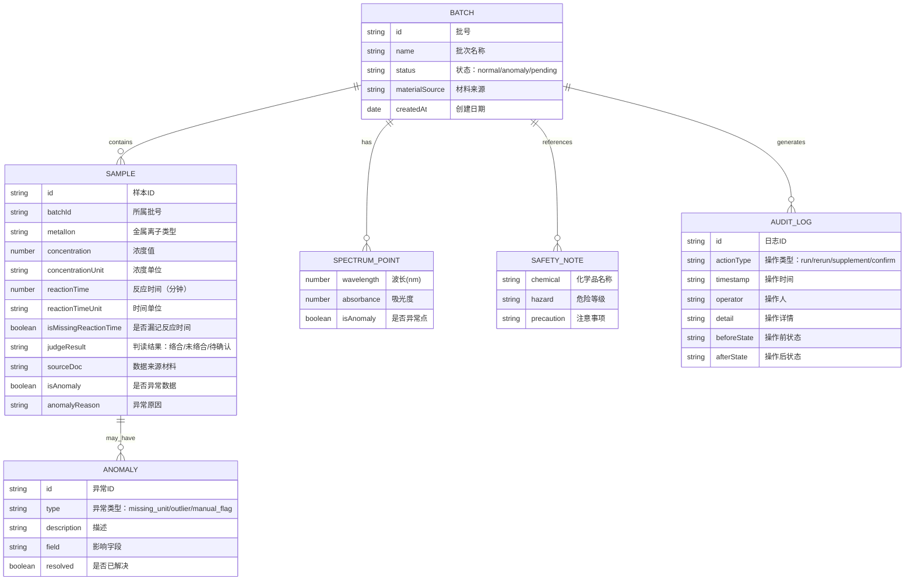

## 1. 架构设计



## 2. 技术描述

- **前端框架**：React@18 + TypeScript
- **构建工具**：Vite@5
- **样式方案**：Tailwind CSS@3 + CSS Variables（主题色）
- **图表渲染**：纯 SVG 手绘谱图（无需额外图表库，保证交互可控）
- **状态管理**：React useState + useReducer（轻量，教学演示无需 Redux）
- **图标**：Lucide React（化学相关图标 + 通用 UI 图标）
- **后端**：无后端，全部数据本地 Mock，计算逻辑在前端完成
- **数据**：内置 3 个真实感样例批次（含旧表格式、补录备注、漏填单位、坏数据）

## 3. 路由定义

| 路由 | 用途 |
|------|------|
| / | 判读工作台主页（包含所有核心功能模块，通过面板切换显示） |

> 本项目为单页教学工具，所有模块通过 Tab / 抽屉 / 模态框切换，不设多页面路由。

## 4. 数据模型

### 4.1 核心数据结构



### 4.2 核心计算逻辑

**浓度换算公式**（用于异常修正前后对比）：
- Beer-Lambert 定律：`A = ε × c × l`
- 浓度反推：`c = A / (ε × l)`
  - A：吸光度（来自谱图）
  - ε：摩尔吸光系数（金属离子特定常数）
  - l：比色皿光程（默认 1 cm）
  - c：摩尔浓度 (mol/L)

**络合判读逻辑**：
1. 检查特征吸收峰波长是否匹配目标金属-配体络合物
2. 吸光度是否高于阈值（默认 0.3）
3. 反应时间是否在有效区间内（漏记则标记"待确认"）
4. 浓度在有效检测范围内

## 5. 组件层次结构

```
App.tsx
├── Header（标题 + 批次选择器）
├── Workbench（主工作台）
│   ├── ControlBar（运行控制：开始/重复运行/补录/人工确认 + 操作历史）
│   ├── MainContent（中间主区，Tab 切换）
│   │   ├── SpectrumView（谱图 + 浓度数据表）
│   │   │   ├── SpectrumChart（SVG 谱图曲线）
│   │   │   └── DataTable（浓度数据表格）
│   │   ├── AnomalyPanel（异常追踪）
│   │   │   ├── AnomalyTimeline（异常时间线）
│   │   │   ├── ConcentrationCompare（浓度换算对比）
│   │   │   └── JudgeChangeLog（判断变更记录）
│   │   └── AuditView（批号审计）
│   │       ├── DuplicateBatch（重复批号卡片）
│   │       ├── MissingFields（漏记字段追踪）
│   │       └── SourceTrace（材料溯源链路）
│   └── SidePanel（右侧面板）
│       ├── SafetySidebar（安全备注）
│       └── ReportPanel（文字报告）
└── GuidedTour（操作流程引导覆盖层）
```

## 6. 样例数据规划

内置 3 个样例批次，覆盖日常教学中常见问题：

**批次 #1：Fe-CN-2024-0612-A（基准正常样）**
- 少量正常数据 + 一个轻微异常点（吸光度偏高 5%，用于演示"人工确认"）
- 所有字段完整

**批次 #2：Cu-EDTA-2024-0612-B（问题样 - 含漏记与坏数据）**
- 反应时间漏记 1 条（用于演示"补录"）
- 浓度单位缺失 1 条
- 一个明显离群值（吸光度为正常值 3 倍）
- 补录备注手写痕迹（"06-12 15:30 补测，王同学"）
- 旧表格式数据（列名与标准不一致）

**批次 #3：Ni-DMG-2024-0612-C（重复批号样）**
- 与另一条记录批号相同
- 两条记录反应时间不一致（一个写 10min，一个写 10sec）
- 浓度单位混用（mol/L 与 mmol/L）
- 用于演示批号重复时的审计追踪
