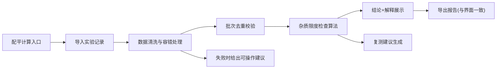

## 1. 产品概述

"药物杂质限度检查"是一款面向环境监测员使用的专业工具，用于处理药物杂质检测实验记录，自动完成限度判定、结果解释与复测建议输出。

- 解决实验记录格式不统一、人工判定效率低、重复导入数据打架、导出内容与界面不一致等日常痛点
- 核心价值：让环境监测员能快速从"不太干净"的原始记录中得出清晰、可解释的杂质检查结论

## 2. 核心功能

### 2.1 用户角色

| 角色 | 使用场景 | 核心诉求 |
|------|----------|----------|
| 环境监测员 | 日常实验配平计算、记录导入、结果复核 | 操作简单、出错时给可操作建议、不要有解释性文字便于讲解 |
| 老师/工程师 | 授课或培训时给他人讲解 | 每个结论旁边要有解释性描述 |
| 质检主管 | 月底复核、课前检查复测建议 | 数据一致性、结论可追溯 |

### 2.2 功能模块

1. **配平计算页（日常入口**：杂质配平计算、快速进入实验记录处理
2. **实验记录处理页**：导入原始记录、清洗"脏数据"、容错处理
3. **杂质限度检查结果页**：展示判定结论与一两句解释说明
4. **复测建议页**：月底/课前查看需要复测的批次
5. **历史记录与导出页**：历史记录查询、CSV/PDF导出（与界面摘要一致）

### 2.3 页面详情

| 页面名称 | 模块名称 | 功能描述 |
|-----------|-------------|---------------------|
| 配平计算页 | 配平计算器 | 输入原料配比、自动计算杂质理论值、快速跳转记录导入 |
| 配平计算页 | 快速导航 | 一键进入实验记录、复测建议、历史记录 |
| 实验记录处理页 | 记录导入 | 支持手动输入、粘贴文本、文件上传三种方式导入原始谱图数据 |
| 实验记录处理页 | 数据清洗 | 自动识别并清洗格式错误、缺失字段、异常值 |
| 实验记录处理页 | 去重校验 | 同一批次谱图数据二次导入自动识别合并，不产生冲突结论 |
| 杂质限度检查结果页 | 限度判定 | 根据药典/标准自动判定是否超限 |
| 杂质限度检查结果页 | 结论解释 | 每个结论旁边附带一两句专业解释（便于讲解） |
| 杂质限度检查结果页 | 错误提示 | 处理失败时给出可操作建议（如"缺少XX反应条件），而非内部错误码 |
| 复测建议页 | 复测列表 | 列出建议复测的批次及理由 |
| 复测建议页 | 批次筛选 | 按时间、批次号筛选 |
| 历史记录与导出页 | 历史查询 | 查询所有检查记录 |
| 历史记录与导出页 | 导出功能 | 导出CSV/PDF，内容与界面摘要严格一致 |

## 3. 核心流程

环境监测员打开配平计算 → 输入/导入实验记录 → 系统自动清洗与去重 → 执行杂质限度检查 → 查看带解释的结论 → 必要时查看复测建议 → 导出报告

## 4. 用户界面设计

### 4.1 设计风格

- **主色**：专业蓝（#1E40AF），体现实验室专业感
- **辅色**：警示橙（#EA580C）用于超限提示，通过绿（#059669）用于合格提示
- **按钮风格**：圆角矩形，带微阴影，悬停有颜色加深
- **字体**：标题使用思源宋体（专业感），正文使用思源黑体（清晰易读）
- **布局风格**：卡片式布局，顶部导航 + 左侧功能区
- **图标**：使用线性图标，与实验室仪器风格

### 4.2 页面设计概览

| 页面名称 | 模块名称 | UI元素 |
|-----------|-------------|-------------|
| 配平计算页 | 计算器面板 | 蓝色主调、卡片式输入区域、大号结果高亮、清晰数字展示 |
| 实验记录处理页 | 导入区域 | 拖拽上传区、格式提示、实时预览清洗后数据 |
| 杂质限度检查结果页 | 结论卡片 | 通过/超限颜色区分、解释文字浅色小字、悬浮展开详情 |
| 复测建议页 | 建议列表 | 表格列表、橙色警示标记、理由说明列 |
| 历史记录与导出页 | 导出面板 | 筛选栏、记录表格、导出按钮预览摘要同步 |

### 4.3 响应式

桌面端优先，适配常见实验室桌面浏览器，移动端做基础适配可浏览。

### 4.4 动效细节

- 页面加载时卡片依次淡入，检查结果数字滚动动画，超限项脉冲提示。
