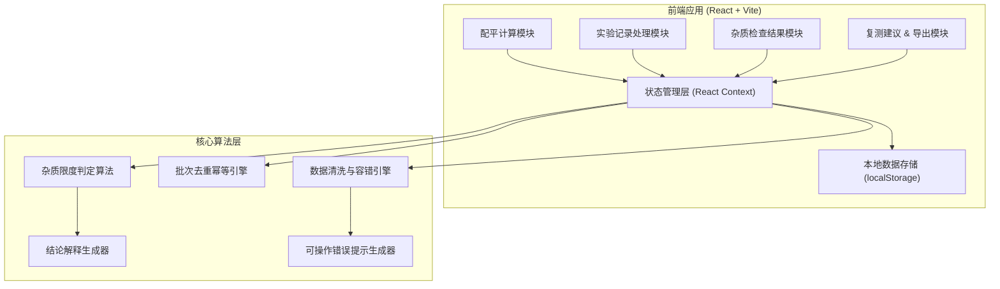

## 1. 架构设计



## 2. 技术说明

- **前端框架**: React 18 + TypeScript + Vite
- **样式方案**: TailwindCSS 3 + 自定义 CSS 变量
- **状态管理**: React Context + useReducer
- **数据持久化**: localStorage（模拟后端存储）
- **路由**: React Router DOM v6
- **图标**: Lucide React（线性风格图标库）
- **导出**: 原生 CSV 生成 + 浏览器打印 API（PDF）

## 3. 路由定义

| 路由 | 页面用途 |
|------|---------|
| / | 配平计算页（日常入口） |
| /records | 实验记录处理页 |
| /results | 杂质限度检查结果页 |
| /retest | 复测建议页 |
| /history | 历史记录与导出页 |

## 4. 核心数据模型

```typescript
// 实验记录批次
interface ExperimentBatch {
  batchId: string;              // 批次号（去重键）
  sampleName: string;           // 样品名称
  recordDate: string;           // 记录日期
  reactionConditions: {         // 反应条件
    temperature?: number;
    ph?: number;
    time?: number;
    [key: string]: any;
  };
  impurities: ImpurityRecord[]; // 杂质谱图数据
  sourceHash: string;           // 原始数据哈希（用于去重）
  createdAt: number;
  updatedAt: number;
}

// 单条杂质记录
interface ImpurityRecord {
  id: string;
  name: string;                 // 杂质名称
  measuredValue: number;        // 实测值 (%)
  limitValue: number;           // 限度值 (%)
  standard: string;             // 依据标准（如药典2025）
}

// 检查结论
interface CheckResult {
  batchId: string;
  overallStatus: 'PASS' | 'FAIL' | 'PENDING';
  impurityResults: ImpurityResult[];
  explanation: string;          // 总体解释（一两句）
  retestAdvice?: string;        // 复测建议
}

interface ImpurityResult {
  impurityId: string;
  name: string;
  status: 'PASS' | 'FAIL' | 'UNCERTAIN';
  measured: number;
  limit: number;
  deviation: number;            // 偏差百分比
  explanation: string;          // 单条解释
}

// 清洗错误与提示
interface ProcessError {
  code: string;
  userMessage: string;          // 给用户看的可操作建议
  suggestion: string;           // 具体操作指引
  missingFields?: string[];     // 缺失字段列表
}
```

## 5. 去重幂等引擎设计

```typescript
// 去重策略：
// 1. 同一 batchId 的批次视为同一批次
// 2. 计算 sourceHash（原始数据内容哈希）
// 3. 二次导入时：
//    - 若 sourceHash 相同 → 直接返回已有结论，不重复计算
//    - 若 sourceHash 不同但 batchId 相同 → 提示"补录数据"，合并并重新计算，保留最新结论
//    - 绝不产生两条互相矛盾的结论
```

## 6. 错误提示策略

| 内部异常 | 用户可见提示 | 可操作建议 |
|----------|-------------|-----------|
| 缺少反应温度字段 | "当前记录缺少反应温度条件" | "请在导入的记录中补充 25°C 等温度信息后重试" |
| 杂质数据格式异常 | "部分杂质数据无法识别" | "请检查第 3、7 行数值格式，应为 0.XX 格式百分比" |
| 批次号重复 | "该批次数据已存在" | "系统已自动合并补录数据，结论以最新计算结果为准" |
