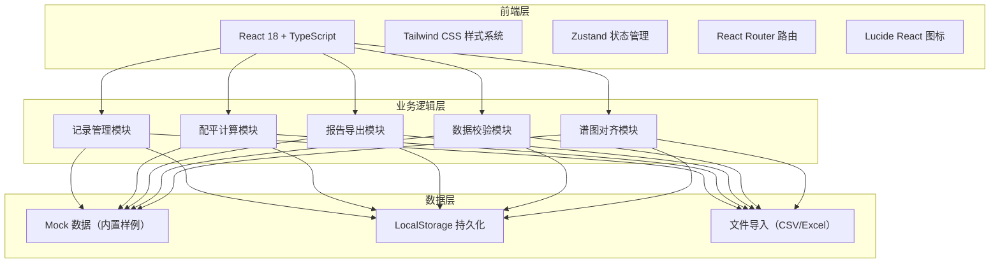
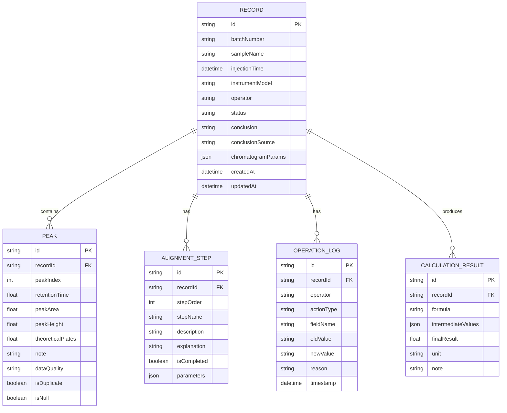

## 1. 架构设计



## 2. 技术描述

- **前端框架**：React@18 + TypeScript + Vite
- **样式方案**：Tailwind CSS@3（自定义设计token）
- **状态管理**：Zustand（轻量级、不可变状态）
- **路由方案**：react-router-dom@6
- **图标库**：lucide-react
- **初始化工具**：vite-init（react-ts 模板，纯前端）
- **后端服务**：无（纯前端应用，数据存储于 LocalStorage）
- **数据格式**：内置 Mock 数据，支持 CSV/Excel 文件导入解析

## 3. 路由定义

| 路由 | 页面 | 用途 |
|------|------|------|
| `/` | 记录总览页 | 数据列表、筛选搜索、统计概览、快速操作入口 |
| `/records/:id` | 记录详情页 | 查看谱图数据、对齐过程、配平计算、判读结论、操作日志 |
| `/records/new` | 新建记录页 | 导入数据、填写批次信息与谱图参数、执行配平计算 |
| `/records/:id/edit` | 编辑记录页 | 修改已有记录，自动记录操作历史 |
| `/reports` | 报告中心 | 选择模板、预览报告、导出下载 |
| `/samples` | 样例展示 | 三条典型样例（顺利/待确认/坏数据）展示 |

## 4. 数据模型

### 4.1 实体关系图



### 4.2 数据质量标记枚举
- `normal`：正常数据
- `null`：空值（缺失）
- `duplicate`：重复数据（与其他峰保留时间/面积重复）
- `note_inline`：备注混写（数值单元格混入备注文本）
- `outlier`：异常值（明显偏离正常范围）

### 4.3 记录状态枚举
- `ready`：可直接使用（绿色）
- `needs_review`：需安全员复核（橙色）
- `invalid`：坏数据/无效（红色）

## 5. 核心模块设计

### 5.1 数据校验模块（DataValidation）
职责：导入数据后自动检测数据质量问题
- 空值检测：遍历所有峰数据，标记缺失字段
- 重复检测：比对保留时间（±0.02min内）和峰面积（±1%内）判断重复
- 备注混写检测：用正则匹配数值单元格中的非数值字符
- 异常值检测：基于四分位距(IQR)检测离群峰

### 5.2 配平计算模块（BalanceCalculation）
职责：根据峰面积计算各组分配平结果
- 输入：各峰面积、校正因子（可选）
- 计算：归一化法 / 外标法 / 内标法（支持切换）
- 输出：各组分百分含量、总和校验（是否接近100%）
- 中间过程：展示每步计算公式与代入数值

### 5.3 报告导出模块（ReportExport）
职责：生成可下载的报告文件
- 模板：批次报告、配平计算报告、综合报告
- 格式：PDF（前端使用 html2canvas + jsPDF）、Excel（使用 SheetJS/xlsx）
- 内容：基本信息、谱图数据表格、对齐过程、配平结果、判读结论

### 5.4 谱图对齐模块（AlignmentProcess）
职责：管理并展示保留时间对齐处理流程
- 步骤管理：定义标准对齐步骤序列
- 解释关联：每步操作关联一句教学式解释说明
- 进度追踪：标记各步骤完成状态

## 6. 项目目录结构

```
src/
├── components/          # 可复用组件
│   ├── layout/         # 布局组件（导航、侧边栏）
│   ├── record/         # 记录相关组件（卡片、列表、表格）
│   ├── alignment/      # 对齐过程组件（时间轴、步骤卡片）
│   ├── calculation/    # 配平计算组件（公式展示、结果面板）
│   ├── report/         # 报告相关组件（预览、模板选择）
│   └── common/         # 通用组件（按钮、标签、弹窗、提示）
├── pages/              # 页面级组件
│   ├── Dashboard.tsx   # 记录总览
│   ├── RecordDetail.tsx
│   ├── RecordEdit.tsx
│   ├── ReportCenter.tsx
│   └── SampleShowcase.tsx
├── store/              # Zustand 状态管理
│   ├── useRecordStore.ts
│   └── useUiStore.ts
├── utils/              # 工具函数
│   ├── validation.ts   # 数据校验
│   ├── calculation.ts  # 配平计算
│   ├── export.ts       # 报告导出
│   └── format.ts       # 格式化工具
├── types/              # TypeScript 类型定义
│   └── index.ts
├── data/               # Mock 数据（三条样例）
│   └── samples.ts
├── hooks/              # 自定义 Hooks
│   ├── useRecord.ts
│   └── useCalculation.ts
├── App.tsx
├── main.tsx
└── index.css
```

## 7. 三条内置样例数据设计

| 样例编号 | 类型 | 批号 | 特点 | 用途 |
|----------|------|------|------|------|
| S001 | 顺利记录 | GC-2026-0421-A | 峰数据完整无缺、无重复、配平完美（99.87%）、对齐步骤齐全 | 展示标准流程、报告导出示例、教学演示 |
| S002 | 待确认记录 | GC-2026-0422-B | 含2个空值峰、1组重复峰（需手动确认是否合并）、配平总和95.3%（略低） | 展示数据质量标记、待复核工作流 |
| S003 | 明显坏数据 | GC-2026-0423-C | 多个峰保留时间偏移>2min、基线漂移严重、备注混入数值单元格、配平失败 | 展示异常检测、无效数据标记、判读结论追溯 |

## 8. 启动与依赖

- **依赖安装**：`npm install`
- **开发启动**：`npm run dev`
- **生产构建**：`npm run build`
- **样例位置**：页面顶部导航「样例展示」入口，或直接访问 `/samples`
