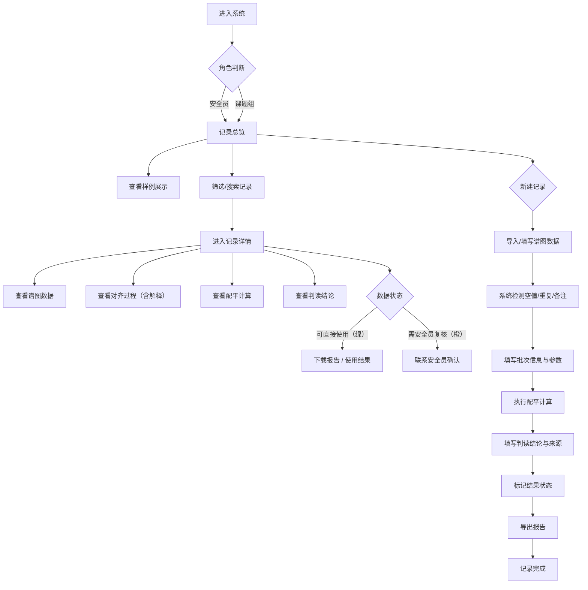

## 1. 产品概述

气相色谱保留时间对齐工具是为化学/材料课题组设计的数据管理与分析平台，替代传统便签记录方式，系统追踪谱图数据从导入、对齐、判读到报告导出的完整流程。核心解决称量单补版、批次报告修改导致的前后差异丢失问题，确保数据可追溯、可复核、可讲解。

- 目标用户：安全员（数据复核）、课题组研究人员（数据使用）、老师/工程师（结果讲解）
- 产品价值：建立规范的色谱数据质量管理体系，让数据处理过程透明可追溯，结果分级清晰呈现

## 2. 核心功能

### 2.1 用户角色
| 角色 | 注册方式 | 核心权限 |
|------|----------|----------|
| 安全员 | 系统配置 | 数据导入、记录编辑、配平计算、报告导出、结果复核标记 |
| 课题组 | 系统配置 | 浏览记录、查看结果、下载报告、标记待复核项 |
| 访客 | 无需注册 | 查看公开样例、了解处理流程 |

### 2.2 功能模块
1. **记录总览页**：数据列表、状态筛选、快速搜索、统计概览
2. **记录详情页**：谱图数据展示、保留时间对齐过程、配平计算、判读结论、操作日志
3. **新建/编辑记录**：数据导入、批次信息、谱图参数、备注编辑
4. **报告中心**：报告模板选择、预览、导出（PDF/Excel）
5. **样例展示**：三条典型样例（顺利记录、待确认、坏数据）

### 2.3 页面详情
| 页面名称 | 模块名称 | 功能描述 |
|----------|----------|----------|
| 记录总览 | 顶部统计卡 | 展示总数、正常/待复核/异常数据统计、最近更新时间 |
| 记录总览 | 筛选搜索区 | 按状态、批号、日期范围筛选；关键词搜索 |
| 记录总览 | 记录列表 | 卡片式列表，显示批号、状态标签、处理人、更新时间、核心数据摘要 |
| 记录总览 | 快速操作 | 新建记录、批量导出、导入数据 |
| 记录详情 | 基本信息区 | 批号、样品名、进样时间、仪器型号、操作人员 |
| 记录详情 | 谱图数据区 | 峰列表表格（保留时间、峰面积、峰高、理论塔板数）、标记空值/重复/异常 |
| 记录详情 | 对齐过程区 | 逐步展示保留时间对齐处理步骤，每步附解释说明 |
| 记录详情 | 配平计算区 | 自动计算配平结果，显示公式、中间值、最终结果 |
| 记录详情 | 判读结论区 | 结论摘要、结论来源追溯（关联原始材料）、可复核标记 |
| 记录详情 | 状态标记 | 一键切换：可直接使用 / 需安全员复核 |
| 记录详情 | 操作日志 | 完整记录修改历史（称量单补版、报告修改等） |
| 新建/编辑 | 数据导入 | 支持CSV/Excel导入，自动检测空值、重复、备注混写 |
| 新建/编辑 | 批次信息 | 批号、样品名称、进样日期、备注 |
| 新建/编辑 | 谱图参数 | 色谱柱、载气、流速、柱温程序 |
| 报告中心 | 模板列表 | 批次报告模板、配平计算报告模板、综合报告 |
| 报告中心 | 报告预览 | 在线预览，支持切换模板 |
| 报告中心 | 导出下载 | 支持PDF、Excel格式导出 |
| 样例展示 | 样例卡片 | 三条典型记录卡片，点击查看完整详情 |

## 3. 核心流程

用户从进入系统开始，浏览记录列表或查看样例，选择某条记录进入详情页查看完整处理过程。安全员可新建/编辑记录，执行配平计算并导出报告，最后标记结果状态（可直接使用/需复核）。课题组人员查看结果时，通过醒目的状态标签快速区分数据可用性。

## 4. 用户界面设计

### 4.1 设计风格
- **主色调**：深蓝科技蓝（#1e3a5f）作为主色，体现实验室专业感
- **辅助色**：
  - 成功绿（#10b981）：可直接使用标记
  - 警示橙（#f59e0b）：待复核标记
  - 危险红（#ef4444）：坏数据/异常标记
  - 信息青（#0ea5e9）：处理中/进行中
- **中性色**：石板灰系列（zinc），保证内容可读性
- **按钮风格**：微圆角（6px），悬停时有微妙阴影加深，点击有按压反馈
- **字体**：标题使用思源宋体（Source Han Serif SC）体现学术感，正文使用思源黑体（Source Han Sans SC）保证可读性
- **布局风格**：顶部导航 + 左侧内容区 + 右侧辅助面板的三栏布局；卡片式信息分组
- **图标风格**：使用 Lucide 线性图标，线条粗细统一 1.5px

### 4.2 页面设计概述
| 页面名称 | 模块名称 | UI元素 |
|----------|----------|--------|
| 记录总览 | 顶部统计卡 | 渐变背景卡片，大字号数字，小型趋势箭头，悬停时轻微上浮 |
| 记录总览 | 记录卡片 | 左侧状态色条标识状态，中间信息摘要，右侧操作区，悬停时边框高亮 |
| 记录详情 | 对齐过程区 | 时间轴布局，每步一个节点，连接线贯穿，当前步骤高亮，每步有展开/收起的解释说明 |
| 记录详情 | 配平计算区 | 公式使用等宽字体，中间变量带计算路径提示，最终结果放大突出显示 |
| 记录详情 | 状态标记 | 大型切换按钮，绿色/橙色强烈对比，切换时有平滑颜色过渡动画 |
| 新建/编辑 | 数据检测提示 | 表格内联标记，空值黄底、重复红底、备注灰底斜体，悬停显示提示气泡 |
| 报告中心 | 报告预览 | 模拟A4纸外观，阴影效果，缩放控制 |

### 4.3 响应性
- 桌面端优先设计（1280px+），三栏布局完整展示
- 平板端（768-1279px）：右侧辅助面板折叠为抽屉，通过按钮展开
- 移动端（<768px）：导航变为底部标签栏，记录卡片纵向堆叠，详情页采用Tab切换各模块

### 4.4 视觉动效
- 页面加载：主内容区域从下往上淡入（translateY 20px → 0，opacity 0 → 1），各卡片错峰出现（stagger 50ms）
- 状态切换：状态标签颜色变化使用 300ms 缓动过渡，配平计算结果数字从0滚动到目标值
- 时间轴节点：对齐过程步骤节点有呼吸式脉冲效果（当前步骤）
- 数据标记：悬停异常数据单元格时，气泡提示从单元格上方弹出并放大
